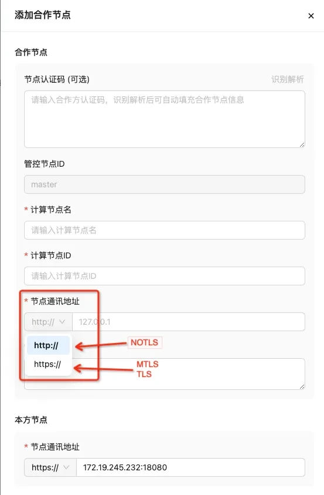

# 添加合作节点

<font color=#DF2A3F> 针对新安装的节点，若需要作为参与节点创建项目，则需提前将节点间的通讯建立起来。</font>

## 修改节点通讯地址
默认通讯地址为127.0.0.1，需用户自行修改为本机IP，修改后系统会更新节点认证码；
Tips：由于本机会有多网卡，以及不同局域网和广域网的地址出口 IP 不同，需要用户自行查看判断 IP 地址，
查看方法：以 Linux 为例，命令行输入命令`ifconfig`；端口号为部署 SecretPad 时用户自行确定的 Kuscia  节点的 gateway 端口。
## 枢纽模式TEE节点添加合作

若需要使用枢纽模式，则需要提前将自己的节点和TEE的节点完成添加合作：登录edge平台——点击添加合作节点——选择tee计算节点——输入本方节点通讯地址——点击确定。


## 添加合作步骤详情

点击添加合作节点——选择已注册的可用节点——输入合作节点的通讯地址——输入本节点对合作节点暴露的通讯地址——点击确定即可建立合作关系。



Tips：节点通讯地址协议是根据平台安装时「-P 参数（默认为TLS）」自动生成，NOTLS对应http，TLS和MTLS对应https。

若需要查询节点端口号，则输入如下命令：
```shell
# 查询本节点端口号的命令
docker ps
```