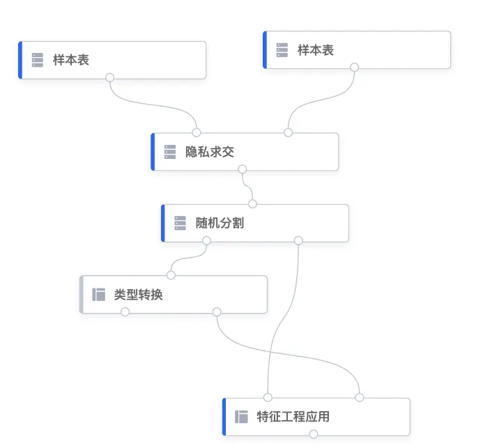
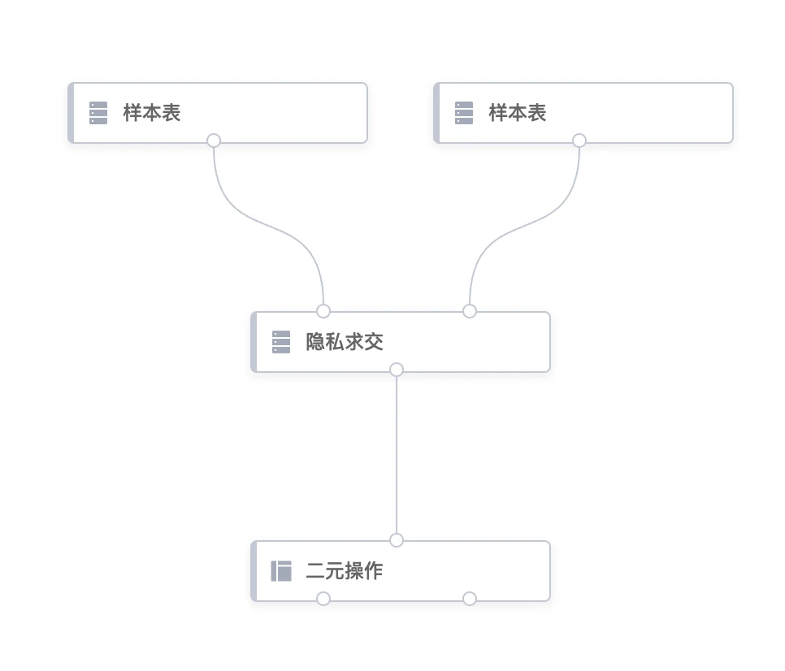
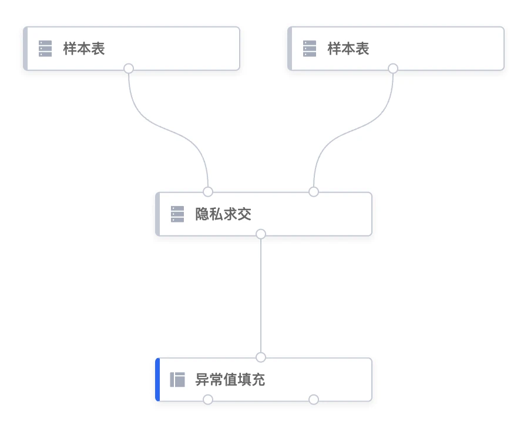
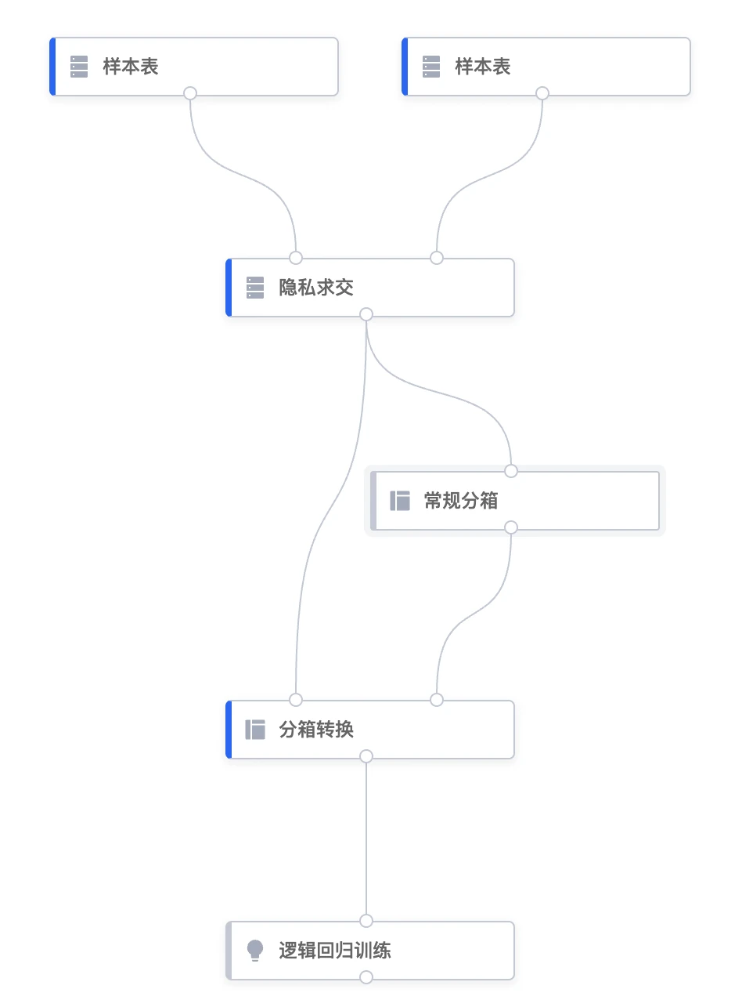
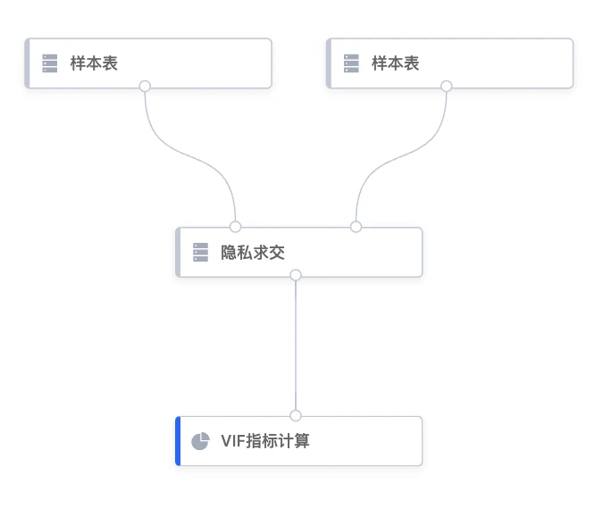
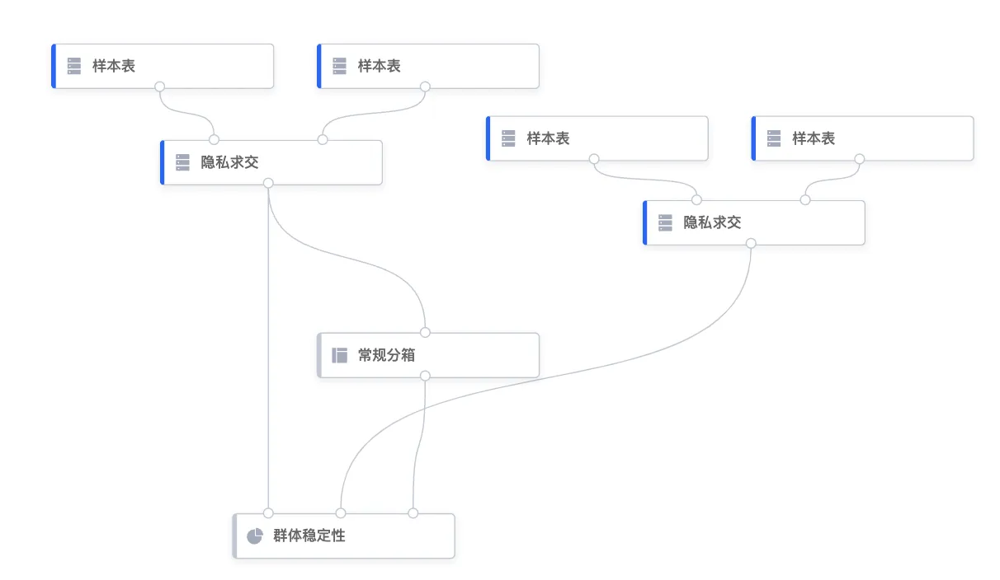
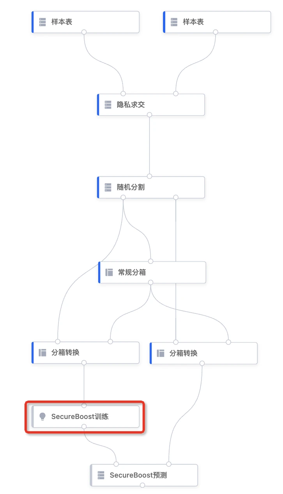
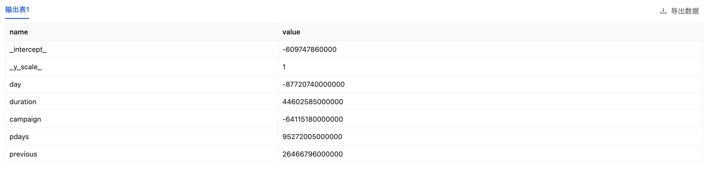
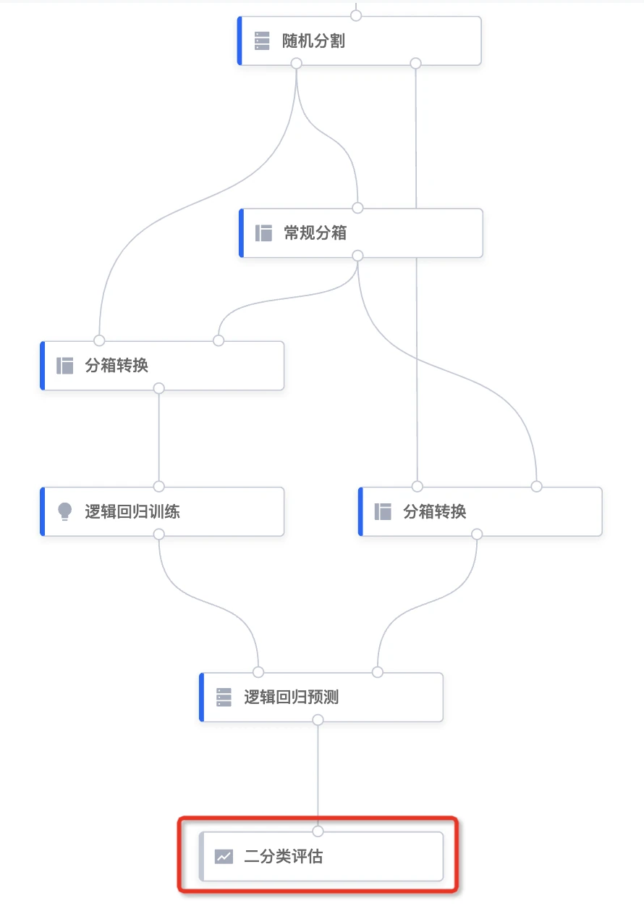
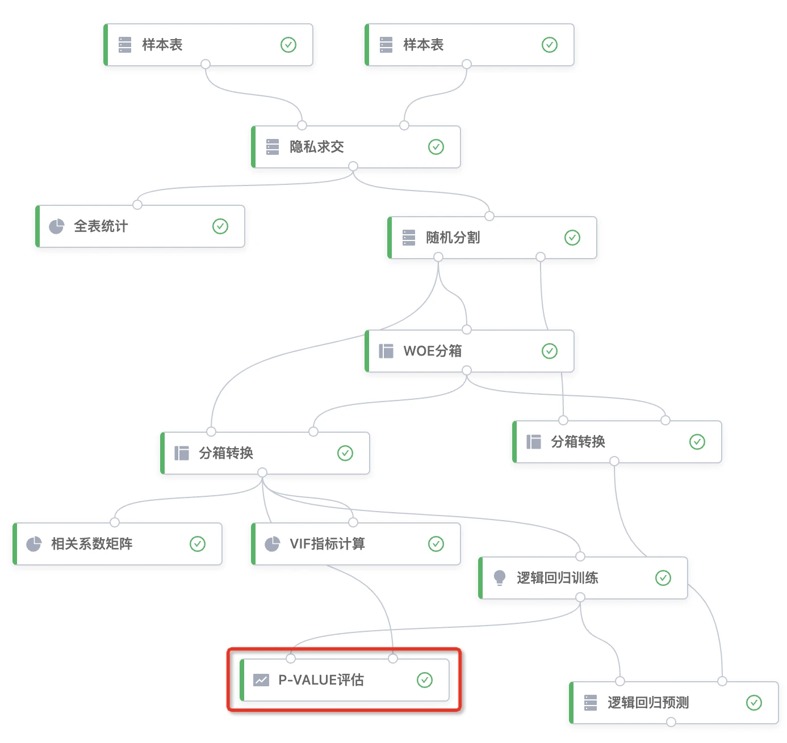

# 平台组件说明

## 1. 文档目的

汇总当前SecretPad平台组件，介绍说明每个组件的功能、组件连线、参数配置等。

## 2. 组件清单
   
<table>
  <tr>
    <th>类型</th>
    <th>组件名称</th>
    <th>组件功能</th>
    <th>数据分类</th>
    <th>输入输出桩</th>
  </tr>
  <tr>
    <td rowspan="4">数据准备</td>
    <td>表union</td>
    <td>横向合并两个数据表，分别支持同节点的联合表或样本表合并</td>
    <td>纵向</td>
    <td>输入桩1：第一个输入表 输入桩2：第二个输入表 输出桩1：输出表</td>
  </tr>
  <tr>
    <td>样本表</td>
    <td>授权到项目内的样本表，作为建模样本</td>
    <td>纵向</td>
    <td>输入桩1：无 输出桩1：输出样本表</td>
  </tr>
  <tr>
    <td>隐私求交</td>
    <td>通过隐私求交（Private Set Intersection）算法，求得各参与方数据的交集</td>
    <td>纵向</td>
    <td>输入桩1：接收方的样本表 输入桩2：发送方的样本表 输出桩1：输出联合表</td>
  </tr>
  <tr>
    <td>随机分割</td>
    <td>将数据集拆分为随机的训练子集和测试子集</td>
    <td>纵向</td>
    <td>输入桩1：输入联合表 输出桩1：输出训练数据子集 输出桩2：输出测试数据子集</td>
  </tr>
   <tr>
    <td rowspan="3">数据过滤</td>
    <td>行级过滤</td>
    <td>根据单个列的值和条件筛选表。</td>
    <td>纵向</td>
    <td>输入桩1：输入竖排表格 输出桩1：输出满足条件的垂直表 输出桩2：输出不满足条件的垂直表格</td>
  </tr>
    <tr>
    <td>列级过滤</td>
    <td>删除数据集中的某个特征</td>
    <td>纵向</td>
    <td>输入桩1：输入联合表 输出桩1：输出联合表</td>
  </tr>
<tr>
   <td>采样</td>
    <td>支持随机采样、等距采样和分层采样</td>
    <td>纵向</td>
    <td>输入桩1：输入联合表 输出桩1：输出联合表</td>
    </tr>
<tr>
    <td rowspan="13">特征预处理</td>
    <td>评分卡转换</td>
    <td>将逻辑回归模型产出的预测值结果（一个概率值）转化为一个更易理解的分数（比如最高为1000分的评分）</td>
    <td>纵向</td>
    <td>输入桩1：输入预测结果表 输出桩1：输出表</td>
  </tr>
 <tr>
    <td>类型转换</td>
    <td>用于基本数据类型之间的转换，例如将浮点转换为字符串</td>
    <td>纵向</td>
    <td>输入桩1：输入表 输出桩1：输出表 输出桩2：类型转换规则</td>
  </tr>
   <tr>
    <td>线性模型参数</td>
    <td>查看并编辑线性模型参数</td>
    <td>纵向</td>
    <td>输入桩1：输入模型（只能输入SSGLM模型） 输出桩1：输出模型</td>
  </tr>
  <tr>
    <td>二元操作</td>
    <td>对现有特征进行二元操作“+、-、*、/”并产生新的特征，仅适用于单边</td>
    <td>纵向</td>
    <td>输入桩1：输入垂直表格 输出桩1：输出垂直表格 输出桩2：特征生成规则</td>
  </tr>
  <tr>
    <td>交叉决策</td>
    <td>对现有特征进行CASE...WHEN...THEN逻辑判断衍生出新的特征，适用于单边特征计算</td>
    <td>纵向</td>
    <td>输入桩1：输入联合表 输出桩1：输出数据集 输出桩2：预处理替换规则</td>
  </tr>
  <tr>
    <td>特征计算</td>
    <td>对特征数值进行常见运算，如标准化、取对数等</td>
    <td>纵向</td>
    <td>输入桩1：输入联合表 输出桩1：输出数据集 输出桩2：特征替换规则</td>
  </tr>
  <tr>
    <td>异常值填充</td>
    <td>对异常的特征值进行替换填充</td>
    <td>纵向</td>
    <td>输入桩1：输入纵向联合表 输出桩1：输出纵向联合表 输出桩2：填充值规则</td>
  </tr>
  <tr>
    <td>onehot_encode</td>
    <td>独热编码，使用N位状态寄存器来对N个状态进行编码，将离散型特征转换为连续型特征</td>
    <td>纵向</td>
    <td>输入桩1：输入竖排表格 输出桩1：输出数据集 输出桩2：onehot规则</td>
  </tr>
  <tr>
    <td>特征工程应用</td>
    <td>统一的特征工程规则应用组件（除分箱）</td>
    <td>纵向</td>
    <td>输入桩1：输入竖排表格 输入桩2：输入预处理规则 输出桩1：输出数据集</td>
  </tr>
  <tr>
    <td>常规分箱</td>
    <td>对数据集进行等频或等宽分箱</td>
    <td>纵向</td>
    <td>输入桩1：输入垂直表 输出桩1：输出分箱规则</td>
  </tr>
  <tr>
    <td>WOE分箱</td>
    <td>	
为数据集生成 Weight of Evidence （WOE） 分箱规则</td>
    <td>纵向</td>
    <td>输入桩1：输入联合表 输出桩1：输出WOE规则</td>
  </tr>
  <tr>
    <td>分箱转换</td>
    <td>将分箱组件生成的规则应用于数据集上，替换数据集的值后产出分箱处理后的数据</td>
    <td>纵向</td>
    <td>输入桩1：要替换的垂直分区数据集 输入桩2：分箱替换规则 输出桩1：输出垂直表</td>
  </tr>
  <tr>
    <td>分箱修改</td>
    <td>查看并编辑分箱规则</td>
    <td>纵向</td>
    <td>输入桩1：输入模型或规则文件 输出桩1：输出WOE规则</td>
  </tr>
  <tr>
    <td rowspan="5">统计</td>
    <td>分组统计</td>
    <td>按照某些特征对数据集进行group by分组后进行汇总统计</td>
    <td>纵向</td>
    <td>输入桩1：输入表</td>
  </tr>
  <tr>
    <td>相关系数矩阵</td>
    <td>计算特征的皮尔逊乘积矩相关系数</td>
    <td>纵向</td>
    <td>输入桩1：输入联合表</td>
  </tr>
  <tr>
    <td>VIF指标计算</td>
    <td>计算特征的方差膨胀因子（variance inflation factor），用于检验多重共线性</td>
    <td>纵向</td>
    <td>输入桩1：输入联合表</td>
  </tr>
  <tr>
    <td>群体稳定性</td>
    <td>Population Stability Index，根据基准列和测试列，计算特征的稳定性</td>
    <td>纵向</td>
    <td>输入桩1：输入基准表 输入桩2：输入测试表 输入桩3：输入分箱规则</td>
  </tr>
  <tr>
    <td>全表统计</td>
    <td>统计数据表所有特征的空值数、最大值、均值等指标</td>
    <td>纵向</td>
    <td>输入桩1：输入表</td>
  </tr>
  <tr>
    <td rowspan="4">模型训练</td>
    <td>SecureBoost训练</td>
    <td>使用Secure Boosting为垂直拆分数据集设置提供分类和回归树Boosting(也称为 GBDT、GBM)。SGB是SecureBoost的缩写与更安全的SS-XGB相比, SecureBoost专注于保护标签持有人 - 详细信息请参阅: https: //arxiv.org/abs/1901.08755</td>
    <td>纵向</td>
    <td>输入桩1：输入模型 输入桩2：输入联合表 输出桩1：输出预测结果表</td>
  </tr>
  <tr>
    <td>SSGLM训练</td>
    <td>基于秘密分享的广义线性模型（GLM）</td>
    <td>纵向</td>
    <td>输入桩1：输入联合表 输出桩1：输出模型</td>
  </tr>
  <tr>
    <td>逻辑回归训练</td>
    <td>训练线性回归和逻辑回归。使用秘密分享的线性模型 ，SS-SGD是秘密分享SGD训练的缩写</td>
    <td>纵向</td>
    <td>输入桩1：输入联合表 输出桩1：输出模型</td>
  </tr>
  <tr>
    <td>SS-XGB训练</td>
    <td>基于秘密分享的 MPC 树模型训练，通过使用秘密共享为垂直分割数据集设置提供分类和回归树提升</td>
    <td>纵向</td>
    <td>输入桩1：输入联合表 输出桩1：输出模型</td>
  </tr>
  <tr>
    <td rowspan="4">模型预测</td>
    <td>SecureBoost预测</td>
    <td>对 SecureBoost 模型进行预测，离线批量打分</td>
    <td>纵向</td>
    <td>输入桩1：输入模型 输入桩2：输入联合表 输出桩1：输出预测结果表</td>
  </tr>
  <tr>
    <td>SSGLM预测</td>
    <td>对 SSGLM 模型进行预测，离线批量打分</td>
    <td>纵向</td>
    <td>输入桩1：输入模型 输入桩2：输入联合表 输出桩1：输出预测结果表</td>
  </tr>
  <tr>
    <td>逻辑回归预测</td>
    <td>对逻辑回归模型进行预测，离线批量打分</td>
    <td>纵向</td>
    <td>输入桩1：输入模型 输入桩2：输入联合表 输出桩1：输出预测结果表</td>
  </tr>
  <tr>
    <td>SS-XGB预测</td>
    <td>对 SS-XGB 模型进行预测，离线批量打分</td>
    <td>纵向</td>
    <td>输入桩1：输入联合表 输出桩1：输出模型</td>
  </tr>
  <tr>
    <td rowspan="4">模型评估</td>
    <td>二分类评估</td>
    <td>对二分类模型进行统计评估，输出AUC、F1、KS等评估指标</td>
    <td>纵向</td>
    <td>输入桩1：带有预测和标签的输入表数据，通常是预测组件的结</td>
  </tr>
  <tr>
    <td>预测偏差评估</td>
    <td>对模型进行统计评估，计算预测偏差，即 预测平均值 - 标签平均值</td>
    <td>纵向</td>
    <td>输入桩1：带有预测和标签的输入表数据，通常是预测组件的结果</td>
  </tr>
  <tr>
    <td>回归模型评估</td>
    <td>对回归模型进行统计评估，输出R2、MSE等评估指标</td>
    <td>纵向</td>
    <td>输入桩1：带有预测和标签的输入表数据，通常是预测组件的结果</td>
  </tr>
  <tr>
    <td>P-VALUEP评估</td>
    <td>使用秘密共享计算数据集上逻辑回归模型训练的 P 值</td>
    <td>纵向</td>
    <td>输入桩1：输入模型 输入桩2：输出联合表</td>
  </tr>
</table>

## 3. 组件配置
### 3.1. 数据准备
#### 3.1.1. 联合
| 类别     | 说明                                           |
|--------|----------------------------------------------|
| 组件名称   | 表union                                       |
| 组件分类   | 数据准备                                         |
| 一句话介绍  | 横向合并两个数据表，分别支持同节点的联合表或样本表合并                  |
| 输入输出   | 输入桩1：第一个样本表 输入桩2：第二个样本表 输出桩1：输出样本表 |
| 组件连线   |                    |
| 组件参数配置 | 无需配置                                         |
| 组件输出结果 | 输出样本表                                        |

#### 3.1.1. 样本表
| 类别     | 说明                              |
|--------|---------------------------------|
| 组件名称   | 样本表                             |
| 组件分类   | 数据准备                            |
| 一句话介绍  | 授权到项目内的样本表，作为建模样本               |
| 输入输出   | 输入桩1：无 输出桩1：输出样本表          |
| 组件连线   |     |
| 组件参数配置 | <ul><li>样本表选择<ul><li>单选，必选</ul> |
| 组件输出结果 | 输出样本表                           |

#### 3.1.2. 隐私求交
| 类别     | 说明                                                                                                                                                                                                                                                                                                                                                                                                                                                                                                                                                                                                                                                                                                                                                                                                                                                                                         | 
|--------|--------------------------------------------------------------------------------------------------------------------------------------------------------------------------------------------------------------------------------------------------------------------------------------------------------------------------------------------------------------------------------------------------------------------------------------------------------------------------------------------------------------------------------------------------------------------------------------------------------------------------------------------------------------------------------------------------------------------------------------------------------------------------------------------------------------------------------------------------------------------------------------------|
| 组件名称   | 隐私求交                                                                                                                                                                                                                                                                                                                                                                                                                                                                                                                                                                                                                                                                                                                                                                                                                                                                                       |
| 组件分类   | 数据准备                                                                                                                                                                                                                                                                                                                                                                                                                                                                                                                                                                                                                                                                                                                                                                                                                                                                                       |
| 一句话介绍  | 通过隐私求交（Private Set Intersection）算法，求得各参与方数据的交集                                                                                                                                                                                                                                                                                                                                                                                                                                                                                                                                                                                                                                                                                                                                                                                                                                             |
| 输入输出   | 输入桩1：接收方的样本表 输入桩2：发送方的样本表 输出桩1：输出联合表                                                                                                                                                                                                                                                                                                                                                                                                                                                                                                                                                                                                                                                                                                                                                                                                                                             |
| 组件连线   |                                                                                                                                                                                                                                                                                                                                                                                                                                                                                                                                                                                                                                                                                                                                                                                                                                                |
| 组件参数配置 | <ul><li>接收方输入key<ul><li>必选，可选择多个</li><li>tooltip：用于隐私求交的列</li></ul></li><li>发送方输入key<ul><li>必选，可选择多个</li><li>tooltip：用于隐私求交的列</li></ul></li><li>隐私求交协议<ul><li>单选，可选择PROTOCOL_RR22、PROTOCOL_ECDH、PROTOCOL_KKRT，默认选择PROTOCOL_RR22</li><li>tooltip：KKRT的运行时间较短，但通信量较大，故适合高带宽时使用；ECDH的运行时间较长，但通信量不大，适合带宽不够大时使用；RR22在时间和通信量方面都具有较大的优势。</li></ul></li><li>允许关键健重复<ul><li>必选，默认为否</li><li>tooltip：某些求交健允许关键健重复，如果选“是”，需选择求交类型，可选“inner_join、left_join、full_join、difference”，默认为“inner_join”</li></ul></li><li>禁用重复值检查<ul><li>必选，默认为否</li></ul></li><li>求交后是否重排序<ul><li>默认开启</li><li>tooltip：如果关闭，双方输出不保证对齐。警告：关闭此选项可能会导致后续组件出现错误。如果要附加其他组件，请不要关闭该选项。</li></ul></li><li>整数类型值填充<ul><li>非必填</li><li>tooltip：对于 int 类型数据，使用此值填充 null。</li></ul></li><li>ecdh_curve<ul><li>单选，可选择CURVE_25519、CURVE_FOURQ、CURVE_SM2、CURVE_SECP25641，默认选择CURVE_FOURQ</li><li>tooltip：ECDH PSI 的曲线类型</li></ul></li></ul> |
| 组件输出结果 | 发送方和接收方数据交集结果表                                                                                                                                                                                                                                                                                                                                                                                                                                                                                                                                                                                                                                                                                                                                                                                                                                                                             |

#### 3.1.3. 随机分割
| **类别**     | **说明**                                                                                                                                                                                                                                                                                                |
|------------|-------------------------------------------------------------------------------------------------------------------------------------------------------------------------------------------------------------------------------------------------------------------------------------------------------|
| **组件名称**   | 随机分割                                                                                                                                                                                                                                                                                                  |
| **组件分类**   | 数据准备                                                                                                                                                                                                                                                                                                  |
| **一句话介绍**  | 将数据集拆分为随机的训练子集和测试子集                                                                                                                                                                                                                                                                                   |
| **输入输出**   | 输入桩1：输入联合表 输出桩1：输出训练数据子集 输出桩2：输出测试数据子集                                                                                                                                                                                                                                                      |
| 组件连线       |                                                                                                                                                                                                                                                     |
| **组件参数配置** | <ul><li>训练子集大小</li><ul><li>必填，默认为0.75</li><li>tooltip：要包含在训练子集中的数据集的比例</li></ul></ul><ul><li>测试子集大小</li><ul><li>必填，默认为0.25</li><li>tooltip：要包含在测试子集中的数据集的比例，测试子集大小和训练子集大小的总和应在 (0, 1] 范围内</li></ul></ul><ul><li>数据打乱的随机种子</li><ul><li>必填，默认为1024</li><li>填写区间：(0，+∞)</li><li>tooltip：制定数据打乱的随机种子</li></ul></ul><ul><li>数据打乱：拆分前是否对数据进行打乱</li></ul></ul> |
| **组件输出结果** | 按照训练和测试子集比例随机分割后的训练数据集和测试数据集                                                                                                                                                                                                                                                                          |

### 3.2. 数据过滤
#### 3.2.1. 行级过滤
| 类别     | 说明                                                                                                                                                                                                                                                                                                                                                                                                                                                                                                                                                                                                                                                  |
|--------|-----------------------------------------------------------------------------------------------------------------------------------------------------------------------------------------------------------------------------------------------------------------------------------------------------------------------------------------------------------------------------------------------------------------------------------------------------------------------------------------------------------------------------------------------------------------------------------------------------------------------------------------------------|
| 组件名称   | 行级过滤                                                                                                                                                                                                                                                                                                                                                                                                                                                                                                                                                                                                                                                |
| 组件分类   | 数据过滤                                                                                                                                                                                                                                                                                                                                                                                                                                                                                                                                                                                                                                                |
| 一句话介绍  | 根据单个列的值和条件筛选表 **tip：负责条件过滤的一方将直接将样本分发发送给其他参与者。 恶意参与者可以通过使用不同的过滤值重复调用来获得特征的分布。 请仔细审核此组件的使用情况。**                                                                                                                                                                                                                                                                                                                                                                                                                                                                                                                                                 |
| 输入输出   | 输入桩1：输入竖排表格 输出桩1：输出满足条件的垂直表格 输出桩2：输出不满足条件的垂直表格                                                                                                                                                                                                                                                                                                                                                                                                                                                                                                                                                                                            |
| 组件连线   |                                                                                                                                                                                                                                                                                                                                                                                                                                                                                                                                                                                                                  |
| 组件参数配置 | <ul><li>特征</li><ul><li>必选、单选</li><li>tooltip：选择某一字段作为过滤数据集的特征</li></ul></ul><ul><li>比较条件</li><ul><li>必选、单选</li><li>tooltip：用于比较的条件，用于比较的条件。目前支持==、<、<=、>、>=、IN</li></ul></ul><ul><li>值类型：</li><ul><li>必选、单选</li><li>tooltip：要与之进行比较的值的类型。必须是“STRING”、“FLOAT”中的一个，STRING比大小采用字典序，此时‘101’>‘1001’</li></ul></ul><ul><li>条件值</li><ul><li>必选，单选</li><li>tooltip：如比较条件选择“IN”，此处可输入多个值，用“，”隔开；如比较条件选择==、<、<=、>=，此处只能输入一个值</li></ul></ul><ul><li>浮点数值误差</li><ul><li>必填，默认为0.000001</li><li>取值区间：[0，+∞)</li><li>tooltip：用于浮点比较的Epsilon值。警告：由于计算机中的浮点表示，如果您想在所需的边界处过滤掉值，请将此数字设置得稍大一些。例如，abs（1.001-1.002）略大于0.001，因此可能无法使用==和epsilson=0.001进行过滤</li></ul></ul> |
| 组件输出结果 | <ul><li>满足条件的数据表</li></ul><ul><li>不满足条件的数据表</li></ul>                                                                                                                                                                                                                                                                                                                                                                                                                                                                                                                                                                                               |

#### 3.2.2. 列级过滤
| 类别     | 说明                                                  |
|--------|-----------------------------------------------------|
| 组件名称   | 列级过滤                                                |
| 组件分类   | 数据过滤                                                |
| 一句话介绍  | 删除数据集中的某个特征                                         |
| 输入输出   | 输入桩1：输入联合表 输出桩1：输出联合表                          |
| 组件连线   |               |
| 组件参数配置 | <ul><li>删除的特征：需要从数据集中删除的特征<ul><li>非必选，可多选</ul></ul> |
| 组件输出结果 | 删除特征字段后的数据集                                         |

#### 3.2.3. 采样
| 类别     | 说明                                                                                     |
|--------|----------------------------------------------------------------------------------------|
| 组件名称   | 采样                                                                                     |
| 组件分类   | 数据过滤                                                                                   |
| 一句话介绍  | 支持随机采样、等距采样和分层采样                                                                       |
| 输入输出   | 输入桩1：输入联合表 输出桩1：输出联合表                                                             |
| 组件连线   |                                                     |
| 组件参数配置 | <ul><li>采样算法</li><ul><li>必选，可选择随机、等距、分层</li></ul></ul><ul><li>放回</li><ul><li>选择随机采样时填写</li><li>否，则为不放回采样；是，则为放回 采样</li></ul></ul><ul><li>采样比例</li><ul><li>选择等距采样、随机采样、分层采样时均需填写；默认0.8，即采样后的数据集行数与原数据集的比例</li></ul></ul><ul><li>观测特征</li><ul><li>选择分层采样时填写，输入一个列名</li></ul></ul><ul><li>观测值分位点</li><ul><li>选择分层采样时填写，输入框，无默认值，必填</li><li>填写方式如1,2,3则分别对（-∞，1]、（1，2]、（3，+∞]）进行分层采样，逗号为半角</li><li>tootip:填写分位点，可分别对各分位区间设置采样权重</li></ul></ul><ul><li>分位点</li><ul><li>根据填写的观测值分位点展示，用户不需填写</li></ul></ul><ul><li>采样方式</li><ul><li>选择分层采样时填写，默认值放回采样，必选</li><li>可选择放回采样和不放回采样</li><li>如采样倍率>1，但选择不放回采样则会报错处理</li></ul></ul><ul><li>权重</li><ul><li>选择分层采样时填写，无默认值，输入框，非必填；如不配置时采样后不改变各区间占比；</li><li>剩最后一桶时，系统填写1-前面填写的权重和</li><ul><li>如用户填写的权重和（除最后一桶）相加大于1，则配置框标红提示错误：各分桶权重之和=1</li></ul><li>填写范围为（0，1）之间数值，即采样后样本的占比，所有分位区间权重之和需等于1；</li></ul></ul><strong>高级配置</strong><ul><li>random_state/随机数种子</li><ul><li>选择随机采样或者分层采样时出现</li><li>默认值：1024<li>范围:（0，+∞）的整数<li>允许用户将文本框删成空（计算引擎此时取默认值1）</li></ul></ul>
| 组件输出结果 | 采样后的新联合表                                                                               |

### 3.3. 特征预处理
#### 3.3.1. 评分卡转换
| 类别     | 说明                                                                                                                                                                                                                                                                                                                                                                                                                                                                                                                                                                                                                                                           |
|--------|--------------------------------------------------------------------------------------------------------------------------------------------------------------------------------------------------------------------------------------------------------------------------------------------------------------------------------------------------------------------------------------------------------------------------------------------------------------------------------------------------------------------------------------------------------------------------------------------------------------------------------------------------------------|
| 组件名称   | 评分卡转换                                                                                                                                                                                                                                                                                                                                                                                                                                                                                                                                                                                                                                                        |
| 组件分类   | 特征预处理                                                                                                                                                                                                                                                                                                                                                                                                                                                                                                                                                                                                                                                        |
| 一句话介绍  | 将逻辑回归模型产出的预测值结果（一个概率值）转化为一个更易理解的分数（比如最高为1000分的评分）；用于模型后处理；                                                                                                                                                                                                                                                                                                                                                                                                                                                                                                                                                                                                   |
| 输入输出   | 输入桩1：输入预测结果表 输出桩1：输出表                                                                                                                                                                                                                                                                                                                                                                                                                                                                                                                                                                                                                                   |
| 组件连线   |                                                                                                                                                                                                                                                                                                                                                                                                                                                                                                                                                                                                                        |
| 组件参数配置 | <ul><li>预测结果列名</li><ul><li>单选，上游输出后选择，必填</li></ul></ul><ul><li>positive标签值</li><ul><li>单选，0或者1；默认1，必填</li></ul></ul><ul><li>转换后列名</li><ul><li>输入，默认predict_score，必填</li></ul></ul><ul><li>scaledValue</li><ul><li>默认值：600，必填</li><li>设定一个基准分数，可根据具体的业务场景调整</li></ul></ul><ul><li>odds</li><ul><li>默认值：20，必填</li><li>tooltip：在给定的分数基准点处的odds值，odds = p / (1-p)</li></ul></ul><ul><li>pdo</li><ul><li>默认值：20，必填</li><li>tooltip：全名points to double the odds，指odds值翻倍时，分数的变化量</li></ul></ul>高级配置</li><ul><li>minscore</li><ul><li>无默认值，设置算出分数后的最小值，支持输入[0,999]内整数</li></ul></ul><ul><li>maxsocre</li><ul><li>默认值1000，设置算出分数后的最大值，支持输入[1,1000]内的整数</li></ul></ul> |
| 组件输出结果 | 输出转换后的预测结果表                                                                                                                                                                                                                                                                                                                                                                                                                                                                                                                                                                                                                                                  

#### 3.3.2. 类型转换
| 类别     | 说明                                                                                                                                 |
|--------|------------------------------------------------------------------------------------------------------------------------------------|
| 组件名称   | 类型转换                                                                                                                               |
| 组件分类   | 特征预处理                                                                                                                              |
| 一句话介绍  | 用于基本数据类型之间的转换，例如将浮点转换为字符串                                                                                                          |
| 输入输出   | 输入桩1：输入表 输出桩1：输出表 输出桩2：类型转换规则                                                                                            |
| 组件连线   |                                                                                      |
| 组件参数配置 | <ul><li>待转换特征列</li><ul><li>多选，可选择不同类型，包括string、integer、float、boolean</li></ul></ul><ul><li>转换后类型</li><ul><li>单选，可选择string、integer、float</li></ul></li> |
| 组件输出结果 | 输出类型转换后的表                                                                                                                          |

#### 3.3.3. 线性模型参数修改
| 类别     | 说明                                                                                                                                                                                                                                                                                                                                                       |
|--------|----------------------------------------------------------------------------------------------------------------------------------------------------------------------------------------------------------------------------------------------------------------------------------------------------------------------------------------------------------|
| 组件名称   | 线性模型参数修改                                                                                                                                                                                                                                                                                                                                                 |
| 组件分类   | 特征预处理                                                                                                                                                                                                                                                                                                                                                    |
| 一句话介绍  | 查看并编辑线性模型参数                                                                                                                                                                                                                                                                                                                                              |
| 输入输出   | 输入桩1：输入模型（只能输入SSGLM模型） 输出桩1：输出模型                                                                                                                                                                                                                                                                                                                    |
| 组件连线   |                                                                                                                                                                                                                                                                                                            |
| 组件参数配置 | <ul><li>选择上次模型参数修改和上游输出，如存在上次编辑记录可选择，否则仅可选择上游输出</li><li>撤销<ul><li>如存在编辑参数动作可撤销，撤销每点击一次撤销一次编辑保存</li></ul></li><li>重做<ul><li>点击可恢复至本次点击“编辑模型参数”后的所有变更</li></ul></li><li>编辑<ul><li>点击每个参数的编辑按钮，可编辑并保存单条结果</li></ul></li><li>weight<ul><li>不同特征的权重</li></ul></li><li>bias(interpect)<ul><li>截距</li></ul></li><li>保存模型参数<ul><li>保存修改的模型参数</li></ul></li></ul> |
| 组件输出结果 | 输出更改参数后的模型                                                                                                                                                                                                                                                                                                                                               |

#### 3.3.4. 二元操作
| 类别     | 说明                                                                                                                                                                                                                                                     |
|--------|--------------------------------------------------------------------------------------------------------------------------------------------------------------------------------------------------------------------------------------------------------|
| 组件名称   | 二元操作                                                                                                                                                                                                                                                   |
| 组件分类   | 特征预处理                                                                                                                                                                                                                                                  |
| 一句话介绍  | 对现有特征进行二元操作“+、-、*、/”并产生新的特征，仅适用于单边                                                                                                                                                                                                                     |
| 输入输出   | 输入桩1：输入垂直表格 输出桩1：输出垂直表格 输出桩2：特征生成规则                                                                                                                                                                                                          |
| 组件连线   |                                                                                                                                                                                                        |
| 组件参数配置 | <ul><li>特征1</li><ul><li>必选、单选</li></ul></ul><ul><li>特征2</li><ul><li>必选、单选</li></ul></ul><ul><li>二元操作</li><ul><li>必选、单选</li><li>目前支持“ +、-、*、/”，默认为“+”</li></ul></ul><ul><li>新特征名称</li><ul><li>必填</li><li>tooltip：二元操作后生成的新特征名称</li></ul></ul><ul><li>作为标签</li><ul><li>必选，默认为 否</li><li>tooltip：是否在模式中存为标签</li></ul></ul> |
| 组件输出结果 | 对选择特征进行二元操作之后包含新特征的数据集                                                                                                                                                                                                                                 |

#### 3.3.5. 交叉决策
| 类别     | 说明                                                                                                                                                                                                                                                                                                                                                                                                                                                                                                                                                                                                                                                                                                                                                                                                                                                                                                                                                                                                                                                                                                                                                                      |
|--------|-------------------------------------------------------------------------------------------------------------------------------------------------------------------------------------------------------------------------------------------------------------------------------------------------------------------------------------------------------------------------------------------------------------------------------------------------------------------------------------------------------------------------------------------------------------------------------------------------------------------------------------------------------------------------------------------------------------------------------------------------------------------------------------------------------------------------------------------------------------------------------------------------------------------------------------------------------------------------------------------------------------------------------------------------------------------------------------------------------------------------------------------------------------------------|
| 组件名称   | 交叉决策                                                                                                                                                                                                                                                                                                                                                                                                                                                                                                                                                                                                                                                                                                                                                                                                                                                                                                                                                                                                                                                                                                                                                                    |
| 组件分类   | 特征预处理                                                                                                                                                                                                                                                                                                                                                                                                                                                                                                                                                                                                                                                                                                                                                                                                                                                                                                                                                                                                                                                                                                                                                                   |
| 一句话介绍  | 对现有特征进行CASE...WHEN...THEN逻辑判断衍生出新的特征，适用于单边特征计算                                                                                                                                                                                                                                                                                                                                                                                                                                                                                                                                                                                                                                                                                                                                                                                                                                                                                                                                                                                                                                                                                                                          |
| 输入输出   | 输入桩1：输入联合表 输出桩1：输出数据集 输出桩2：预处理替换规则                                                                                                                                                                                                                                                                                                                                                                                                                                                                                                                                                                                                                                                                                                                                                                                                                                                                                                                                                                                                                                                                                                                            |
| 组件连线   |                                                                                                                                                                                                                                                                                                                                                                                                                                                                                                                                                                                                                                                                                                                                                                                                                                                                                                                                                                                                                                                                                                                             |
| 组件参数配置 | <ul><li>Case（可增加多个）<ul><li>WHEN（条件判断，可增加多个）<ul><li>列名<ul><li>单选，必选</li></ul></li><li>条件<ul><li>单选，必选</li><li>目前支持 >、<、>=、<=、=、!=</li></ul></li><li>类型<ul><li>单选，必选</li><li>可选择“常量”或者“列”，默认为“常量”</li></ul></li><li>条件值<ul><li>必填</li><li>tooltip：如类型选择“常量”且条件选择“>、<、>=、<=、=、!=”，则此处填写常量；如类型选择“列”，则此处选择上游输出列</li></ul></li></ul></li><li>THEN<ul><li>类型<ul><li>必选，单选</li><li>可选择“常量”或者“列”，默认为“常量”</li></ul></li><li>数据类型<ul><li>单选</li><li>可选择string、float、int，默认为float</li><li>tooltip：如类型选择“常量”，则无需填写</li></ul></li><li>赋值<ul><li>必填</li><li>tooltip：如类型选择“常量”，则此处填写常量；如类型选择“列”，则此处选择上游输出列</li></ul></li></ul></li></ul></li><li>ELSE<ul><li>类型<ul><li>必选，单选</li><li>可选择“常量”或者“列”，默认为“常量”</li></ul></li><li>数据类型<ul><li>单选</li><li>可选择string、float、int，默认为float</li><li>tooltip：如类型选择“常量”，则无需填写</li></ul></li><li>赋值<ul><li>必填</li><li>tooltip：如类型选择“常量”，则此处填写常量；如类型选择“列”，则此处选择上游输出列</li></ul></li></ul></li><li>END AS<ul><li>必填</li><li>tooltip：输入列名，如和原有特征命名相同，则覆盖原有特征；否则新生成一个特征</li></ul></li><li>float epsilon<ul><li>必填，默认为0.000001</li><li>tooltip：计算精度，在相等判断中，如果两个float的差距小于epsilon，就认为这两个float是相等的</li></ul></li><li>输出为标签列<ul><li>必选，默认为否</li></ul></li></ul> |
| 组件输出结果 | <ul><li>对特征进行条件判断之后包含新特征的二维表数据集</li></ul><ul><li>case when规则</li></ul>                                                                                                                                                                                                                                                                                                                                                                                                                                                                                                                                                                                                                                                                                                                                                                                                                                                                                                                                                                                                                                                                                                  |

#### 3.3.6. 特征计算
| 类别     | 说明                                                                                                                                                                                                                                                                                                                                                                                                                                                                                                                                 |
|--------|------------------------------------------------------------------------------------------------------------------------------------------------------------------------------------------------------------------------------------------------------------------------------------------------------------------------------------------------------------------------------------------------------------------------------------------------------------------------------------------------------------------------------------|
| 组件名称   | 特征计算                                                                                                                                                                                                                                                                                                                                                                                                                                                                                                                               |
| 组件分类   | 特征预处理                                                                                                                                                                                                                                                                                                                                                                                                                                                                                                                              |
| 一句话介绍  | 对特征数值进行常见运算，如标准化、取对数等                                                                                                                                                                                                                                                                                                                                                                                                                                                                                                              |
| 输入输出   | 输入桩1：输入联合表 输出桩1：输出数据集 输出桩2：特征替换规则                                                                                                                                                                                                                                                                                                                                                                                                                                                                                        |
| 组件连线   |                                                                                                                                                                                                                                                                                                                                                                                                                                                                              |
| 组件参数配置 | <ul><li>特征列<ul><li>必选，可多选</li></ul></li><li>算子选择<ul><li>必选，默认为Standardize（标准化）</li><li>Standardize（标准化）</li><li>归一化</li><li>Range（范围限制）<ul><li>填写范围区间最大值、最小值</li></ul></li><li>Unary（单变量四则运算）<ul><li>填写运算规则</li></ul></li><li>Round（圆整）</li><li>LogRound（取log后圆整）<ul><li>填写运算规则</li></ul></li><li>sqrt（根号）</li><li>Log<ul><li>填写运算规则</li></ul></li><li>exp</li><li>length</li><li>Substr<ul><li>填写截取长度</li><li>tooltip：填写开始截取位数，如输入正数，则从左边开始往后从左到右截取；如输入负数，则从结尾往前数从左到右截取位数截取。</li></ul></li><li>Reciprocal（倒数）</li></ul></li></ul> |
| 组件输出结果 | <ul><li>特征计算后的二维表数据集</li></ul><ul><li>特征计算规则</li></ul>                                                                                                                                                                                                                                                                                                                                                                                                                                                                                       |

#### 3.3.7. 异常值填充
| 类别     | 说明                                                                                                                                                                                                                                                                                                                                                                                                                                                                                                                                                                                                                                                                                                                                                                                                                                                                                    |
|--------|---------------------------------------------------------------------------------------------------------------------------------------------------------------------------------------------------------------------------------------------------------------------------------------------------------------------------------------------------------------------------------------------------------------------------------------------------------------------------------------------------------------------------------------------------------------------------------------------------------------------------------------------------------------------------------------------------------------------------------------------------------------------------------------------------------------------------------------------------------------------------------------|
| 组件名称   | 异常值填充                                                                                                                                                                                                                                                                                                                                                                                                                                                                                                                                                                                                                                                                                                                                                                                                                                                                                 |
| 组件分类   | 特征预处理                                                                                                                                                                                                                                                                                                                                                                                                                                                                                                                                                                                                                                                                                                                                                                                                                                                                                 |
| 一句话介绍  | 对异常的特征值进行定义、并进行填充                                                                                                                                                                                                                                                                                                                                                                                                                                                                                                                                                                                                                                                                                                                                                                                                                                                                     |
| 输入输出   | 输入桩1：输入纵向联合表 输出桩1：输出纵向联合表 输出桩2：填充值规则                                                                                                                                                                                                                                                                                                                                                                                                                                                                                                                                                                                                                                                                                                                                                                                                                                        |
| 组件连线   |                                                                                                                                                                                                                                                                                                                                                                                                                                                                                                                                                                                                                                                                                                                                                                                                                                         |
| 组件参数配置 | <ul><li>填充特征<ul><li>非必选，可多选</li></ul></li><li>填充缺失值的方式<ul><li>必选，默认为constant</li><li>tooltip：constant（自定义值）：用fill_value替换缺失的值。可以与字符串或数字数据一起使用；mean（平均值）：使用每列的平均值替换缺失值。只能与数字数据一起使用；median（中数）：使用每列的中值替换缺失值。只能与数字数据一起使用；most_frequent（众数）：使用每列中最频繁的值替换缺失的值。可以与字符串或数字数据一起使用。如果存在多个这样的值，则只返回最小的值。</li></ul></li><li>缺失值类型<ul><li>必选，单选，默认为general_na</li><li>general_na类型表示只有np.nan、None或pandas.NA将被视为缺失值。当类型不是general_na时，除了general_na值之外，类型转换后的missing_value_type(missing_value)也将被视为缺失值</li></ul></li><li>缺失值<ul><li>必填，默认为custom_missing_value</li></ul></li><li>整数类型填充值<ul><li>当缺失值类型选择int时，必填</li><li>对于整数类型的数据，如果填充缺失值的方式是“constant”，使用此值来填充null</li></ul></li><li>浮点类型填充值<ul><li>当缺失值类型选择float时，必填</li><li>对于浮点类型的数据，如果填充缺失值的方式是“constant”，使用此值来填充null</li></ul></li><li>字符串类型填充值<ul><li>当缺失值类型选择str时，必填</li><li>对于字符串类型的数据，如果填充缺失值的方式是“constant”，使用此值来填充null</li></ul></li></ul> |
| 组件输出结果 | <ul><li>填充异常值后的二维表数据集</li></ul><ul><li>异常值填充规则</li></ul>                                                                                                                                                                                                                                                                                                                                                                                                                                                                                                                                                                                                                                                                                                                                                                                                                                        |

#### 3.3.8. onehot_encode
| 类别     | 说明                                                                                                                                                                                                                                                                                                                                                                                                        |
|--------|-----------------------------------------------------------------------------------------------------------------------------------------------------------------------------------------------------------------------------------------------------------------------------------------------------------------------------------------------------------------------------------------------------------|
| 组件名称   | onehot_encode                                                                                                                                                                                                                                                                                                                                                                                             |
| 组件分类   | 特征预处理                                                                                                                                                                                                                                                                                                                                                                                                     |
| 一句话介绍  | 独热编码，将离散的分类标签转换为二进制向量                                                                                                                                                                                                                                                                                                                                                                                     |
| 输入输出   | 输入桩1：输入联合表 输出桩1：输出数据集 输出桩2：onehot规则                                                                                                                                                                                                                                                                                                                                                             |
| 组件连线   |                                                                                                                                                                                                                                                                                                                                                                 |
| 组件参数配置 | <ul><li>特征列<ul><li>非必选，可多选</li><li>tooltip：要编码的功能</li></ul></li><li>丢弃<ul><li> 必选，可选择不丢弃、丢弃第一列、众数，默认为不丢弃</li><li>  tooltip：不丢弃是默认设置，它不会执行任何操作。如果设置为丢弃第一列，则会删除每个功能中的第一个类别。如果设置为众数，则会删除每个功能中的众数类别。如果只存在一个类别，并且设置不是不丢弃，则该功能将被完全删除。</li></ul></li><li>最小频率<ul><li>非必填，区间为[0，1)</li><li>tooltip：指定类别将被视为不频繁的最低频率，填写0表示禁用</li></ul></li><li>报告规则<ul><li>必选，默认为 是</li><li>tooltip：是否报告规则详细信息</li></ul></li></ul> |
| 组件输出结果 | <ul><li>二维表数据集</li></ul><ul><li>onehot编码规则</li></ul><ul><li>报告</li></ul>                                                                                                                                                                                                                                                                                                                                                 |

#### 3.3.9. 特征工程应用
| 类别     | 说明                                                     |
|--------|--------------------------------------------------------|
| 组件名称   | 特征工程应用                                                 |
| 组件分类   | 特征预处理                                                  |
| 一句话介绍  | 统一的特征工程规则应用组件（除分箱）                                     |
| 输入输出   | 输入桩1：输入竖排表格 输入桩2：输入预处理规则 输出桩1：输出数据集          |
| 组件连线   |  |
| 组件参数配置 | 无需配置                                                   |
| 组件输出结果 | 特征预处理后的数据集                                             |

#### 3.3.10. 常规分箱
| 类别     | 说明                                                                                                                                                                                                                                                                               |
|--------|----------------------------------------------------------------------------------------------------------------------------------------------------------------------------------------------------------------------------------------------------------------------------------|
| 组件名称   | 常规分箱                                                                                                                                                                                                                                                                             |
| 组件分类   | 特征预处理                                                                                                                                                                                                                                                                            |
| 一句话介绍  | 对数据集进行等频或等宽分箱                                                                                                                                                                                                                                                                    |
| 输入输出   | 输入桩1：输入垂直表 输出桩1：输出分箱规则                                                                                                                                                                                                                                                      |
| 组件连线   |                                                                                                                                                                                                                          |
| 组件参数配置 | <ul><li>特征列<ul><li>必选，可多选</li><li>tooltip：要根据哪些特征进行分箱</li></ul></li><li>分箱方式<ul><li>必选，单选，默认等宽</li><li>tooltip：如何对特征进行分箱。quantile等频，按数据分布均匀切分，每个箱体里数值数量基本一致；eq_range等宽，将数据集按照预设的宽度分箱，每个箱体的宽度一样</li></ul></li><li>bin_num<ul><li>必填，默认为10</li><li>取值区间：(0，+∞)</li></ul></li></ul> |
| 组件输出结果 | 分箱规则                                                                                                                                                                                                                                                                             |

#### 3.3.11. WOE分箱
| 类别     | 说明                                                                                                                                                                                                                                                                                                                                                                                                                                                                                                                                                                                                                                                                                                                                                                                                                                                                                                                                                      |
|--------|---------------------------------------------------------------------------------------------------------------------------------------------------------------------------------------------------------------------------------------------------------------------------------------------------------------------------------------------------------------------------------------------------------------------------------------------------------------------------------------------------------------------------------------------------------------------------------------------------------------------------------------------------------------------------------------------------------------------------------------------------------------------------------------------------------------------------------------------------------------------------------------------------------------------------------------------------------|
| 组件名称   | WOE分箱                                                                                                                                                                                                                                                                                                                                                                                                                                                                                                                                                                                                                                                                                                                                                                                                                                                                                                                                                   |
| 组件分类   | 特征预处理                                                                                                                                                                                                                                                                                                                                                                                                                                                                                                                                                                                                                                                                                                                                                                                                                                                                                                                                                   |
| 一句话介绍  | 为垂直分割数据集生成 Weight of Evidence （WOE） 分箱规则                                                                                                                                                                                                                                                                                                                                                                                                                                                                                                                                                                                                                                                                                                                                                                                                                                                                                                                |
| 输入输出   | 输入桩1：输入联合表 输出桩1：输出WOE规则                                                                                                                                                                                                                                                                                                                                                                                                                                                                                                                                                                                                                                                                                                                                                                                                                                                                                                                            |
| 组件连线   |                                                                                                                                                                                                                                                                                                                                                                                                                                                                                                                                                                                                                                                                                                                                                                                                                                                                                                                   |
| 算子逻辑   | 对用户所选的特征列，按照用户指定的分箱规则（等频/等宽/卡方）完成分箱。并基于多方安全计算技术，计算每个特征列的每一箱的WOE值（Weight of Evidence）                                                                                                                                                                                                                                                                                                                                                                                                                                                                                                                                                                                                                                                                                                                                                                                                                                                                    |
| 组件参数配置 | <ul><li>特征列<ul><li>必选，可多选</li></ul></li><li>标签<ul><li>必选，单选</li></ul></li><li>安全设备类型<ul><li>单选，必选</li><li>可选范围为“SPU、HEU”，默认为SPU</li><li>tooltip：使用 SPU（安全多方计算, MPC）或 HEU（同态加密, HE）来保护桶求和</li></ul></li><li>分箱方式<ul><li>单选，必选</li><li>可选范围为“quantile、er_range、chimerge”，默认为quantile</li><li>tooltip：quantile等频，按数据分布均匀切分，每个箱体里数值数量基本一致；er_range等宽，将数据集按照预设的宽度分箱，每个箱体的宽度一样；chimerge：卡方，将连续变量按照分割点分成不同区间</li></ul></li><li>分箱个数<ul><li>必填，默认为10</li></ul></li><li>正值标签<ul><li>必填，默认为1</li><li>tooltip：哪个值表示标签中的正值</li></ul></li><li>chimerge初始分箱数<ul><li>必填，默认为100</li><li>tooltip：（在ChiMerge中初始化分箱的最大分箱数）（卡方分箱时才需要填写）</li></ul></li><li>chimerge目标分箱数<ul><li>必填，默认为10</li><li>tooltip：在 ChiMerge 中如果剩余箱计数小于或等于此值，则停止合并（卡方分箱时才需要填写）</li></ul></li><li>chimerge目标 p-value 值<ul><li>必填，默认为0.1</li><li>tooltip：在 ChiMerge 中如果剩余分箱的最大 p-value 大于此值，则停止合并（卡方分箱时才需要填写）</li></ul></li></li><li>报告规则<ul><li>非必选，默认为否</li><li>tooltip：是否有报表装箱规则</li></ul></li></ul> |
| 组件输出结果 | 分箱规则                                                                                                                                                                                                                                                                                                                                                                                                                                                                                                                                                                                                                                                                                                                                                                                                                                                                                                                                                    |

#### 3.3.12. 分箱转换
| 类别     | 说明                                                   |
|--------|------------------------------------------------------|
| 组件名称   | 分箱转换                                                 |
| 组件分类   | 特征预处理                                                |
| 一句话介绍  | 将分箱组件生成的规则应用于数据集上，替换数据集的值后产出分箱处理后的数据                 |
| 输入输出   | 输入桩1：要替换的垂直分区数据集 输入桩2：分箱替换规则 输出桩1：输出垂直表    |
| 组件连线   |  |
| 组件参数配置 | 无需配置                                                 |
| 组件输出结果 | 用分箱规则替换数据后的联合表                                       |

#### 3.3.13. 分箱修改
| 类别     | 说明                                                                                                                                                                                                                                                                                                                         |
|--------|----------------------------------------------------------------------------------------------------------------------------------------------------------------------------------------------------------------------------------------------------------------------------------------------------------------------------|
| 组件名称   | 分箱修改                                                                                                                                                                                                                                                                                                                       |
| 组件分类   | 特征预处理                                                                                                                                                                                                                                                                                                                      |
| 一句话介绍  | 查看并编辑分箱规则                                                                                                                                                                                                                                                                                                                  |
| 输入输出   | 输入桩1：输入模型或规则文件 输出桩1：输出WOE规则                                                                                                                                                                                                                                                                                           |
| 组件连线   |                                                                                                                                                                                                                                                                                |
| 组件参数配置 | <ul><li>编制分箱<ul><li>分箱结果表选择<ul><li>上次分箱修改结果</li><li>上游输出：上游组件产生的分箱结果表</li></ul></li><li>导出分箱：导出分箱</li><li>上传分箱：仅支持上传导出过的分箱（csv 文件），文件中不支持手动修改 woe 等操作</li><li>合并：合并分箱</li><li>撤销：撤销上次操作</li><li>前进：返回上一步操作</li><li>重做：回到最初分箱</li><li>tooltip：需先执行分箱修改组件后才可编辑分箱，合并操作会自动保存分箱并执行算子；撤销、前进等操作后的分箱需手动保存和执行算子</li></ul></li></ul> |
| 组件输出结果 | 修改后的分箱规则                                                                                                                                                                                                                                                                                                                   |

### 3.4. 统计
#### 3.4.1. 分组统计
| 类别     | 说明                                                                                                                                                                                                                                                                                                                                                                                                                              |
|--------|---------------------------------------------------------------------------------------------------------------------------------------------------------------------------------------------------------------------------------------------------------------------------------------------------------------------------------------------------------------------------------------------------------------------------------|
| 组件名称   | 分组统计                                                                                                                                                                                                                                                                                                                                                                                                                            |
| 组件分类   | 统计                                                                                                                                                                                                                                                                                                                                                                                                                              |
| 一句话介绍  | 按照某些特征对数据集进行group by分组后进行汇总统计                                                                                                                                                                                                                                                                                                                                                                                                   |
| 输入输出   | 输入桩1：输入表                                                                                                                                                                                                                                                                                                                                                                                                                        |
| 组件连线   |                                                                                                                                                                                                                                                                                                                                                                           |
| 组件参数配置 | <ul><li>特征列（按照哪些特征进行分组）<ul><li>必选，可多选</li></ul></li><li>统计指标（汇总统计方法）<ul><li>必选，单选</li><li>选择范围为“mean、sum、var、min、mix、count”，默认为mean</li><li>tooltip：mean：统计每个分组中数值的平均值；sum：统计每个分组中数值的总和；var：统计每个分组中数值的方差；min：统计每个分组中数值的最小值；mix：统计每个分组中数值的最大值；count：统计每个分组中非空值的数量</li></ul></li><li>添加数值<ul><li>tooltip：添加统计指标</li></ul></li><li>最大组数<ul><li>必填，默认为10000</li><li>填写区间：[1，10000]内的整数</li><li>tooltip：允许的最大分组数</li></ul></li></ul> |
| 组件输出结果 | <ul><li>分组统计表 </url>    <li>交叉透视表 </url>                                                                                                                                                                                                                                                                         |

#### 3.4.2. 相关系数矩阵
| 类别     |     | 说明                                                                                                                                                                                                        |
|--------|:----|-----------------------------------------------------------------------------------------------------------------------------------------------------------------------------------------------------------|
| 组件名称   |     | 相关系数矩阵                                                                                                                                                                                                    |
| 组件分类   |     | 统计                                                                                                                                                                                                        |
| 一句话介绍  |     | 计算特征的皮尔逊乘积矩相关系数                                                                                                                                                                                           |
| 输入输出   |     | 输入桩1：输入联合表                                                                                                                                                                                                |
| 组件连线   |     |                                                                                                                                                                                   |
| 算子逻辑说明 |     | 基于多方安全计算技术，计算用户指定的特征列中两两之间的皮尔逊相关系数 **tip：皮尔逊乘积矩相关系数是用于度量两个变量X和Y之间的线性相关，其值介于-1与1之间。**                                                                                                                 |
| 组件参数配置 |     | <ul><li>特征列<ul><li>可多选，非必选<li>tooltip：指定要计算相关系数的特征，如果为空，将使用所有特征</li></ul></li>                                                                                                                            |
| 组件输出结果 |     | 以不同方式展示两两特征间的皮尔逊相关系数<ul><li>表格</url> <li>色块矩阵</li><li>色块坐标轴</li> |

#### 3.4.3. VIF指标计算
| 类别     | 说明                                                                            |
|--------|-------------------------------------------------------------------------------|
| 组件名称   | VIF指标计算                                                                       |
| 组件分类   | 统计                                                                            |
| 一句话介绍  | 计算特征的方差膨胀因子（variance inflation factor），用于检验多重共线性                              |
| 输入输出   | 输入桩1：输入联合表                                                                    |
| 组件连线   |                                                         |
| 算子逻辑说明 | VIF值越接近于1,多重共线性越轻,反之越重                                                        |
| 组件参数配置 | <ul><li>特征列<ul><li>可多选，非必选<li>tooltip：指定要用于计算 VIF 的特征，如为空，将使用所有特征计算</li></ul> |
| 组件输出结果 | 特征的VIF计算结果                                                                    |

#### 3.4.4. 群体稳定性
| 类别     | 说明                                                                                                                                                                                                                                                                                                                                                                                                                                                                     |
|--------|------------------------------------------------------------------------------------------------------------------------------------------------------------------------------------------------------------------------------------------------------------------------------------------------------------------------------------------------------------------------------------------------------------------------------------------------------------------------|
| 组件名称   | 群体稳定性                                                                                                                                                                                                                                                                                                                                                                                                                                                                  |
| 组件分类   | 统计                                                                                                                                                                                                                                                                                                                                                                                                                                                                     |
| 一句话介绍  | Population Stability Index，根据基准列和测试列，计算特征的稳定性                                                                                                                                                                                                                                                                                                                                                                                                                          |
| 输入输出   | 输入桩1：输入基准表 输入桩2：输入测试表 输入桩3：输入分箱规则                                                                                                                                                                                                                                                                                                                                                                                                                              |
| 组件连线   |                                                                                                                                                                                                                                                                                                                                                                                                                                      |
| 算子逻辑说明 | <strong>Step1：</strong>将变量预期分布（excepted）进行分箱（binning）离散化，统计各个分箱里的样本占比。 注意： a) 分箱可以是等频、等距或其他方式，分箱方式不同，将导致计算结果略微有差异； b) 对于连续型变量（特征变量、模型分数等），分箱数需要设置合理，一般设为10或20；对于离散型变量，如果分箱太多可以提前考虑合并小分箱；分箱数太多，可能会导致每个分箱内的样本量太少而失去统计意义；分箱数太少，又会导致计算结果精度降低。 <strong>step2: </strong>按相同分箱区间，对实际分布（actual）统计各分箱内的样本占比。 <strong>step3:</strong>计算各分箱内的A - E和Ln(A / E)，即计算index = (实际占比 - 预期占比）* ln(实际占比 / 预期占比) 。 <strong>step4: </strong>将各分箱的index进行求和，即得到最终的PSI |
| 组件参数配置 | <ul><li>特征选择</li><ul><li>选择需要参与稳定性评估的列</li></li></ul>                                                                                                                                                                                                                                                                                                                                                                                                                            |
| 组件输出结果 | 各特征的稳定性评估指标结果表                                                                                                                                                                                                                                                                                                                                                                                                                                                         

#### 3.4.5. 全表统计
| 类别     | 说明                                                                                                                                                                                                                                                                                                                                                                                                                                                                                                                                                                                                                                                                                                                                                                                                                                                                                      |
|--------|-----------------------------------------------------------------------------------------------------------------------------------------------------------------------------------------------------------------------------------------------------------------------------------------------------------------------------------------------------------------------------------------------------------------------------------------------------------------------------------------------------------------------------------------------------------------------------------------------------------------------------------------------------------------------------------------------------------------------------------------------------------------------------------------------------------------------------------------------------------------------------------------|
| 组件名称   | 全表统计                                                                                                                                                                                                                                                                                                                                                                                                                                                                                                                                                                                                                                                                                                                                                                                                                                                                                    |
| 组件分类   | 统计                                                                                                                                                                                                                                                                                                                                                                                                                                                                                                                                                                                                                                                                                                                                                                                                                                                                                      |
| 一句话介绍  | 统计数据表所有特征的空值数、最大值、均值等指标                                                                                                                                                                                                                                                                                                                                                                                                                                                                                                                                                                                                                                                                                                                                                                                                                                                                 |
| 输入输出   | 输入桩1：输入表                                                                                                                                                                                                                                                                                                                                                                                                                                                                                                                                                                                                                                                                                                                                                                                                                                                                                |
| 组件连线   |                                                                                                                                                                                                                                                                                                                                                                                                                                                                                                                                                                                                                                                                                                                                                                                                                               |
| 算子逻辑说明 | 用户指定联合表（通过连线）后，安全计算节点在本地计算各个特征列的统计信息并上报<ul><li>根据特征列类型（string/double）不同，执行不同的计算逻辑<ul><li>对于double，计算：<ul><li>total_count：含空值的记录数</li><li>count：非nan总数</li><li>count_na：nan总数</li><li>na_ratio：nan比例</li><li>min：最小值</li><li>max：最大值</li><li>mean：平均值</li><li>var：方差</li><li>std：标准差</li><li>sem：平均值的标准误差</li><li>skewness：偏度</li><li>kurtosis：峰度</li><li>q1：第一四分位数</li><li>q2：第二四分位数</li><li>q3：第三四分位数</li><li>moment_2：E[X^2] X平方的数学期望</li><li>moment_3：E[X^3] X立方的数学期望</li><li>moment_4：E[X^4] X四次方的数学期望</li><li>central_ment_2：</li><li>central_ment_3</li><li>central_ment_4</li><li>sum</li><li>sum_2</li><li>sum_3</li><li>sum_4</li><li>tip：moment_2 表示 E[X^2]。central_ment_2 表示 E[(X - mean(X))^2]。sum_2表示 sum(X^2)。</li></ul></li><li>对于string，计算：<ul><li>total_count：含空值的记录数</li><li>count：非nan总数</li><li>count_na：nan总数</li><li>na_ratio：nan比例</li></ul></li></ul></li></ul> |
| 组件参数配置 | 无需配置                                                                                                                                                                                                                                                                                                                                                                                                                                                                                                                                                                                                                                                                                                                                                                                                                                                                                    |
| 组件输出结果 | 所有特征的空值数、最大值、均值等指标的统计报告                                                                                                                                                                                                                                                                                                                                                                                                                                                                                                                                                                                                                                                                                                                                                                                                                                                                 |

### 3.5. 模型训练
#### 3.5.1. SecureBoost训练
| 类别     | 说明                                                                                                                                                                                                                                                                                                                                                                                                                                                                                                                                                                                                                                                                                                                                                                                                                                                                                                                                                                                                                                                                                                                                                                                                                                                                                                                                                                                                                                                                                                                                                                                                                                                                                                                                                                                                                                                                                                                                                                                                                                                                                                                                                                                                                                                                                                                                                                                                                                                                                                                                                                                                                                                                                                                                                                                                                                                |
|--------|---------------------------------------------------------------------------------------------------------------------------------------------------------------------------------------------------------------------------------------------------------------------------------------------------------------------------------------------------------------------------------------------------------------------------------------------------------------------------------------------------------------------------------------------------------------------------------------------------------------------------------------------------------------------------------------------------------------------------------------------------------------------------------------------------------------------------------------------------------------------------------------------------------------------------------------------------------------------------------------------------------------------------------------------------------------------------------------------------------------------------------------------------------------------------------------------------------------------------------------------------------------------------------------------------------------------------------------------------------------------------------------------------------------------------------------------------------------------------------------------------------------------------------------------------------------------------------------------------------------------------------------------------------------------------------------------------------------------------------------------------------------------------------------------------------------------------------------------------------------------------------------------------------------------------------------------------------------------------------------------------------------------------------------------------------------------------------------------------------------------------------------------------------------------------------------------------------------------------------------------------------------------------------------------------------------------------------------------------------------------------------------------------------------------------------------------------------------------------------------------------------------------------------------------------------------------------------------------------------------------------------------------------------------------------------------------------------------------------------------------------------------------------------------------------------------------------------------------------|
| 组件名称   | SecureBoost训练                                                                                                                                                                                                                                                                                                                                                                                                                                                                                                                                                                                                                                                                                                                                                                                                                                                                                                                                                                                                                                                                                                                                                                                                                                                                                                                                                                                                                                                                                                                                                                                                                                                                                                                                                                                                                                                                                                                                                                                                                                                                                                                                                                                                                                                                                                                                                                                                                                                                                                                                                                                                                                                                                                                                                                                                                                     |
| 组件分类   | 模型训练                                                                                                                                                                                                                                                                                                                                                                                                                                                                                                                                                                                                                                                                                                                                                                                                                                                                                                                                                                                                                                                                                                                                                                                                                                                                                                                                                                                                                                                                                                                                                                                                                                                                                                                                                                                                                                                                                                                                                                                                                                                                                                                                                                                                                                                                                                                                                                                                                                                                                                                                                                                                                                                                                                                                                                                                                                              |
| 一句话介绍  | 使用Secure Boosting为垂直拆分数据集设置提供分类和回归树Boosting(也称为 GBDT、GBM)SGB是SecureBoost的缩写与更安全的SS-XGB相比, SecureBoost专注于保护标签持有人 - 详细信息请参阅: https: //arxiv.org/abs/1901.08755                                                                                                                                                                                                                                                                                                                                                                                                                                                                                                                                                                                                                                                                                                                                                                                                                                                                                                                                                                                                                                                                                                                                                                                                                                                                                                                                                                                                                                                                                                                                                                                                                                                                                                                                                                                                                                                                                                                                                                                                                                                                                                                                                                                                                                                                                                                                                                                                                                                                                                                                                                                                                                                                                      |
| 输入输出   | 输入桩1：输入联合表 输出桩1：输出模型                                                                                                                                                                                                                                                                                                                                                                                                                                                                                                                                                                                                                                                                                                                                                                                                                                                                                                                                                                                                                                                                                                                                                                                                                                                                                                                                                                                                                                                                                                                                                                                                                                                                                                                                                                                                                                                                                                                                                                                                                                                                                                                                                                                                                                                                                                                                                                                                                                                                                                                                                                                                                                                                                                                                                                                                                         |
| 组件连线   |                                                                                                                                                                                                                                                                                                                                                                                                                                                                                                                                                                                                                                                                                                                                                                                                                                                                                                                                                                                                                                                                                                                                                                                                                                                                                                                                                                                                                                                                                                                                                                                                                                                                                                                                                                                                                                                                                                                                                                                                                                                                                                                                                                                                                                                                                                                                                                                                                                                                                                                                                                                                                                                                                                                                                                                                             |
| 组件参数配置 | <ul><li>特征列<ul><li>必选，可多选</li><li>tooltip：哪些特征应该用于训练。仅支持 double 型，不支持带空值的特征列。若特征列含空值/异常值，请勿选择（经异常值处理或分箱后可使用）</li></ul></li><li>标签列<ul><li>必选，单选</li><li>tooltip：训练数据集的标签</li></ul></li><li>训练轮数<ul><li>必填，默认为10</li><li>tooltip：Boosting迭代次数</li></ul></li><li>最大深度<ul><li>必填，默认为5</li><li>填写区间，大于0的整数，最大不可超过16</li><li>tooltip：树的最大深度</li></ul></li><li>学习率<ul><li>必填，默认为0.1</li><li>填写区间为(0，1]</li><li>tooltip：更新中使用的步长收缩以防止过度拟合</li></ul></li><li>目标<ul><li>必填，默认logistic</li><li>tooltip：指定学习目标。logistic：逻辑回归，linear：线性回归,tweedie：tweedie回归</li></ul></li><li>叶子节点权重L2正则项<ul><li>必填，默认为0.1</li><li>填写区间：[0，10000]</li><li>tooltip：该参数越大算法越保守</li></ul></li><li>最小分裂阀值<ul><li>必填，默认为0.1</li><li>填写区间：[0，10000]</li><li>tooltip：节点分裂所需的最小损失函数下降值。通常这个参数的值越大，算法越保守</li></ul></li><li>每棵树子样本比率<ul><li>必填，默认为1</li><li>填写区间：(0，1]</li></ul></li><li>分裂系数<ul><li>必填，默认为0.1</li><li>填写区间：(0，1]</li><li>tooltip：箱数大致为 bucket_number = ceil( 1 / shetch_eps ) 个。分箱数的倒数，样本按照等频划分到各个分桶，决定分裂点和进行权重计算；通常设置较小的数值可提升精度、设置较大的数值可提速。</li></ul></li><li>初始预测分数<ul><li>非必填</li><li>填写区间：[0，+∞]</li><li>tooltip：所有实例的初始预测分数，全局偏差</li></ul></li><li>种子<ul><li>必填，默认为为42</li><li>填写区间：[0，+∞]</li><li>tooltip：伪随机数生成器种子</li></ul></li><li>HEU定点参数<ul><li>必填，默认为20</li><li>填写区间：1-100内的整数</li><li>tooltip：由heu编码的任何浮点数将乘以一个刻度并四舍五入, 刻度 = 2 ** HEU定点参数; 较大的值可能意味着更高的数值精度, 但太大会导致溢出问题</li></ul></li><li>第一棵树是否使用标签持有人自己的特征<ul><li>单选，必选，默认为 否</li></ul></li><li>批量编码是否启用<ul><li>单选，必选，默认为 是</li></ul></li><li>启用量化<ul><li>单选，必选，默认为 否</li><li>tooltip：是否启用h和g的量化</li></ul></li><li>量化刻度<ul><li>必填，默认10000</li><li>填写区间：1-10000000内的整数</li><li>tooltip：将g的总和缩放到指定的值</li></ul></li><li>最大叶子<ul><li>必填，默认15</li><li>填写区间：1-32768内的整数</li><li>tooltip：树的最大叶子;仅在叶子-wise训练时有效</li></ul></li><li>行采样比率<ul><li>必填，默认为 1</li><li>填写区间：(0，1]</li><li>tooltip：训练实例的行子采样比率</li></ul></li><li>启用GOSS<ul><li>单选，必选，默认为 否</li></ul></li><li>顶部比例<ul><li>必填，默认为 0.3</li><li>填写区间：(0，1]</li><li>tooltip：GOSS特定参数;采样的大梯度的比例</li></ul></li><li>底部比例<ul><li>必填，默认为 0.5</li><li>填写区间：(0，1]</li><li>tooltip：GOSS特定参数;采样的小梯度的比例</li></ul></li><li>树生长方法<ul><li>必填，默认为 level</li></ul></li><li>启动模型性能监控<ul><li>非必选，默认为否</li><li>tooltip：是否在训练期间启用模型性能监控，用于监控模型的表现，如auc</li></ul></li><li>启动提前停止<ul><li>tooltip：根据评估指标配置的停止容忍度，启动提前停止</li></ul></li><li>数据评估指标<ul><li>单选，可选择roc_auc、rmse、mse、tweedie_deviance、tweedie_nll，默认roc_auc</li><li>tooltip：使用哪种指标进行模型表现监控和提前停止模型</li></ul></li><li>验证集比例<ul><li>填写区间：（0，1）</li><li>tooltip：提前停止的特定参数。仅当启用提前停止时有效。用作验证集的样本比例</li></ul></li><li>停止轮次<ul><li>填写区间：[1，1024]</li><li>tooltip:提前停止的特定参数。如果连续超过'停止轮次'没有改善，训练将停止。仅当启用提前停止时有效</li></ul></li><li>停止容忍度<ul><li>tooltip：提前停止特定参数。如果验证集上的指标不再至少提高此量，则考虑不改进</li></ul></li><li>Tweedie分布的power参数</li><ul><li>默认1.5</li><li>目标选择Tweedie时选择</li><li>tooltip：控制Tweedie分布方差的参数</li></ul><li>保存最佳模型<ul><li>tooltip：是否在训练期间保存在验证集上的最佳模型</li></ul></li></ul> |
| 组件输出结果 | 输出模型                                                                                                                                                                                                                                                                                                                                                                                                                                                                                                                                                                                                                                                                                                                                                                                                                                                                                                                                                                                                                                                                                                                                                                                                                                                                                                                                                                                                                                                                                                                                                                                                                                                                                                                                                                                                                                                                                                                                                                                                                                                                                                                                                                                                                                                                                                                                                                                                                                                                                                                                                                                                                                                                                                                                                                                                                                              |

#### 3.5.2. SSGLM训练
| 类别     | 说明                                                                                                                                                                                                                                                                                                                                                                                                                                                                                                                                                                                                                                                                                                                                                                                                                                                                                                                                                                                                                                                                                                                                                                                                                                                                                                                                                                                                                                                                                                                                                                                                                                                                                                                                                                                                                                                                                                                                                                                                                                                                                                                                                                                                                                                                                         |
|--------|--------------------------------------------------------------------------------------------------------------------------------------------------------------------------------------------------------------------------------------------------------------------------------------------------------------------------------------------------------------------------------------------------------------------------------------------------------------------------------------------------------------------------------------------------------------------------------------------------------------------------------------------------------------------------------------------------------------------------------------------------------------------------------------------------------------------------------------------------------------------------------------------------------------------------------------------------------------------------------------------------------------------------------------------------------------------------------------------------------------------------------------------------------------------------------------------------------------------------------------------------------------------------------------------------------------------------------------------------------------------------------------------------------------------------------------------------------------------------------------------------------------------------------------------------------------------------------------------------------------------------------------------------------------------------------------------------------------------------------------------------------------------------------------------------------------------------------------------------------------------------------------------------------------------------------------------------------------------------------------------------------------------------------------------------------------------------------------------------------------------------------------------------------------------------------------------------------------------------------------------------------------------------------------------|
| 组件名称   | SSGLM训练                                                                                                                                                                                                                                                                                                                                                                                                                                                                                                                                                                                                                                                                                                                                                                                                                                                                                                                                                                                                                                                                                                                                                                                                                                                                                                                                                                                                                                                                                                                                                                                                                                                                                                                                                                                                                                                                                                                                                                                                                                                                                                                                                                                                                                                                                    |
| 组件分类   | 模型训练                                                                                                                                                                                                                                                                                                                                                                                                                                                                                                                                                                                                                                                                                                                                                                                                                                                                                                                                                                                                                                                                                                                                                                                                                                                                                                                                                                                                                                                                                                                                                                                                                                                                                                                                                                                                                                                                                                                                                                                                                                                                                                                                                                                                                                                                                       |
| 一句话介绍  | 基于秘密分享的广义线性模型（GLM）                                                                                                                                                                                                                                                                                                                                                                                                                                                                                                                                                                                                                                                                                                                                                                                                                                                                                                                                                                                                                                                                                                                                                                                                                                                                                                                                                                                                                                                                                                                                                                                                                                                                                                                                                                                                                                                                                                                                                                                                                                                                                                                                                                                                                                                                         |
| 输入输出   | 输入桩1：输入联合表 输出桩1：输出模型                                                                                                                                                                                                                                                                                                                                                                                                                                                                                                                                                                                                                                                                                                                                                                                                                                                                                                                                                                                                                                                                                                                                                                                                                                                                                                                                                                                                                                                                                                                                                                                                                                                                                                                                                                                                                                                                                                                                                                                                                                                                                                                                                                                                                                                                  |
| 组件连线   |                                                                                                                                                                                                                                                                                                                                                                                                                                                                                                                                                                                                                                                                                                                                                                                                                                                                                                                                                                                                                                                                                                                                                                                                                                                                                                                                                                                                                                                                                                                                                                                                                                                                                                                                                                                                                                                                                                                                                                                                                                                                                                                                                                                                                                                                  |
| 组件参数配置 | <ul><li>特征列<ul><li>必选，可多选</li><li>tooltips：哪些特征应该用于训练，仅支持 double 型，不支持带空值的特征列。若特征列含空值/异常值，请勿选择（经异常值处理或分箱后可使用）</li></ul></li><li>偏移列<ul><li>非必选，单选</li><li>tooltips：指定要用作偏移量的列</li></ul></li><li>权重列<ul><li>非必选，单选</li><li>tooltips：指定用于观测权重的列</li></ul></li><li>标签列<ul><li>必选，单选</li><li>tooltips：训练数据集的标签</li></ul></li><li>训练轮数<ul><li>必填，默认为10</li><li>填写区间：大于1的整数</li><li>tooltips：通过完整训练数据的次数</li></ul></li><li>学习率<ul><li>必填，默认为0.1</li><li>填写区间：(0，+∞)</li><li>tooltips：一次迭代中每次迭代的步长</li></ul></li><li>训练批数据量<ul><li>必填，默认为1024</li><li>填写区间：大于0的整数</li></ul></li><li>链接函数类型<ul><li>必选，单选</li><li>可选范围为“Logit、Log、Reciprocal、Indentity”，默认为Logit</li></ul></li><li>样本分布类型<ul><li>必选，单选</li><li>可选范围为“Bernoulli、Poisson、Gamma、Tweedie”，默认为Bernoulli</li></ul></li><li>tweedie_power<ul><li>非必填，默认为1</li><li>tooltips：Tweedie分布的power参数，只有样本分布类型选择Tweedie才需要填写</li></ul></li><li>样本分布尺度的猜测值<ul><li>非必填，默认为1</li><li>填写区间：[1，+∞)</li><li>只有样本分布类型选择Tweedie才需要填写</li></ul></li><li>IRLS初始化轮数<ul><li>非必填，默认为空</li><li>填写区间：[0，+∞)中的整数</li><li>tooltips：运行几轮IRLS训练作为SGD训练的初始化w，0表示禁用</li></ul></li><li>decay_epoch<ul><li>非必填，默认为空</li><li>填写区间：[0，+∞)中的整数</li><li>tooltips：衰减学习区间</li></ul></li><li>decay_rate<ul><li>非必填，默认为空</li><li>填写区间：[0，1]</li><li>tooltips：衰减学习率</li></ul></li><li>优化器<ul><li>必选，单选</li><li>选择范围为SGD、IRLS</li><li>tooltips：使用哪个优化器，IRLS（迭代加权最小二乘法）、SGD（随机梯度下降法）</li></ul></li><li>I2_lambda<ul><li>非必填，默认0.1</li><li>填写区间：[0，+∞)</li><li>tooltips：L2正则系数</li></ul></li><li>输入批次大小限制<ul><li>非必填，默认为10000000</li><li>填写区间：[1000，+∞)中的整数</li><li>tooltips：单个块的大小，默认为10w * 100。增加大小将增加内存成本，但可能会减少运行时间。建议尽可能大，过大会导致内存溢出</li></ul></li><li>验证集占比<ul><li>用于产出验证报告，并通过停止指标判断模型是否提前停止</li></ul></li><li>随机状态</li><ul><li>  验证集划分的随机状态</li></ul><li>停止指标<ul><li>tooltip：使用哪个指标作为早停的条件？必须是['偏差', '均方误差', '均方根误差', 'AUC', '权重']之一。只有逻辑回归链接支持AUC指标（注意，在多方计算中AUC非常占用资源）</li></ul></li><li>停止轮数<ul><li>tooltip：如果模型在停止轮数设定期间没有提升，则训练过程将被停止。对于'权重'停止指标，停止轮数固定为1</li></ul></li><li>停止容差<ul><li>tooltip：如果模型在度量指标上相对历史最佳指标的改善未达到设定的容忍度，则认为模型未有改进。若度量指标为'weight'并且容忍度为0，则不启用提前停止功能。</li></ul></li><li>报告指标<ul><li>tooltip：是否报告终止指标的值。这仅在启用提前停止时有效。如果此选项被设置为真，则会公开并记录该指标。</li></ul></li><li>模型报告<ul><li>必选，单选，默认为 否</li><li>tooltips：如果此选项设置为“true”模型会被转换到明文，并且模型的详细信息对各方都可见</li></ul></li></ul> |
| 组件输出结果 | <ul><li>输出SSGLM训练模型</li></ul><ul><li>输出模型参数，如选择模型报告开关打开</li></ul>                                                                                                                                                                                                                                                                                                                                                                                                                                                                                                                                                                                                                                                                                                                                                                                                                                                                                                                                                                                                                                                                                                                                                                                                                                                                                                                                                                                                                                                                                                                                                                                                                                                                                                                                                                                                                                                                                                                                                                                                                                                                                                                                                                                  |

#### 3.5.3. 逻辑回归训练
| 类别     | 说明                                                                                                                                                                                                                                                                                                                                                                                                                                                                                                                                                                                                                                                                                       |
|--------|------------------------------------------------------------------------------------------------------------------------------------------------------------------------------------------------------------------------------------------------------------------------------------------------------------------------------------------------------------------------------------------------------------------------------------------------------------------------------------------------------------------------------------------------------------------------------------------------------------------------------------------------------------------------------------------|
| 组件名称   | 逻辑回归训练                                                                                                                                                                                                                                                                                                                                                                                                                                                                                                                                                                                                                                                                                   |
| 组件分类   | 模型训练                                                                                                                                                                                                                                                                                                                                                                                                                                                                                                                                                                                                                                                                                     |
| 一句话介绍  | 训练线性回归和逻辑回归，使用秘密共享协议                                                                                                                                                                                                                                                                                                                                                                                                                                                                                                                                                                                                                                                                     |
| 输入输出   | 输入桩1：输入联合表 输出桩1：输出模型                                                                                                                                                                                                                                                                                                                                                                                                                                                                                                                                                                                                                                                                |
| 组件连线   |                                                                                                                                                                                                                                                                                                                                                                                                                                                                                                                                                                                                                                                          |
| 算子逻辑说明 | 基于多方安全计算技术，进行逻辑回归模型的训练。在参与训练的节点上产出模型文件                                                                                                                                                                                                                                                                                                                                                                                                                                                                                                                                                                                                                                                   |
| 组件参数配置 | <ul><li>特征列<ul><li>必选，可多选</li><li>tooltip：哪些特征应该用于训练。仅支持 double 型，不支持带空值的特征列。若特征列含空值/异常值，请勿选择（经异常值处理或分箱后可使用）</li></ul></li><li>标签<ul><li>必选，单选</li><li>tooltip：训练数据集的标签。上游宽表未生成时，支持用户输入标签列</li></ul></li><li>迭代次数<ul><li>必填，默认为10</li><li>tooltip：通过完整训练数据的次数</li></ul></li><li>学习率<ul><li>必填，默认为0.1</li><li>tooltip：一次迭代中每次迭代的步长</li></ul></li><li>训练批量数据<ul><li>必填，默认为1024</li><li>tooltip：一次迭代中使用的训练示例数</li></ul></li><li>sigmoid函数拟合方法<ul><li>必选，默认为t1</li></ul></li><li>回归类型<ul><li>必选，默认为logistic</li></ul></li><li>正则化项类型<ul><li>必选，默认为None</li><li>可选择l1、l2</li></ul></li><li>L2正则系数<ul><li>必填，默认为0.5</li></ul></li><li>eps<ul><li>必填，默认为0.001</li><li>填写范围：(0，+∞]</li><li>tooltip：如果权重的变化率小于此阈值，则认为模型已收敛，训练提前停止；0 表示禁用</li></ul></li></ul><ul><li>report_weights<ul><li>bool类型，默认为False，如果此选项设置为true，模型会被转换到明文，并且模型的详细信息对各方都可见</ul></ul> |
| 组件输出结果 | 输出逻辑回归训练模型、模型报告                                                                                                                                                                                                                                                                                                                                                                                                                                                                                                                                                                                                                                                                          |

#### 3.5.4. SS-XGB训练
| 类别     | 说明                                                                                                                                                                                                                                                                                                                                                                                                                                                                                                                                                                                                                                                                                                                                                                                                                                                                                                                                                                                                                                                                                                                            |
|--------|-------------------------------------------------------------------------------------------------------------------------------------------------------------------------------------------------------------------------------------------------------------------------------------------------------------------------------------------------------------------------------------------------------------------------------------------------------------------------------------------------------------------------------------------------------------------------------------------------------------------------------------------------------------------------------------------------------------------------------------------------------------------------------------------------------------------------------------------------------------------------------------------------------------------------------------------------------------------------------------------------------------------------------------------------------------------------------------------------------------------------------|
| 组件名称   | SS-XGB训练                                                                                                                                                                                                                                                                                                                                                                                                                                                                                                                                                                                                                                                                                                                                                                                                                                                                                                                                                                                                                                                                                                                      |
| 组件分类   | 模型训练                                                                                                                                                                                                                                                                                                                                                                                                                                                                                                                                                                                                                                                                                                                                                                                                                                                                                                                                                                                                                                                                                                                          |
| 一句话介绍  | 基于秘密分享的 MPC 树模型训练                                                                                                                                                                                                                                                                                                                                                                                                                                                                                                                                                                                                                                                                                                                                                                                                                                                                                                                                                                                                                                                                                                             |
| 输入输出   | 输入桩1：输入联合表 输出桩1：输出模型                                                                                                                                                                                                                                                                                                                                                                                                                                                                                                                                                                                                                                                                                                                                                                                                                                                                                                                                                                                                                                                                                                     |
| 组件连线   |                                                                                                                                                                                                                                                                                                                                                                                                                                                                                                                                                                                                                                                                                                                                                                                                                                                                                                                                                                                                                                                                                                     |
| 组件参数配置 | <ul><li>特征列<ul><li>必选，可多选</li><li>tooltip：哪些特征应该用于训练。仅支持 double 型，不支持带空值的特征列。若特征列含空值/异常值，请勿选择（经异常值处理或分箱后可使用）</li></ul></li><li>标签<ul><li>必选，单选</li><li>tooltip：训练数据集的标签</li></ul></li><li>训练轮数<ul><li>必填，默认为10</li><li>填写区间：大于0的整数</li><li>tooltip：Boosting迭代次数</li></ul></li><li>最大深度<ul><li>必填，默认为5</li><li>填写区间：大于0的整数，最大不可超过16</li></ul></li><li>学习率<ul><li>必填，默认为0.1</li><li>填写区间：(0，1]</li><li>tooltip：更新中使用的步长收缩以防止过度拟合</li></ul></li><li>目的<ul><li>必选，默认为logistic</li><li>tooltip：logistic：逻辑回归；linear：线性回归，分别进行分类和回归计算</li></ul></li><li>叶子节点权重L2正则项<ul><li>必填，默认为0.1</li><li>填写区间：[0，10000]</li></ul></li><li>子样本比率<ul><li>必填，默认为0.1</li><li>填写区间：(0，1]</li><li>tooltip：训练实例的子样本比率</li></ul></li><li>每棵树子样本比率<ul><li>必填，默认为0.1</li><li>填写区间：(0，1]</li></ul></li><li>分裂系数<ul><li>必填，默认为0.1</li><li>填写区间：(0，1]</li><li>tooltip：箱数大致为 bucket_number = ceil( 1 / sketch_eps )个。分箱数的倒数，样本按照等频划分到各个分桶，决定分裂点和进行权重计算；通常设置较小的数值可提升精度、设置较大的数值可提速。</li></ul></li><li>初始预测分数<ul><li>非必填</li><li>tooltip：所有实例的初始预测分数，全局偏差</li></ul></li><li>种子<ul><li>必填，默认为42</li><li>tooltip：伪随机数生成器种子</li><li>填写区间：(0，+∞]</li></ul></li></ul> |
| 组件输出结果 | 输出模型                                                                                                                                                                                                                                                                                                                                                                                                                                                                                                                                                                                                                                                                                                                                                                                                                                                                                                                                                                                                                                                                                                                          |

### 3.6. 模型预测
#### 3.6.1. SecureBoost预测
| 类别     | 说明                                                                                                                                                                                                                                                                                                                                                                                                                                                                                             |
|--------|------------------------------------------------------------------------------------------------------------------------------------------------------------------------------------------------------------------------------------------------------------------------------------------------------------------------------------------------------------------------------------------------------------------------------------------------------------------------------------------------|
| 组件名称   | SecureBoost 预测                                                                                                                                                                                                                                                                                                                                                                                                                                                                                 |
| 组件分类   | 模型预测                                                                                                                                                                                                                                                                                                                                                                                                                                                                                           |
| 一句话介绍  | 对 SecureBoost 模型进行预测，模型离线批量打分                                                                                                                                                                                                                                                                                                                                                                                                                                                                  |
| 输入输出   | 输入桩1：输入模型 输入桩2：输入联合表 输出桩1：输出预测结果表                                                                                                                                                                                                                                                                                                                                                                                                                                                    |
| 组件连线   |                                                                                                                                                                                                                                                                                                                                                                                                                                                          |
| 组件参数配置 | <ul><li>保存特征列<ul><li>非必选</li><li>tooltip：哪些特征应该与预测结果一起保存，选择的特征列必须和标签持有方为同一方</li></ul></li><li>结果接收方<ul><li>必选，单选</li><li>tooltip：哪个参与方接收模型预测结果</li></ul></li><li>预测结果列名<ul><li>必填，默认为 pred</li></ul></li><li>保存id列<ul><li>必选，默认为 是</li><li>tooltip：是否将 id 列保存到输出预测表中。如果为 是，则输入feature_dataset必须包含 id 列，并且接收方必须是 id 所有者</li></ul></li><li>保存标签列<ul><li>必选，默认为 false</li><li>tooltip：是否将真实的标签列保存到输出预测文件中；如果为 是，则输入feature_dataset必须包含标签列，并且接收方必须是标签所有者；如下游评估组件需选择标签列，此处需选择 是</li></ul></li></ul> |
| 组件输出结果 | 输出预测结果表                                                                                                                                                                                                                                                                                                                                                                                                                                                                                        |

#### 3.6.2. SSGLM预测
| 类别     | 说明                                                                                                                                                                                                                                                                                                                                                                                                                                                                                                |
|--------|---------------------------------------------------------------------------------------------------------------------------------------------------------------------------------------------------------------------------------------------------------------------------------------------------------------------------------------------------------------------------------------------------------------------------------------------------------------------------------------------------|
| 组件名称   | SSGLM预测                                                                                                                                                                                                                                                                                                                                                                                                                                                                                           |
| 组件分类   | 模型预测                                                                                                                                                                                                                                                                                                                                                                                                                                                                                              |
| 一句话介绍  | 对 SSGLM 模型进行预测，离线批量打分                                                                                                                                                                                                                                                                                                                                                                                                                                                                             |
| 输入输出   | 输入桩1：输入模型 输入桩2：输入联合表 输出桩1：输出预测结果表                                                                                                                                                                                                                                                                                                                                                                                                                                                       |
| 组件连线   |                                                                                                                                                                                                                                                                                                                                                                                                                                                         |
| 组件参数配置 | <ul><li>保存特征列<ul><li>必选，可多选</li><li>tooltip：哪些特征应该与预测结果一起保存，选择的特征列必须和标签持有方为同一方</li></ul></li><li>结果接收方<ul><li>必选，单选</li><li>tooltip：哪个参与方接收模型预测结果</li></ul></li><li>预测结果列名<ul><li>必填，默认为 pred</li></ul></li><li>保存id列<ul><li>必选，默认为 是</li><li>tooltip：是否将 id 列保存到输出预测表中；如果为 是，则输入feature_dataset必须包含 id 列，并且接收方必须是 id 所有者</li></ul></li><li>保存标签列<ul><li>必选，默认为 false</li><li>tooltip：是否将真实的标签列保存到输出预测文件中。如果为 是，则输入feature_dataset必须包含标签列，并且接收方必须是标签所有者；如下游评估组件需选择标签列，此处需选择 是</li></ul></li></ul> |
| 组件输出结果 | 输出预测结果表                                                                                                                                                                                                                                                                                                                                                                                                                                                                                           |

#### 3.6.3. 逻辑回归预测
| 类别     | 说明                                                                                                                                                                                                                                                                                                                                                                                                                                                                                                                             |
|--------|--------------------------------------------------------------------------------------------------------------------------------------------------------------------------------------------------------------------------------------------------------------------------------------------------------------------------------------------------------------------------------------------------------------------------------------------------------------------------------------------------------------------------------|
| 组件名称   | 逻辑回归预测                                                                                                                                                                                                                                                                                                                                                                                                                                                                                                                         |
| 组件分类   | 模型预测                                                                                                                                                                                                                                                                                                                                                                                                                                                                                                                           |
| 一句话介绍  | 对逻辑回归模型进行预测，离线批量打分                                                                                                                                                                                                                                                                                                                                                                                                                                                                                                             |
| 输入输出   | 输入桩1：输入模型 输入桩2：输入联合表 输出桩1：输出预测结果表                                                                                                                                                                                                                                                                                                                                                                                                                                                                                    |
| 组件连线   |                                                                                                                                                                                                                                                                                                                                                                                                                                                                                            |
| 组件参数配置 | <ul><li>保存特征列：哪些特征应该与预测结果一起保存，选择的特征列必须和标签持有方为同一方<ul><li>必选，可多选</li></ul></li><li>训练批数据量：一次迭代中使用的训练示例数<ul><li>必填，默认1024</li></ul></li><li>结果接收方：哪个参与方接收模型预测结果<ul><li>必选，单选</li></ul></li><li>预测结果列名<ul><li>必填，默认为 pred</li></ul></li><li>保存id列：是否将 id 列保存到输出预测表中；<ul><li>必选，默认为 true</li><li>如果为 true，则输入feature_dataset必须包含 id 列，并且接收方必须是 id 所有者</li></ul></li><li>保存标签列：是否将真实的标签列保存到输出预测文件中<ul><li>必选，默认为 false</li><li>如果为 true，则输入feature_dataset必须包含标签列，并且接收方必须是标签所有者</li><li>如下游评估组件需选择标签列，此处需选择 true</li></ul></li></ul> |
| 组件输出结果 | 输出预测结果表                                                                                                                                                                                                                                                                                                                                                                                                                                                                                                                        |

#### 3.6.4. SS-XGB预测
| 类别     | 说明                                                                                                                                                                                                                                                                                                                                                                                                                                                                                                   |
|--------|------------------------------------------------------------------------------------------------------------------------------------------------------------------------------------------------------------------------------------------------------------------------------------------------------------------------------------------------------------------------------------------------------------------------------------------------------------------------------------------------------|
| 组件名称   | SS-XGB预测                                                                                                                                                                                                                                                                                                                                                                                                                                                                                             |
| 组件分类   | 模型预测                                                                                                                                                                                                                                                                                                                                                                                                                                                                                                 |
| 一句话介绍  | 对 SS-XGB 模型进行预测，离线批量打分                                                                                                                                                                                                                                                                                                                                                                                                                                                                               |
| 输入输出   | 输入桩1：输入模型 输入桩2：输入联合表 输出桩1：输出预测结果表                                                                                                                                                                                                                                                                                                                                                                                                                                                          |
| 组件连线   |                                                                                                                                                                                                                                                                                                                                                                                                                                                            |
| 组件参数配置 | <ul><li>保存特征列<ul><li>必选，可多选</li><li>tooltip：哪些特征应该与预测结果一起保存，选择的特征列必须和标签持有方为同一方</li></ul></li><li>结果接收方<ul><li>必选，单选</li><li>tooltip：哪个参与方接收模型预测结果</li></ul></li><li>预测结果列名<ul><li>必填，默认为 pred</li></ul></li><li>保存id列<ul><li>必选，默认为 true</li><li>tooltip：是否将 id 列保存到输出预测表中；如果为 是，则输入feature_dataset必须包含 id 列，并且接收方必须是 id 所有者</li></ul></li><li>保存标签列<ul><li>必选，默认为 false</li><li>tooltip：是否将真实的标签列保存到输出预测文件中；如果为 是，则输入feature_dataset必须包含标签列，并且接收方必须是标签所有者。如下游评估组件需选择标签列，此处需选择 是</li></ul></li></ul> |
| 组件输出结果 | 输出预测结果表                                                                                                                                                                                                                                                                                                                                                                                                                                                                                              |

### 3.7. 模型评估
#### 3.7.1. 二分类评估
| 类别     | 说明                                                                                                                                                                                                                                                                                                                                                 |
|--------|----------------------------------------------------------------------------------------------------------------------------------------------------------------------------------------------------------------------------------------------------------------------------------------------------------------------------------------------------|
| 组件名称   | 二分类评估                                                                                                                                                                                                                                                                                                                                              |
| 组件分类   | 模型评估                                                                                                                                                                                                                                                                                                                                               |
| 一句话介绍  | 对二分类模型进行统计评估，输出AUC、F1、KS等评估指标                                                                                                                                                                                                                                                                                                                      |
| 输入输出   | 输入桩1：带有预测和标签的输入表数据，通常是预测组件的结果                                                                                                                                                                                                                                                                                                                      |
| 组件连线   |  **tip：通常连接模型预测组件，建议不对预测结果表做任何处理，否则将影响二分类评估的准确性**                                                                                                                                                                                                             |
| 组件参数配置 | <ul><li>标签<ul><li>必选，单选</li><li>tooltip：数据集中要使用的标签名称；需和模型预测的标签列名一致，否则报错</li></ul></li><li>预测<ul><li>必选，单选</li><li>tooltip：要在数据集中使用的预测结果列名；需和模型预测的预测值列名一致，否则报错</li></ul></li><li>分桶数<ul><li>必填，默认为10</li><li>填写区间：大于0的整数</li><li>tooltip：计算KS,PR等指标时按等频/等宽分桶</li></ul></li><li>每个桶的最小项目数<ul><li>必填，默认为5</li><li>填写区间：(5，+∞)中的整数</li></ul></li></ul> |
| 组件输出结果 | <ul><li>输出总评估表</li></ul><ul><li>输出等频评估表</ul></li><ul><li>输出等宽评估表</ul></li><ul><li>输出头表</ul></li>                                                                               |

#### 3.7.2. 预测偏差评估
| 类别     | 说明                                                                                                                                                                                                                                                                                                                                                                                                              |
|--------|-----------------------------------------------------------------------------------------------------------------------------------------------------------------------------------------------------------------------------------------------------------------------------------------------------------------------------------------------------------------------------------------------------------------|
| 组件名称   | 预测偏差评估                                                                                                                                                                                                                                                                                                                                                                                                          |
| 组件分类   | 模型评估                                                                                                                                                                                                                                                                                                                                                                                                            |
| 一句话介绍  | 对模型进行统计评估，计算预测偏差，即 预测平均值 - 标签平均值                                                                                                                                                                                                                                                                                                                                                                                |
| 输入输出   | 输入桩1：带有预测和标签的输入表数据，通常是预测组件的结果                                                                                                                                                                                                                                                                                                                                                                                   |
| 组件连线   |                                                                                                                                                                                                                                                                                                                                                                         |
| 组件参数配置 | <ul><li>标签<ul><li>必选，单选</li><li>tooltip：要在数据集中使用的标签名称；需和模型预测的标签列名一致，否则报错</li></ul></li><li>预测<ul><li>必选，单选</li><li>tooltip：要在数据集中使用的预测结果列名；需和模型预测的预测值列名一致，否则报错</li></ul></li><li>分桶数<ul><li>必填，默认为10</li><li>填写区间：大于0的整数</li></ul></li><li>每个桶的最小项目数<ul><li>必填，默认为2</li><li>填写区间：(2，+∞]中的整数</li></ul></li><li>分桶方法<ul><li>必填，默认为equal_width</li><li>tooltip：equal_width等宽；equal_frequency等频</li></ul></li></ul> |
| 组件输出结果 | 输出预测偏差曲线                                                                                                                                                                                                                                                                                                                                               |

#### 3.7.3. 回归模型评估
| 类别     | 说明                                                                                                                                                                                                                                                                                                                                                                                                                                                                                                                                  |
|--------|-------------------------------------------------------------------------------------------------------------------------------------------------------------------------------------------------------------------------------------------------------------------------------------------------------------------------------------------------------------------------------------------------------------------------------------------------------------------------------------------------------------------------------------|
| 组件名称   | 回归模型评估                                                                                                                                                                                                                                                                                                                                                                                                                                                                                                                              |
| 组件分类   | 模型评估                                                                                                                                                                                                                                                                                                                                                                                                                                                                                                                                |
| 一句话介绍  | 对回归模型进行统计评估，输出R2、MSE等评估指标                                                                                                                                                                                                                                                                                                                                                                                                                                                                                                           |
| 输入输出   | 输入桩1：带有预测和标签的输入表数据，通常是预测组件的结果                                                                                                                                                                                                                                                                                                                                                                                                                                                                                                       |
| 组件连线   |  **tip：通常连接模型预测组件，建议不对预测结果表做任何处理，否则将影响回归模型评估的准确性**                                                                                                                                                                                                                                                                                                                                                                                                                             |
| 组件参数配置 | <ul><li>标签<ul><li>必选，单选</li><li>tooltip：要在数据集中使用的标签名称；需和模型预测的标签列名一致，否则报错</li></ul></li><li>预测<ul><li>必选，单选</li><li>tooltip：要在数据集中使用的预测结果列名；需和模型预测的预测值列名一致，否则报错</li></ul></li><li>桶大小<ul><li>必填，默认为10</li><li>填写区间：大于0的整数</li><li>tooltip：残差直方图的桶数</li></ul></li></ul>                                                                                                                                                                                                                                                               |
| 组件输出结果 | <ul><li>输出评估指标<ul><li>r2_score：R2得分，表示因变量中可以从自变量中预测的方差比例</li><li>mean_abs_err：平均绝对误差，计算预测值和实际值之间的平均绝对差</li><li>mean_abs_percent_err：平均绝对百分比误差，计算预测值和实际值之间的平均绝对百分比差</li><li>sum_squared_errors：误差平方和，计算预测值和实际值之间的差值的平方和</li><li>mean_squared_errors：均方误差，计算预测值和实际值之间的差值的平方的平均值</li><li>root_mean_squared_errors：均方根误差，提供目标变量原始标度中误差的平均幅度的测量</li><li>y_true_mean：真值的平均值，计算目标变量中实际值的平均值</li><li>y_pred_mean：预测值的平均值，计算预测值的平均值</li></ul></li><li>输出残差直方图：表示预测值和实际值之间的差异分布</li></ul> |

#### 3.7.4. P-VALUE评估
| 类别     | 说明                                                                 |
|--------|--------------------------------------------------------------------|
| 组件名称   | P-VALUE评估                                                          |
| 组件分类   | 模型评估                                                               |
| 一句话介绍  | 使用秘密共享计算数据集上逻辑回归模型训练的 P 值                                          |
| 输入输出   | 输入桩1：输入模型 输入桩2：输出联合表                                          |
| 组件连线   |                                      |
| 组件参数配置 | 无需配置 **tip：模型收敛且无共线性变量则P值有意义，建议通过PVA或相关系数矩阵剔除共线性变量后再进行P值计算。** |
| 组件输出结果 | 输出各特征的P值                                                           |
