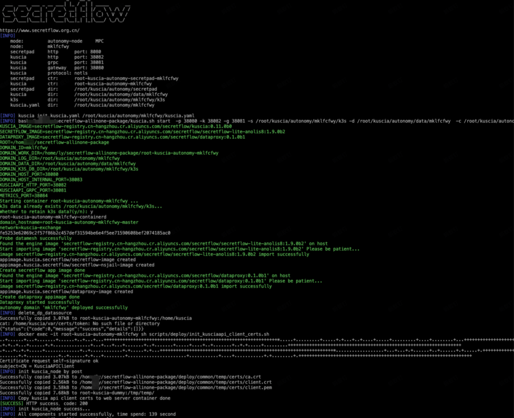

# 添加autonomy_node节点

可以通过<添加autonomy_node节点>来实现一个机构多节点的功能。

## step1:新增计算节点

点击<新增计算节点>


输入节点名称


可以看到如下节点，点击alice-isv-01节点，可以看到节点相关信息，此时节点状态为不可用。

  


## step2:在宿主机上进行安装部署

与安装autonomy节点不同点在于执行脚本命令不同，脚本执行后操作步骤相同，这里仅提供相关部署命令。

```shell
# -n：平台节点Id，上图中“mklfcfwy”
# -m：secretpad页面入口地址，宿主机真实ip和宿主机端口（本文以alice-isv为例）
# -t：从页面节点信息中复制获取，如上图
# -p，-k，-g，-q，-x，-P和autonomy节点部署含义相同，此处不再过多介绍

./install.sh autonomy-node -n mklfcfwy -m 'http://xxxxx:18088' -t xdeploy-tokenx -p 38080 -g 38081 -k 38082 -q 38083 -x 38084 -P notls
```

脚本执行过程如下



当安装成功后，刷新web页面，可以看到新增的节点已经可用。


