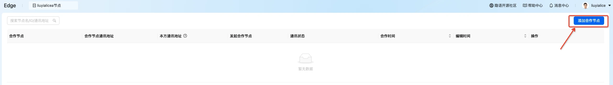
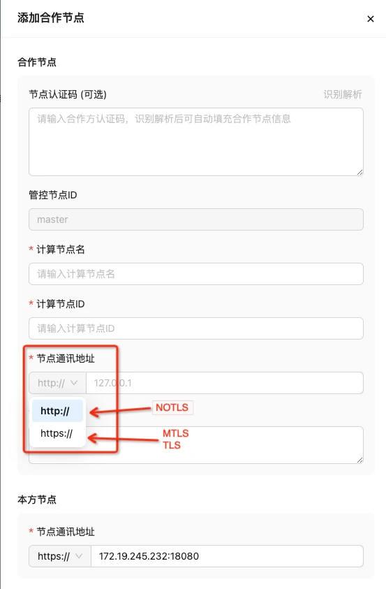

# 添加合作节点

节点之间通过<添加合作节点>建立授权关系，此步骤是后续创建合作项目进行联合计算的前提。需要双方分别添加对方节点才可建立双向授权。

## step1:查看/编辑本方节点信息

默认通讯地址为本机地址，需用户自行修改为对外通讯地址，修改后系统会更新节点认证码；

Tips：由于本机会有多网卡，以及不同局域网和广域网的地址出口 IP 不同，需要用户自行查看判断 IP 地址，

查看方法：以 Linux 为例，命令行输入命令 ifconfig；端口号为部署 SecretPad 时用户自行确定的 Kuscia p2p 节点的gateway
端口。

```shell
ifconfig
```

通过点击“我的节点”获取节点认证码、节点名称、节点ID、公钥。


根据本机真实IP（ifconfig获取），部署时-p指定的端口（docker ps 查看kuscia容器1080在宿主机映射的端口），修改通讯地址

推荐用“节点认证码”用于给其他方进行<添加合作节点>操作。


## Step2:添加合作节点

点击<添加合作节点>  


1.输入要添加的合作节点的节点认证码  
2.输入后点击<识别解析>  
3.修改为本机IP,并选择对应的协议  
<font color=#DF2A3F>重要：合作双方需分别添加对应合作节点</font>

  
Tips：节点通讯地址协议是根据平台安装时「-P 参数（默认是TLS）」自动生成，NOTLS对应http，TLS和MTLS对应https。