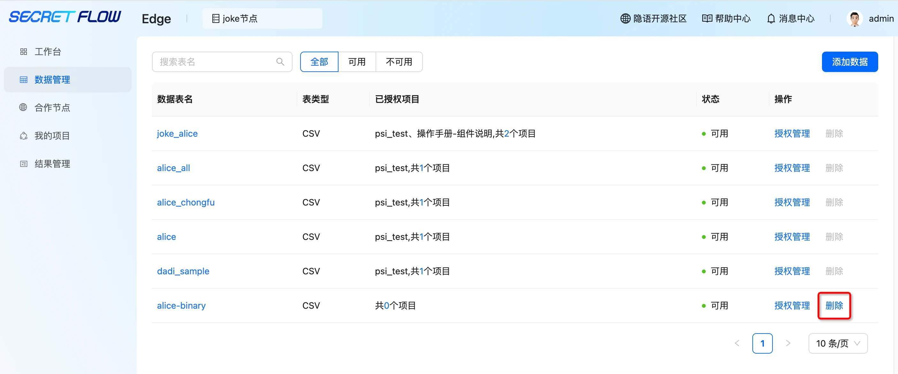
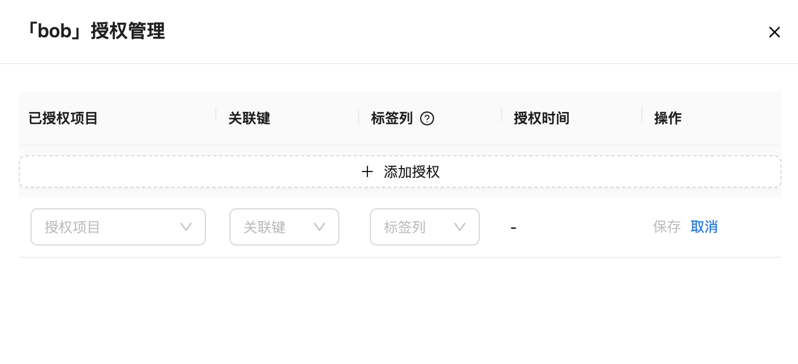
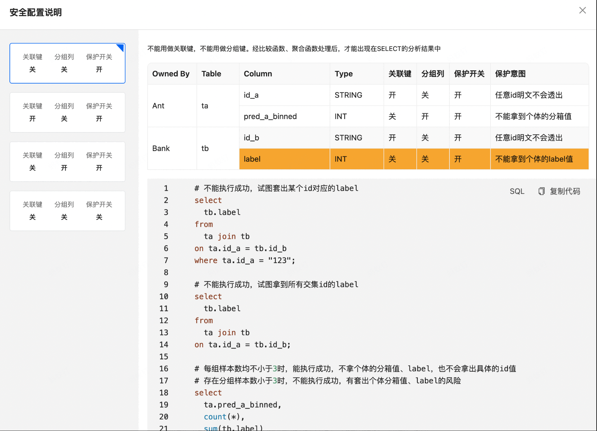
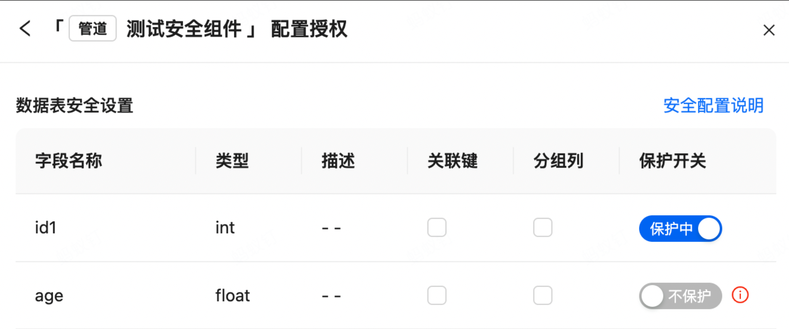
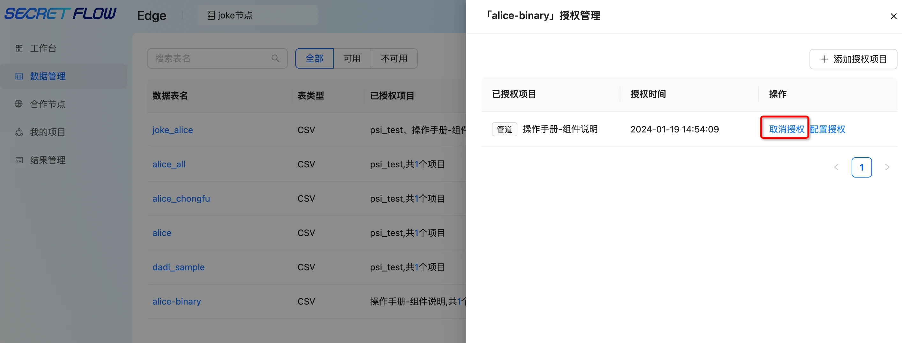

# 数据管理

## 1. 模块说明

本模块主要是对节点自有数据进行管理，包括添加数据、删除数据、进行数据授权、取消数据授权操作

## 2. 添加数据

用户需添加自有数据用于离线任务研发或在线预测，在数据管理右侧点击“添加数据”：

可选择本地数据源、HTTP数据源或在数据源管理注册的oss数据源；

以选择本地数据源为例：

注：需在此页面等待数据上传完毕，如中途关闭页面会导致数据上传中断

上传数据后，可设置数据表名称、输入数据表描述及特征描述后点击“提交”。

重要：特征名称需和实际文件的 schame 名称保持一致。

## 3. 删除数据

点击“删除”按钮可删除训练数据

 注：已授权到项目中的数据无法删除，删除按钮为灰色 

## 4. 授权管理

若想在某项目中使用节点的数据，需先将数据授权给该项目。点击“授权管理”—“添加授权”—选择“关联项目”、“关联键”（可关联两张表的唯一值）、“标签列”（非必填）—点击“保存”。

 注：双方节点都需上传训练数据并进行授权 

## 5. 安全配置

在数据授权的时候，启用了数据表安全设置功能，针对表字段增加关联键，分组列，保护开关配置，目前安全配置仅适用于 SCQL 联合分析组件，可以根据实际情况进行配置，以下将会以隐私求交相关组件为例。

  

点击安全配置说明可以查看具体配置规则

安全配置包含：  
**关联键**：注意选择关联键时，保护开关会自动打开，且无法同时选择分组列。  
**分组列**：注意选择分组列时，保护开关会自动打开，且无法同时选择关联键。  

保护开关：如果关闭，字段将不被保护，字段数值可以明文透出在结果中，字段可以任意操作；当打开时，经比较函数、聚合函数处理后，才能出现在SELECT的分析结果中；注意保护开关可以单独打开。

隐私求交仅使用了求交键，打开id1的保护开关。

  

其它具体配置场景，建议在配置授权时，查看安全配置说明。

## 6. 取消授权

如需对某项目取消数据授权，点击“授权管理”—“取消授权”即可

