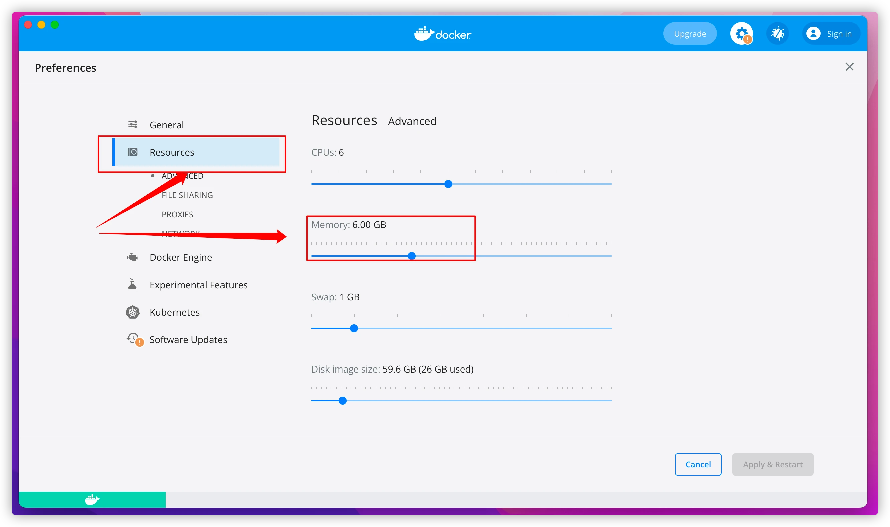
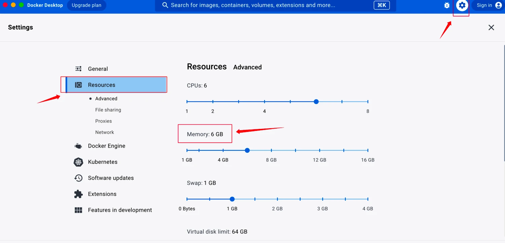
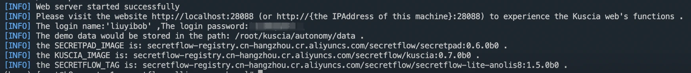

# 平台安装指引

## 1.安装指引

## 1.1. 系统要求

操作系统：MacOS, CentOS7, CentOS8，Ubuntu 16.04 及以上版本，Windows(通过WSL2上的 Ubuntu)

资源：8core/16G Memory/200G Hard disk

Docker：推荐使用 20.10.24 或更高版本

## 1.2. Docker安装与配置

若已安装可跳过

### 1.2.1.Linux（CentOS）

```shell
# 安装 docker
yum install -y yum-utils
yum-config-manager \
  --add-repo \
  https://download.docker.com/linux/centos/docker-ce.repo
yum install -y docker-ce docker-ce-cli containerd.io

# 启动 docker。
systemctl start docker
```

其他 OS 可参考 Docker 官方文档：https://docs.docker.com/engine/install/（其他 OS 暂未进行系统性测试，若安装过程中出现问题，可提交 [Issue](https://github.com/secretflow/secretflow/issues) 反馈，欢迎开发者们提供相应解决方案）

### 1.2.2.Windows系统

参考[Docker官方文档](https://docs.docker.com/desktop/install/windows-install/)在 Windows 上安装 Docker，并确保 Docker
的后段是**WSL2**

MacOS 需将 docker container 内存上限提⾼为 6G。

参考[WSL官方文档](https://learn.microsoft.com/en-us/windows/wsl/wsl-config#configure-global-options-with-wslconfig)
设置对应的设置即可

### 1.2.3.mac OS

参考官网进行安装 https://docs.docker.com/desktop/install/mac-install/

### <font color=#DF2A3F> 非常重要📢 ： Docker 配置 </font>

**需将 docker container 内存上限提高为 6G，操作步骤如下（版本不同操作入口可能不同）：**

示例一（V4.3.1）：

 

示例二（V4.20.1）：



## 1.3. 隐语体验部署包安装（Linux）

### 1.3.1.解压部署包

下载部署包后解压

### 1.3.2.安装部署

通过cd命令进入解压后的部署包目录
执行 `install.sh` 安装隐语平台部署包

<font color=#DF2A3F>Tips：

①节点名称由用户自定义，最多 63 个字符，只能包含小写字母、数字，以及 '-'，且必须以字母或数字开头，必须以字母或数字结尾，默认节点名称就是节点ID；

②默认部署成功就是一个节点，如需安装新的节点，重复操作即可，注意一台电脑安装两个节点需保证两个节点名称/路径/端口均不同。 </font>

```shell
# 进入部署包所在路径
cd 部署包所在路径
sh install.sh autonomy -n alice -s 8080 -g 40803 -k 40802 -p 10080 -q 13081 -P mtls
```

端口示例：
```shell
容器:                端口对应:外部->内部  部署参数:
secretpad  http     port:  8088->8080   -s 参数
kuscia     http     prot:  18082->8082  -k 参数
kuscia     grpc     port:  18083->8083  -g 参数
kuscia     gateway  port:  18080->1080  -p 参数
```

配置参数详解：

- n:节点名称，平台页面的计算节点ID
- m:master节点地址
   - 协议:与—P参数对应关系
      - notls->http
      - (tls、mtls)->https
   - ip:master节点的ip地址
   - port:master节点的gateway端口号
- t:节点token，平台页面中的节点部署令牌
- d:项目的安装目录(默认安装目录是：$HOME/kuscia)
- p:参数传递的是 lite/autonomy 容器 kuscia-gateway 映射到主机的端口，保证和主机上现有的端口不冲突即可
- k:参数传递的是 lite/autonomy 容器 Kuscia-api 映射到主机的 HTTP/HTTPS 端口，保证和主机上现有的端口不冲突即可
- g:参数传递的是 lite/autonomy 容器 Kuscia-grpc 映射到主机的 HTTP/HTTPS 端口，保证和主机上现有的端口不冲突即可
- s:secretpad平台端口，保证和主机上现有的端口不冲突即可
- q:参数传递的是 lite/autonomy 容器 kuccia 映射到主机的 env 端口，保证和主机上现有的端口不冲突即可
- P:KusciaAPI 以及节点对外网关使用的通信协议，有三种安全模式可供选择：notls/tls/mtls（非必填，只允许小写，默认：tls)，与 Kuscia 部署配置相同 [protocol参考链接](https://www.secretflow.org.cn/zh-CN/docs/kuscia/v0.6.0b0/deployment/kuscia_config_cn#id3)
   - notls: 此模式下，通信通过未加密的 HTTP 传输，比较安全的内部网络环境或者 Kuscia 已经存在外部网关的情况可以使用该模式【直接部署在公网有安全风险】。
   - tls: (默认)在此模式下，通信通过 TLS 协议进行加密，即使用 HTTPS 进行安全传输，不需要手动配置证书。
   - mtls: 这种模式也使用 HTTPS 进行通信，但它支持双向 TLS 验证，需要手动交换证书以建立安全连接。

### 1.3.3.设置登录web页面的用户名和密码

**用户名：** 长度要求大于4位字符；

**密码：** 长度要求大于8位字符，需包含大小写及特殊字符。


### 1.3.4.安装完成

看到“web server started successfully”即为部署成功



### 1.3.5.浏览器访问平台

部署成功后，浏览器打开 http://localhost:secretpad 端口号（或者 http://部署服务器的ip:secretpad端口号），利用部署过程中配置的用户密码登录平台即可体验


若在部署过程中有相关的问题或者建议，可提交[Issue](https://github.com/secretflow/secretflow/issues)反馈。