# 隐语SecretPad平台新增组件

# 概述
本教程将会和读者一起实践新增一个隐语组件，读者有一定的隐语知识或者有python开发有一定的开发基础，实践及操作会更快捷。

# 什么是隐语组件？

在隐语平台中，你需要基于一系列组件来组建训练流：

- **组件**：隐语提供的最小粒度的计算任务。
- **组件列表**：组件的集合。
- **组件实例**：组件的一次调用。
- **训练流**：组件实例的DAG流。

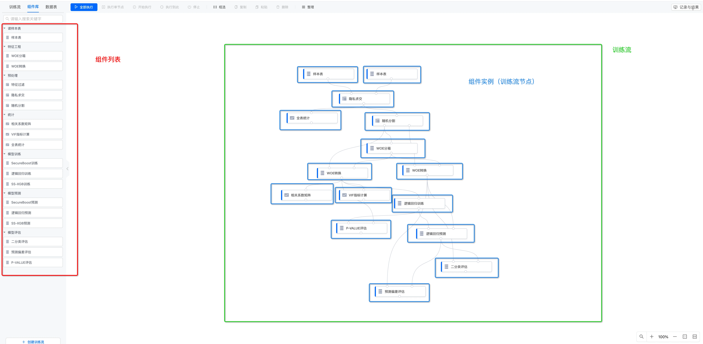

每一个组件（以“隐私求交”为例）都有以下接口：

- 输入(input)

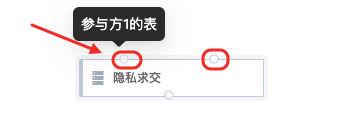

- 输出(output)

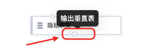

- 参数(attribute)

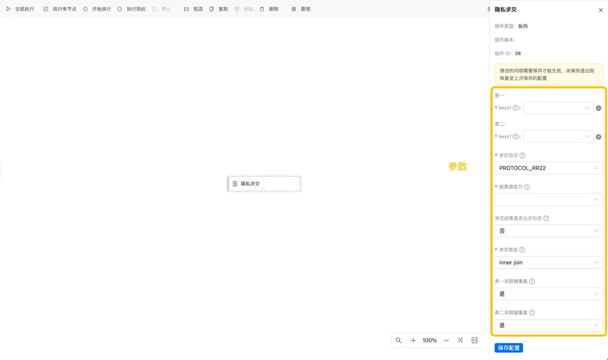

知识扩展：
可以利用官方提供的隐语组件来构建一个训练流来完成相对复杂的一个隐私计算任务。然后有时候你可能会有以下诉求：

- 我想修改某个组件的实现（我发明了更好的算法）。
- 我想修改某个组件的参数。
- 我想支持新的输入类型。
- 我想创建一个新的组件。

在开始教程之前，我们先简单了解一下，隐语组件在整个平台产品中的角色。

下图描述了隐语技术栈各模块的关系：

- 1.SecretPad是隐语平台的用户界面，用户在这里可以看到所有组件列表；用户利用组件来构建训练流。
- 2.Kuscia节点部署在每一个计算方，负责拉起隐语组件实例。
- 3.SecretFlow镜像包含了隐语的binary，负责实际执行组件实例。

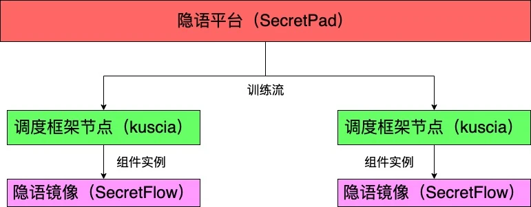


# 开发新组件步骤
## 新组件目录结构
```shell
├── test_compare
│   ├── requirements.txt
│   ├── setup.py	    # 打包入口
│   └── ss_compare
│       ├── entry.py	    # 组件入口
│       ├── __init__.py
│       └── ss_compare.py   # 自定义组件
```
创建test_compare和ss_compare文件夹，并按照步骤依次创建组件文件：
```shell
$ mkdir -p test_compare/ss_compare/
$ cd test_compare/
```

## 配置secretflow依赖版本
在 <font color=#E83E8C> test_compare/ </font> 下创建 requirements.txt
```shell
//创建文件
$ touch requirements.txt
//设置secretflow的依赖版本
secretflow-lite==1.11.0b1 
```
## 配置组件打包
在 <font color=#E83E8C> test_compare/ </font> 下创建 <span>setup.py</span>
```shell
$ touch setup.py
```

定义组件打包入口信息
```setup.py
from setuptools import find_packages, setup

def read_requirements(file):
    with open(file) as f:
        return [line.strip() for line in f if line and not line.startswith("#")]

setup(
    name="test_compare",
    version="0.1",
    packages=find_packages(),
    install_requires=read_requirements("requirements.txt"),
    entry_points={
        "secretflow_plugins": [
            "ss_compare=ss_compare.entry:main",
        ],
    },
)
```
- name：包名。
- version：包的版本号。
- packages：需要包含的包。
- install_requires：定义打包时需要安装的依赖库。
- entry_points：组件的入口。需要指定group为secretflow_plugins，每个插件名需要全局唯一,entry.py为插件入口函数，需要import所需要的组件。

## 配置组件注册文件
在 <font color=#E83E8C> test_compare/ss_compare/ </font> 下创建 <span>entry.py</span>
 
```shell
$ touch ss_compare/entry.py
```

定义组件的注册信息

```shell
import os

from secretflow.component.core import load_component_modules

def main():
    root_path = os.path.dirname(__file__)
    load_component_modules(
        root_path, "ss_compare", ignore_keys=["entry.py"], ignore_root_files=False
    )
```
load_component_modules为Secretflow的动态加载组件的函数。
- root_path：当前目录
- test_compare：组件名称
- ignore_keys：忽略指定文件
- ignore_root_files：是否忽略根目录文件（此处为不忽略）

## 配置组件声明
在 <font color=#E83E8C> test_compare/ss_compare/ </font> 下创建 <span> __init__.py </span>
```shell
$ touch ss_compare/__init__.py
```

声明组件为python模块

```shell 
#__init__.py
# Copyright 2024 Ant Group Co., Ltd.
#
# Licensed under the Apache License, Version 2.0 (the "License");
# you may not use this file except in compliance with the License.
# You may obtain a copy of the License at
#
#   http://www.apache.org/licenses/LICENSE-2.0
#
# Unless required by applicable law or agreed to in writing, software
# distributed under the License is distributed on an "AS IS" BASIS,
# WITHOUT WARRANTIES OR CONDITIONS OF ANY KIND, either express or implied.
# See the License for the specific language governing permissions and
# limitations under the License.
```
标记 ss_compare 为一个python模块。

## 创建组件
在 <span style="color: #E83E8C;"> ss_compare/ </span> 文件夹下新建文件 <span style="color: #E83E8C;"> ss_compare.py </span>

```shell
$ touch ss_compare/ss_compare.py
```
## 组件代码示例
```shell
# Copyright 2024 Ant Group Co., Ltd.
#
# Licensed under the Apache License, Version 2.0 (the "License");
# you may not use this file except in compliance with the License.
# You may obtain a copy of the License at
#
#   http://www.apache.org/licenses/LICENSE-2.0
#
# Unless required by applicable law or agreed to in writing, software
# distributed under the License is distributed on an "AS IS" BASIS,
# WITHOUT WARRANTIES OR CONDITIONS OF ANY KIND, either express or implied.
# See the License for the specific language governing permissions and
# limitations under the License.


import logging

import pyarrow as pa
import pyarrow.compute as pc
from secretflow.component.core import (
    Component,
    CompVDataFrame,
    Context,
    DistDataType,
    Field,
    Input,
    Interval,
    Output,
    VTable,
    VTableField,
    VTableFieldKind,
    register,
)
from secretflow.device import PYU

@register(domain="user", version="1.0.0", name="ss_compare")

class SSCompare(Component):
    """
    compare two tables.
    """

    tolerance: int = Field.attr(
        desc="two numbers to be equal if they are within tolerance.",
        default=10,
        bound_limit=Interval.closed(0, None),
    )
    alice_value: str = Field.table_column_attr(
        "input_table", desc="Column(s) used to compare."
    )
    bob_value: str = Field.table_column_attr(
        "input_table", desc="Column(s) used to compare."
    )

    input_table: Input = Field.input(  # type: ignore
        desc="Input vertical table",
        types=[DistDataType.VERTICAL_TABLE],
    )

    alice_output: Output = Field.output(
        desc="Output for alice",
        types=[DistDataType.INDIVIDUAL_TABLE],
    )
    bob_output: Output = Field.output(
        desc="Output for bob",
        types=[DistDataType.INDIVIDUAL_TABLE],
    )

    def evaluate(self, ctx: Context) -> None:
        logging.warning("ss_compare evaluate")
        input_tbl = VTable.from_distdata(self.input_table)
        for p in input_tbl.parties.values():
            if self.alice_value in p.schema.fields:
                alice_party = p.party
            elif self.bob_value in p.schema.fields:
                bob_party = p.party

        # init devices.
        alice = PYU(alice_party)
        bob = PYU(bob_party)
        spu = ctx.make_spu()

        input_df = ctx.load_table(self.input_table)
        values = [self.alice_value, self.bob_value]
        selected_df = input_df[values]

        # pass inputs from alice and bob PYUs to SPU
        alice_input_spu_object = selected_df.partitions[alice].to(spu)
        bob_input_spu_object = selected_df.partitions[bob].to(spu)

        from secretflow.device import SPUCompilerNumReturnsPolicy

        def compare_fn(x_tbl: pa.Table, y_tbl: pa.Table, tolerance: int):
            x = x_tbl.column(0)
            y = y_tbl.column(0)
            res_x = pc.greater(pc.subtract(x, tolerance), y)
            res_y = pc.greater(pc.subtract(y, tolerance), x)
            schema = pa.schema(
                VTableField.pa_field("result", pa.bool_(), VTableFieldKind.FEATURE)
            )
            res_x_tbl = pa.Table.from_arrays([res_x], schema=schema)
            res_y_tbl = pa.Table.from_arrays([res_y], schema=schema)

            return res_x_tbl, res_y_tbl

        # do comparison
        output_alice_spu_obj, output_bob_spu_obj = spu(
            compare_fn,
            num_returns_policy=SPUCompilerNumReturnsPolicy.FROM_USER,
            user_specified_num_returns=2,
        )(alice_input_spu_object, bob_input_spu_object, self.tolerance)

        def merge(in_df: pa.Table, id_keys: list[str], res: pa.Table):
            new_columns = [in_df[name] for name in id_keys]
            new_columns.extend(res.columns)
            return pa.Table.from_arrays(new_columns)

        id_tbl = input_tbl.select_by_kinds(VTableFieldKind.ID)
        alice_res = alice(merge)(
            input_df.partitions[alice],
            id_tbl.parties[alice_party].columns,
            output_alice_spu_obj.to(alice),
        )
        alice_df = CompVDataFrame(
            partitions={alice: alice_res}, system_info=input_tbl.system_info
        )
        ctx.dump_to(alice_df, self.alice_output)

        bob_res = alice(merge)(
            input_df.partitions[bob],
            id_tbl.parties[bob_party].columns,
            output_bob_spu_obj.to(bob),
        )
        bob_df = CompVDataFrame(
            partitions={bob: bob_res}, system_info=input_tbl.system_info
        )
        ctx.dump_to(bob_df, self.bob_output)
```


### 定义组件
定义组件的输入结构：
```shell
import logging

import jax.numpy as jnp
import pyarrow as pa
import pyarrow.compute as pc
from secretflow.component.core import (
    Component,
    CompVDataFrame,
    Context,
    DistDataType,
    Field,
    Input,
    Interval,
    Output,
    VTable,
    VTableField,
    VTableFieldKind,
    register,
)
from secretflow.device import PYU
from secretflow.data import FedNdarray, PartitionWay
from secretflow.device.driver import wait
from secretflow.spec.v1.data_pb2  import (
        DistData,
        IndividualTable,
        TableSchema,
        VerticalTable,
)
import os

@register(domain="user", version="1.0.0", name="ss_compare")
```

这段代码表明了：

- 组件名称：<span style="color: #E83E8C;"> ss_compare </span>
- domain: <span style="color: #E83E8C;"> user </span>,可以理解为命名空间/分类
- version: <span style="color: #E83E8C;"> 0.0.1 </span>
- desc: <span style="color: #E83E8C;"> compare two tables. </span> 组件描述。

### 声明组件

```shell
class SSCompare(Component):
```
- Component：组件的基类

### 参数介绍
```shell
tolerance: int = Field.attr(
    desc="two numbers to be equal if they are within tolerance.",
    default=10,
    bound_limit=Interval.closed(0, None),
)
```

在这里，我们为 <span style="color: #E83E8C;"> ss_compare </span> 定义了一个参数 <span style="color: #E83E8C;"> tolerance </span>
,为了一定程度上保护两位富翁的隐私，我们可以认为在一定范围的区别可以认为是相等的。

<font color=#E83E8C> int_attr </font> 代表了 <font color=#E83E8C> tolerance </font> 是一个integer参数。

- Field.attr：定义 tolerance 参数的配置属性
    - desc： 描述。
    - defaultdesc： 默认值
    -   bound_limit：约束，只能取大于0的整数。

组件还可以设置其他类型的参数，请参阅：
https://github.com/secretflow/secretflow/blob/main/secretflow/component/component.py#L256-L719


### 选择列
```shell
alice_value: str = Field.table_column_attr(
    "input_table", desc="Column(s) used to compare."
)

bob_value: str = Field.table_column_attr(
    "input_table", desc="Column(s) used to compare."
)
```
定义需要比较的列（分别属于Alice和Bob的输入表）。
- input_table：输入表的名称。
- desc：描述。


### 定义输入输出
```shell
input_table: Input = Field.input(
    desc="Input vertical table",
    types=[DistDataType.VERTICAL_TABLE],
)

alice_output: Output = Field.output(
    desc="Output for alice",
    types=[DistDataType.INDIVIDUAL_TABLE],
)

bob_output: Output = Field.output(
    desc="Output for bob",
    types=[DistDataType.INDIVIDUAL_TABLE],
)
```

我们在这里定义了两个输出：<span style="color: #E83E8C;"> alice_output/bob_output </span> 和一个输入 <span style="color: #E83E8C;">input_table </span>

输入和输出的定义是类似的：

- desc：描述。
- types：类型，包括：
    - INDIVIDUAL_TABLE：单方表。
    - VERTICAL_TABLE：垂直切分表，联合表。


### 定义组件执行内容

```shell
def evaluate(self, ctx: Context) -> None:
    logging.warning("ss_compare evaluate")

    # load inputs
    meta = VerticalTable()
    self.input_table.meta.Unpack(meta)

    # get alice and bob party
    for data_ref, schema in zip(list(self.input_table.data_refs), list(meta.schemas)):
        if self.alice_value in list(schema.features):
            alice_party = data_ref.party
            alice_ids = list(schema.ids)
            alice_id_types = list(schema.id_types)
        elif self.bob_value in list(schema.features):
            bob_party = data_ref.party
            bob_ids = list(schema.ids)
            bob_id_types = list(schema.id_types)

    # init devices.
    alice = PYU(alice_party)
    bob = PYU(bob_party)
    spu = ctx.make_spu()

    input_df = ctx.load_table(self.input_table)
    values = [self.alice_value, self.bob_value]
    selected_df = input_df[values]

    # inputs from alice and bob PYUs to SPU
    alice_input_spu_object = selected_df.partitions[alice].to(spu)
    bob_input_spu_object = selected_df.partitions[bob].to(spu)

    from secretflow.device import SPUCompilerNumReturnsPolicy

    def compare_fn(x, y, tolerance):
        return (x - tolerance) > y, (y - tolerance) > x

    # do comparison
    output_alice_spu_obj, output_bob_spu_obj = spu(
        compare_fn,
        num_returns_policy=SPUCompilerNumReturnsPolicy.FROM_USER,
        user_specified_num_returns=2,
    )(alice_input_spu_object, bob_input_spu_object, self.tolerance)

    # convert to FedNdarray
    res = FedNdarray(
        partitions={
            alice: output_alice_spu_obj.to(alice),
            bob: output_bob_spu_obj.to(bob),
        },
        partition_way=PartitionWay.VERTICAL,
    )

    def save(id, id_key, res, res_key, path):
        print(f'save:id: {id}')
        print(f'save():id: {type(id)}')
        logging.info(f'save():id: {id}')
        logging.info(f'save():id: {type(id)}')
        import pandas as pd

        x = pd.DataFrame(id.to_pandas(), columns=id_key)
        label = pd.DataFrame(res, columns=res_key)
        x = pd.concat([x, label], axis=1)

        x.to_csv(path, index=False)

    data_dir = ctx.data_dir

    alice_id_df = input_df[alice_ids]

    wait(
        alice(save)(
            alice_id_df.partitions[alice].data,
            alice_ids,
            res.partitions[alice].data,
            ['result'],
            os.path.join(data_dir, self.alice_output.uri),
        )
    )

    bob_id_df = input_df[bob_ids]

    wait(
        bob(save)(
            bob_id_df.partitions[bob].data,
            bob_ids,
            res.partitions[bob].data,
            ['result'],
            os.path.join(data_dir, self.bob_output.uri),
        )
    )

    # generate DistData
    alice_db = DistData(
        name='result',
        type=str(DistDataType.INDIVIDUAL_TABLE),
        data_refs=[DistData.DataRef(uri=self.alice_output.uri, party=alice.party, format="csv")],
    )

    alice_meta = IndividualTable(
        schema=TableSchema(
            ids=alice_ids,
            id_types=alice_id_types,
            features=['result'],
            feature_types=['bool'],
        ),
        line_count=-1,
    )

    alice_db.meta.Pack(alice_meta)

    bob_db = DistData(
        name='result',
        type=str(DistDataType.INDIVIDUAL_TABLE),
        data_refs=[DistData.DataRef(uri=self.bob_output.uri, party=bob.party, format="csv")],
    )

    bob_meta = IndividualTable(
        schema=TableSchema(
            ids=bob_ids,
            id_types=bob_id_types,
            features=['result'],
            feature_types=['bool'],
        ),
        line_count=-1,
    )

    bob_db.meta.Pack(bob_meta)

    self.alice_output.data = alice_db

    self.bob_output.data = bob_db
```
1. ctx包含了所有环境信息，比如spu的config。
2. CompVDataFrame：作为结果存储的数据结构，返回一个VDataFrame对象。


## 打包组件
在 <font color=#E83E8C> test_compare/ </font> 下执行打包命令：`python setup.py bdist_wheel`，成功后会生成 <font color=#E83E8C> dist/test_compare-0.1-py3-none-any.whl </font> 文件。
接下来可以检查 ss_compare 是否打包成功：
```shell
$ pip install dist/test_compare-0.1-py3-none-any.whl

$ secretflow component ls
```
如果需要创建多个组件，重复上述步骤即可。


# 打包隐语镜像

## 创建Dockerfile
在 <font color=#E83E8C> test_compare/ </font> 下创建 <font color=#E83E8C> docker/ </font> 目录并生成 Dockerfile；
```shell
$ mkdir docker

$ touch docker/Dockerfile
```
参考 https://github.com/secretflow/secretflow/blob/main/docker/dev/Dockerfile 定义Dockerfile；
```
FROM openanolis/anolisos:8.8 AS builder

RUN yum install -y \
    wget gcc gcc-c++ autoconf bison flex git protobuf-devel libnl3-devel \
    libtool make pkg-config protobuf-compiler \
    && yum clean all

RUN cd / && git clone https://github.com/google/nsjail.git \
    && cd /nsjail && git checkout 3.3 -b v3.3 \
    && make && mv /nsjail/nsjail /bin

FROM secretflow/anolis8-python:3.10.13 AS python

FROM openanolis/anolisos:8.8

LABEL maintainer="secretflow-contact@service.alipay.com"

COPY --from=builder /bin/nsjail /usr/local/bin/
COPY --from=python /root/miniconda3/envs/secretflow/bin/ /usr/local/bin/
COPY --from=python /root/miniconda3/envs/secretflow/lib/ /usr/local/lib/

RUN yum install -y protobuf libnl3 libgomp && yum clean all

RUN grep -rl '#!/root/miniconda3/envs/secretflow/bin' /usr/local/bin/ | xargs sed -i -e 's/#!\/root\/miniconda3\/envs\/secretflow/#!\/usr\/local/g'

COPY *.whl /tmp/

RUN pip install -i https://mirrors.aliyun.com/pypi/simple/ kuscia
RUN pip install -i https://mirrors.aliyun.com/pypi/simple/ /tmp/*.whl && rm -rf /root/.cache

# COPY .nsjail /root/.nsjail

ARG config_templates=""
LABEL kuscia.secretflow.config-templates=$config_templates

ARG deploy_templates=""
LABEL kuscia.secretflow.deploy-templates=$deploy_templates

# run as root for now
WORKDIR /root

CMD ["/bin/bash"]
```

将生成的 <font color=#E83E8C> dist/test_compare-0.1-py3-none-any.whl </font>  拷贝到 <font color=#E83E8C> docker/ </font> 路径下；
```shell
$ cp dist/* docker/
```

## 打包镜像
```shell
$ cd docker/
$ docker build . -f Dockerfile -t secretflow/sf-dev-anolis8:test_compare
```

成功之后你可以用 `docker inspect` 来检查镜像。
```shell
$ docker image inspect secretflow/sf-dev-anolis8:test_compare
```

在打包好镜像之后，需参考后续步骤完成下面操作：
- 将自定义的新组件更新到隐语SecretPad平台组件列表中（此步骤后续在1.11中由secretpad完成）。
- 将自定义的新组件镜像注册在调度框架Kuscia中。
在完成上述步骤后，就可以在隐语SecretPad平台上使用自定义的新组件了。


# 注册新组件的secretFLow镜像

在注册隐语镜像前，需保证已部署隐语SecretPad平台和调度框架Kuscia节点。
更新平台组件列表时，需要准备好自定义的Secretflow组件镜像。

## 获取工具脚本


```shell

#获取脚本（'pad容器id'替换为真实pad容器id）
docker cp pad容器id:/app/scripts/update-sf-components.sh . && chmod +x update-sf-components.sh
```

## 运行工具脚本

```shell
# -u: 指定 ${USER}。若不指定，则使用系统默认${USER}，通过命令echo ${USER}查看
# -i: 指定自定义Secretflow组件镜像为 "secretflow/sf-dev-anolis8:test_compare"
#更新组件（'pad容器id'替换为真实pad容器id）
sed -i 's/SECRETPAD_CONTAINER_NAME="${DEPLOY_USER}-kuscia-secretpad"/SECRETPAD_CONTAINER_NAME="pad容器id"/g' update-sf-components.sh  
./update-sf-components.sh -u ${USER} -i secretflow/sf-dev-anolis8:test_compare

# 查看更多帮助信息
./update-sf-components.sh -h
```

## 在Kuscia中注册自定义算法镜像

⚠️**注意事项**
- 使用 <span style="color: #E83E8C;"> -n secretflow-image </span> 指定注册在Kuscia中的算法镜像AppImage名称为 <span style="color: #E83E8C;">
  secretflow-image </span>。
- 使用 <span style="color: #E83E8C;"> -i docker.io/secretflow/sf-dev-anolis8: test_compare </span> 指定打包的自定义Secretflow组件镜像。由于默认打包的镜像Repo为 docker.io，因此在导入镜像时需填写完成的镜像信息。

有关将自定义Secretflow组件镜像注册到Kuscia ，详细可参考[注册自定义算法镜像](https://www.secretflow.org.cn/docs/kuscia/latest/zh-Hans/development/register_custom_image#id6)

```shell
# -u: 指定 ${USER}
# -m: 指定中心化组网模式部署方式为 "center"
# -n: 指定Kuscia AppImage名称为 "secretflow-image"
# -i: 指定自定义Secretflow组件镜像为 "docker.io/secretflow/sf-dev-anolis8:test_compare"
```
点对点模式示例：
- Autonomy 节点需要同时导入引擎镜像和注册 Appimage，下面以 root-kuscia-autonomy-alice 节点为例，其他 autonomy 节点也需要进行导入
```shell
./register_app_image.sh -c root-kuscia-autonomy-alice -i secretflow-registry.cn-hangzhou.cr.aliyuncs.com/secretflow/scql:latest -f appimage.yaml --import
```

中心化模式示例：
- Master 节点注册 Appimage 即可，下面以 root-kuscia-master 为例
```shell
./register_app_image.sh -c root-kuscia-master -i secretflow-registry.cn-hangzhou.cr.aliyuncs.com/secretflow/scql:latest -f appimage.yaml
```
- Lite 节点导入引擎镜像即可，下面以 root-kuscia-lite-alice 节点为例，其他 lite 节点也需要进行导入
```shell
./register_app_image.sh -c root-kuscia-lite-alice -i secretflow-registry.cn-hangzhou.cr.aliyuncs.com/secretflow/scql:latest --import
```


# 使用新组件

## 导入数据

📎[alice_bank_account.csv](https://www.yuque.com/attachments/yuque/0/2023/csv/29690418/1692964409932-ae408839-c9a0-47d8-af28-9586e32315f3.csv)

📎[bob_bank_account.csv](https://www.yuque.com/attachments/yuque/0/2023/csv/29690418/1692964412445-26b38397-cac9-4223-938e-9c08ca4e612e.csv)

请在alice节点导入alice_bank_account，deposit_alice字段改为float

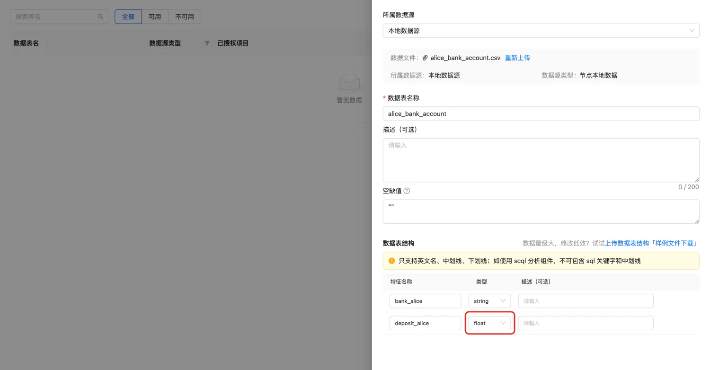

请在 bob 节点导入 bob_bank_account，deposit_bob字段改为float

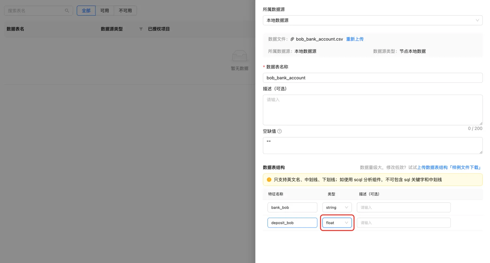

## 新建项目

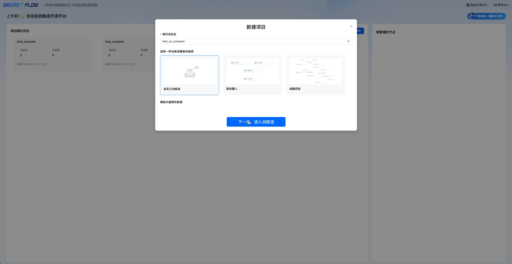

观察组件库，新组件已经成功注册

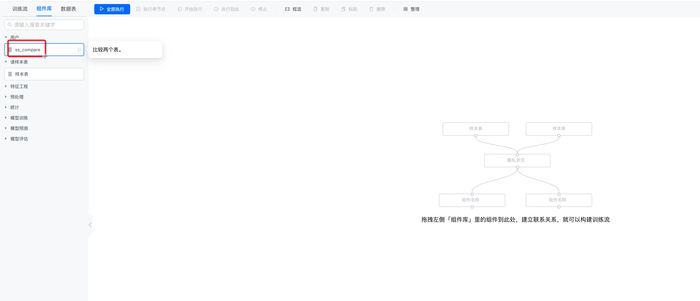

## 数据授权

在alice节点，将alice_bank_account授权给项目，注意关联键为bank_alice.

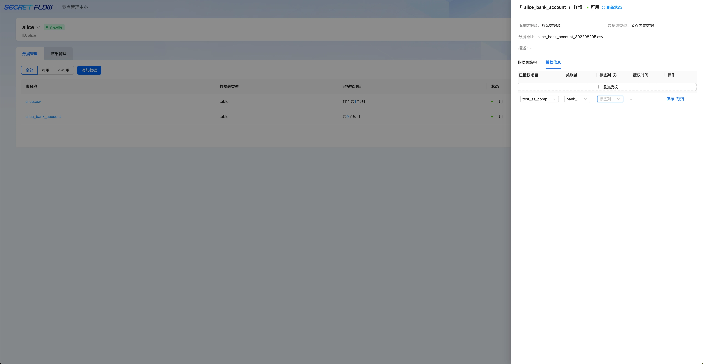

在bob节点，将bob_bank_account授权给项目，注意关联键为bank_bob.

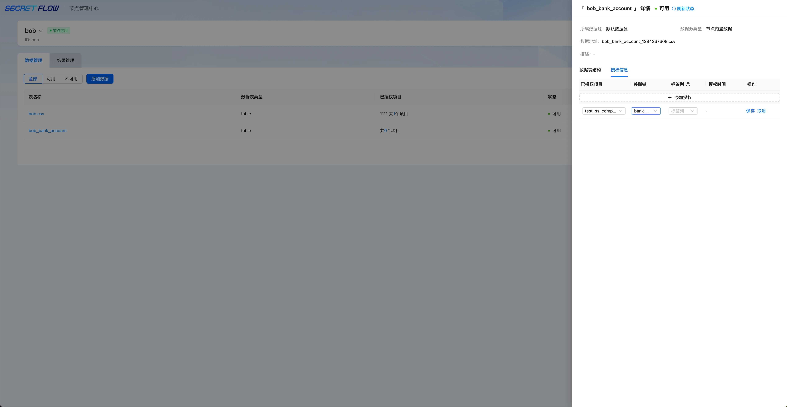

## 构建训练流

按照下图构建训练流

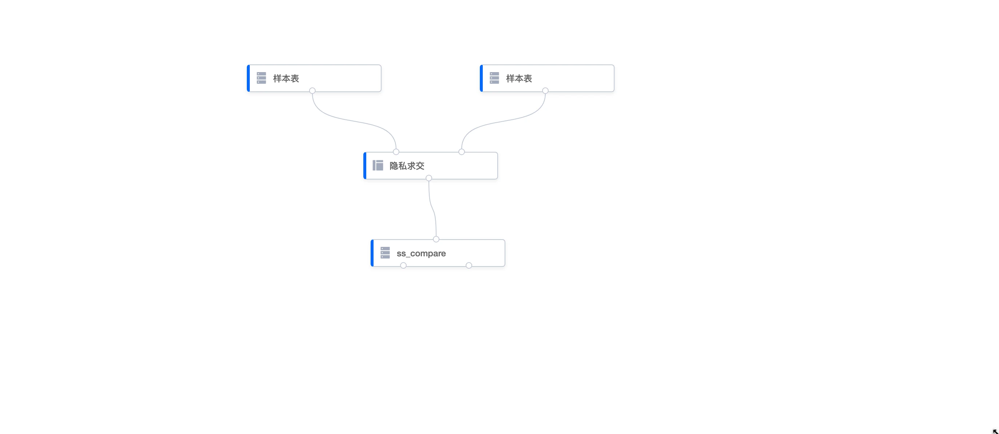

样本表组件1配置：

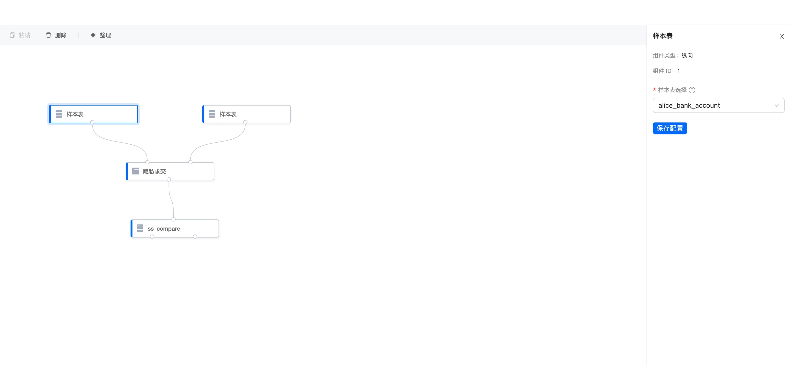

样本表组件2配置：

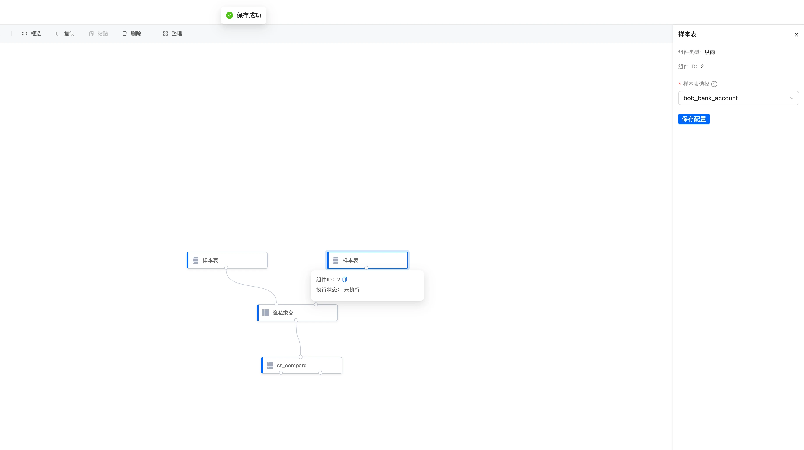

隐私求交组件配置：

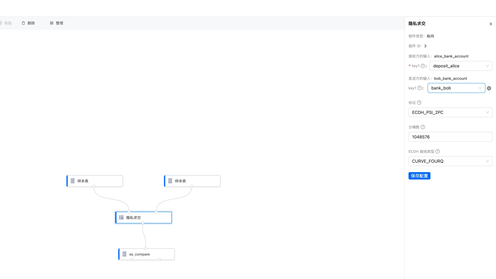

ss_compare组件配置：

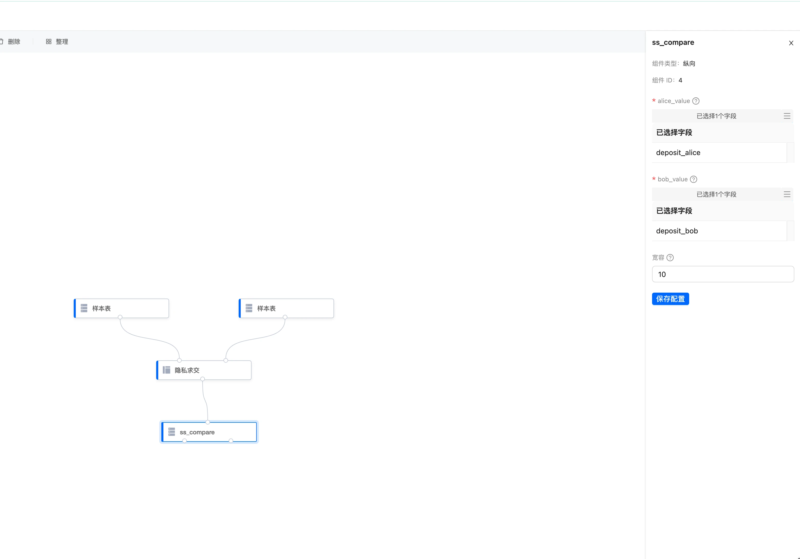

## 执行训练流

点击全部执行按钮。

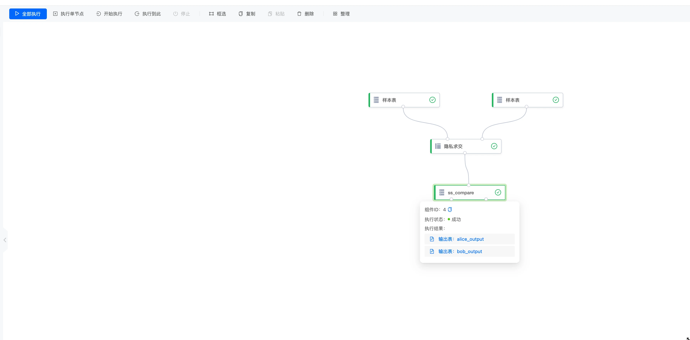

## 查看结果

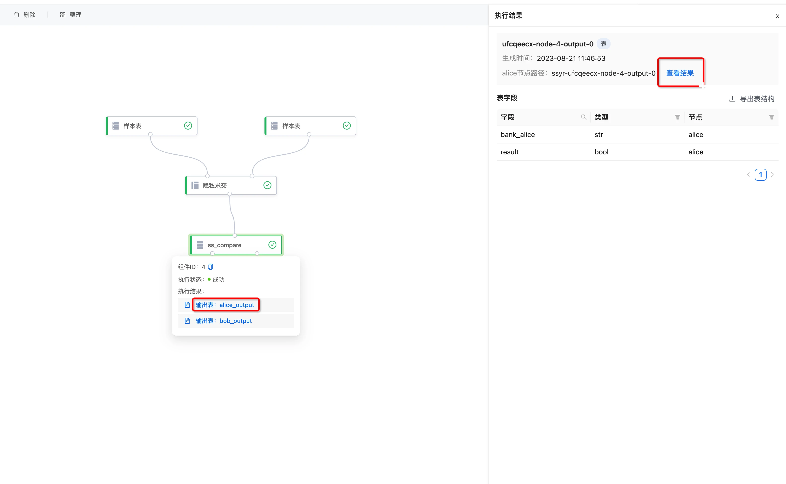

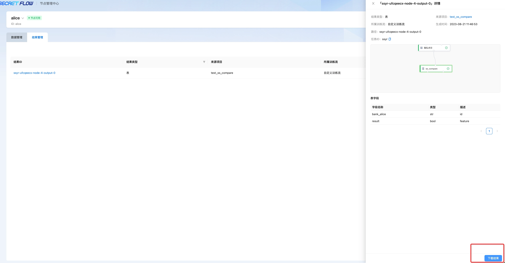

# 组件新增问题汇总（FAQ）
Q：secretpad上看不到新增的组件
- 先检查使用的secretflow版本，现在确定secretflow1.8版本register_app_image.sh脚本注册kuscia有问题，会出现注册失败的情况。可以从高于1.8版本下载后替换下。

Q：secretpad添加组件运行报错
- 检查组件算法的python文件，格式是否有python错误语法，修改完整的。

Q：使用新的组件隐私求交报错，提示找不到组件
- 检查 1.登陆双方kuscia 节点 docker exec -it 容器id bash 2.查询镜像信息 kubectl get appimage secretflow-image -oyaml 确定下镜像name:tag 是否是自己构建的自定义镜像，并修改成自己的自定义镜像。

Q：新增多个组件问题
```shell
1 检查多组件的目录是否匹配。
├── test_compare
│   ├── requirements.txt
│   ├── setup.py         	# 打包入口
│   └── ss_compare
│       ├── entry.py		# 组件入口
│       ├── __init__.py
│       └── ss_compare.py       # 自定义组件
│   └── ss_compare1
│       ├── entry.py		# 组件入口1
│       ├── __init__.py
│       └── ss_compare1.py      # 自定义组件1

2 检查setup.py 中配置的组件secretflow_plugins数组信息。
参考示例：
    entry_points={
        "secretflow_plugins": [
            "ss_compare=ss_compare.entry:main",
            "ss_compare1=ss_compare1.entry:main",
        ],
    },
3 参考配置组件注册文件,检查每个组件算法entry.py的组件名字是否正常。
```

# 总结

以上为隐语SecretPad平台新增组件的全部教程。

如果你对教程存在疑问，你可以直接留言或者在[GitHub Issues](https://github.com/secretflow/secretflow/issues)中发起issue。

如果你想要了解更多隐语组件的信息，请阅读[这些文档](https://www.secretflow.org.cn/docs/secretflow/latest/zh-Hans/component)。


