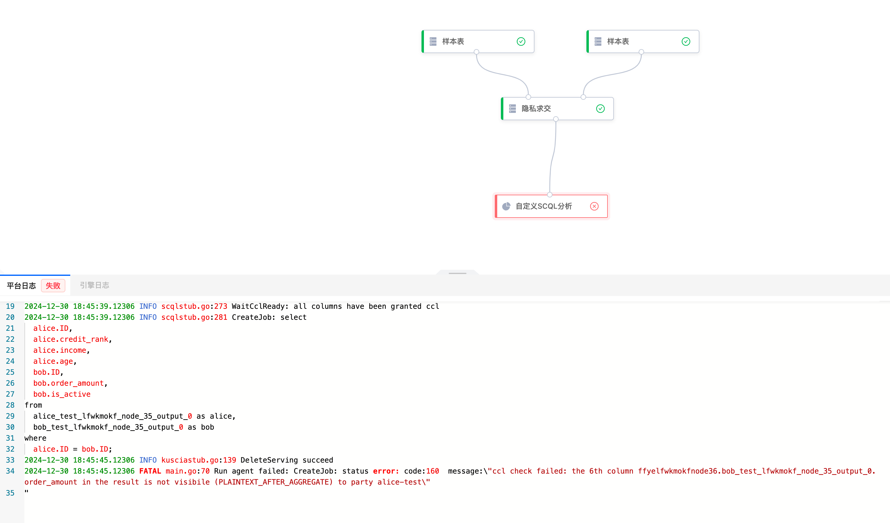

# 快速完成一个SCQL联合分析任务
前置准备：完成添加合作节点，创建项目后，可以进行SCQL联合分析任务
## Step1：上传数据
可以通过以下命令获取scql的demo数据
```shell
# alice的数据
wget https://github.com/secretflow/kuscia/tree/main/tests/data/scql-alice.csv

# bob的数据
wget https://github.com/secretflow/kuscia/tree/main/tests/data/scql-bob.csv
```
在添加数据时需要修改部分字段类型，如下:

alice侧需要将income字段的类型修改为float


bob侧需要将order_amount字段的类型修改为float


## Step2：数据授权（CCL）

数据添加完成之后需要将数据授权给对应项目


可以通过配置授权来进行CCL配置，具体配置规则查看安全配置说明，点击配置授权-点击安全配置说明，查看安全配置详情


以第一种安全配置进行示例说明


对bob数据进行CCL授权


### case1：执行如下sql，预期CCL报错
在自定义SCQL分析组件中填写如下sql，执行，预期执行报错，因为order_amount开启了保护开关，直接查询不满足SCQL的CCL权限规则
``` SQL
select
  alice.ID,
  alice.credit_rank,
  alice.income,
  alice.age,
  bob.ID,
  bob.order_amount,
  bob.is_active
from
  alice_test_lfwkmokf_node_35_output_0 as alice,
  bob_test_lfwkmokf_node_35_output_0 as bob
where
  alice.ID = bob.ID;
``` 

执行完成后符合预期



### case2：执行如下sql（不查询被保护的列），预期正常执行

状态正常，数据正常，结果数据列包含alice：ID，credit_rank，income，age；bob：ID，is_active

``` SQL
select
  alice.ID as alice_ID,
  alice.credit_rank as alice_credit_rank,
  alice.income as alice_income,
  alice.age as alice_age,
  bob.ID as bob_ID,
  bob.is_active as bob_is_active
from
  alice_test_lfwkmokf_node_35_output_0 as alice,
  bob_test_lfwkmokf_node_35_output_0 as bob
where
  alice.ID = bob.ID;
```

执行后状态符合预期，结果符合预期


## Step3：执行双方联合分析任务
自定义SCQL分析组件在填写配置时，sql语句中的表名依赖上游组件输出，因此需要先执行隐私求交，再次执行自定义SCQL分析组件，如下图：


点击'执行到此处'


此时查看自定义SCQL分析组件配置，已经带出双方表名和schema信息


填写sql语句保存配置后执行（本次以简单sql语句进行查询）


注：单方SCQL分析，无需接入隐私求交，可以直接连接样本表

## Step4：结果输出
组件执行成功，查看输出结果，由于执行的是 select * from 'table'； 此时查询的是求交后的输出数据


