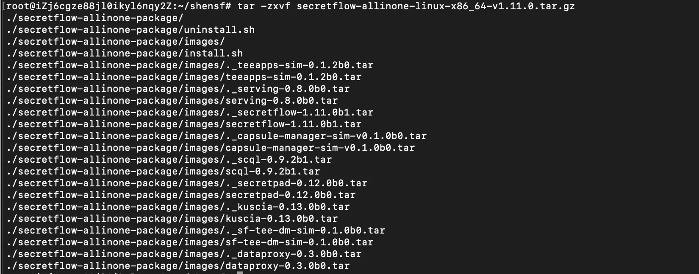
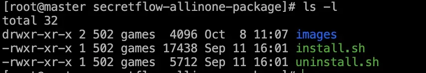
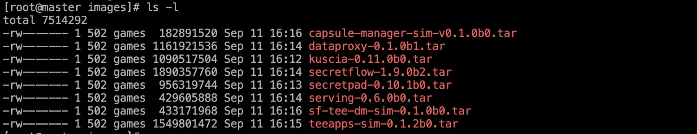
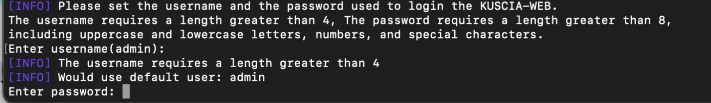
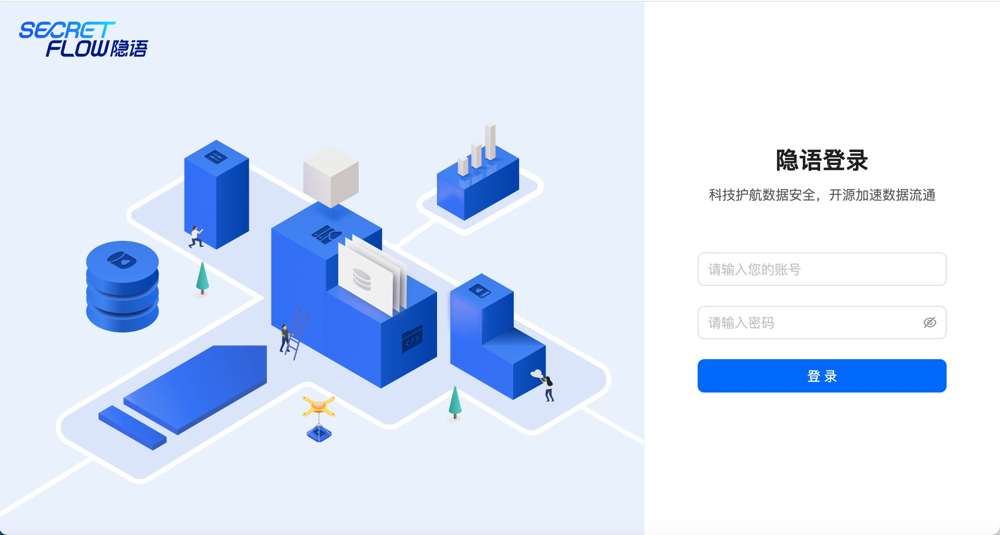

# 中心化模式安装部署

## 下载安装包
最新版本下载链接，（如已下载，可以跳过）：  

x86架构:[点此下载 x86_64 安装包](https://secretflow-public.oss-cn-hangzhou.aliyuncs.com/mvp-packages/secretflow-allinone-linux-x86_64-v1.11.0.tar.gz)

arm架构:[点此下载 arm_64安装包](https://secretflow-public.oss-cn-hangzhou.aliyuncs.com/mvp-packages/secretflow-allinone-linux-aarch_64-v1.11.0.tar.gz)  

## 部署安装包
安装部署需要对linux操作命令有基本的了解。
## 解压包
执行 tar -zxvf 下载的安装包  

示例：tar -zxvf secretflow-allinone-linux-x86_64-v1.11.0.tar.gz  解压x86系统包  

解压后到的安装包包含 images文件夹，instal.sh，uninstall.sh，如下图

install.sh：一键部署脚本，可启动两个docker容器，分别是secretpad和kuscia容器，且将dataproxy，serving，secretflow镜像注册到kuscia容器中
uninstall.sh：一键卸载脚本，会将所有docker容器卸载
images：镜像文件夹，存放所需的离线镜像包，执行安装部署脚本时会从这里获取镜像进行load，因此allinone包支持离线安装

<li>kuscia-0.11.0b0.tar：任务调度离线镜像包，主要是做任务调度编排，脚本部署启动kuscia时使用</li>
<li>secretpad-0.10.1b0.tar：白屏页面离线镜像包，主要启动一个可视化页面，脚本部署启动secretpad使用</li>
<li>secretflow-1.9.0b2.tar：引擎离线镜像包，主要是提供各种算法能力，脚本部署会将secretflow镜像注册到kuscia容器中。目前提供的是lite镜像包，不包含深度学习能力，如需要深度学习，可以替换secretflow镜像包或重新注册非lite镜像</li>
<li>serving-0.6.0b0.tar：在线预测镜像包，主要提供在线预测能力，脚本部署会将serving镜像注册到kuscia容器中</li>
<li>dataproxy-0.1.0b1.tar：DP离线镜像包，配合ODPS数据源使用，脚本部署会将dataproxy镜像注册到kuscia容器中</li>
<li>capsule-manager-sim-v0.1.0b0.tar，sf-tee-dm-sim-0.1.0b0.tar，teeapps-sim-0.1.2b0.tar可无需关注，主要是trustflow模拟镜像包，不适合生产环境
install.sh</li>
<li>一键部署脚本，可启动两个docker容器，分别是secretpad和kuscia容器，且将dataproxy，serving，secretflow镜像注册到kuscia容器中
uninstall.sh</li>
<li>一键卸载脚本，会将所有docker容器卸载</li>

## 执行安装命令
通过cd命令 进入到解压后到安装包，执行install.sh master：
cd 部署包所在路径
bash install.sh master

## 安装过程
设置登录用户名和密码
    用户名密码设置要求：
    用户名： 长度要求大于4位字符；
    密码： 长度要求大于8位字符，需包含大小写及特殊字符。
参考示例：

安装完成状态
安装输出“All components started successfully, time spend: xxx second”即为部署成功 
## 浏览器访问平台
部署成功后，浏览器打开 http://localhost:secretpad 端口号（或者 http://部署服务器的ip:secretpad端口号），利用部署过程中配置的用户密码登录平台即可体验。

若在部署过程中有相关的问题或者建议，可提交

[Issue](https://github.com/secretflow/secretpad/issues)反馈。