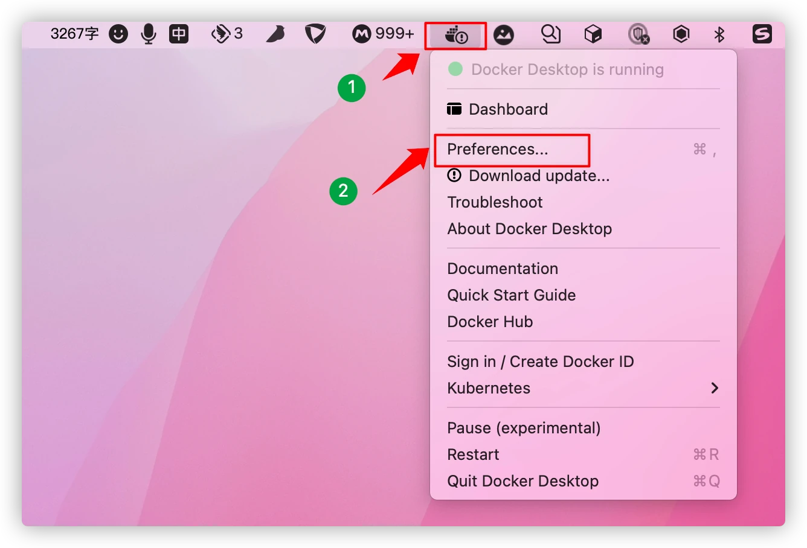
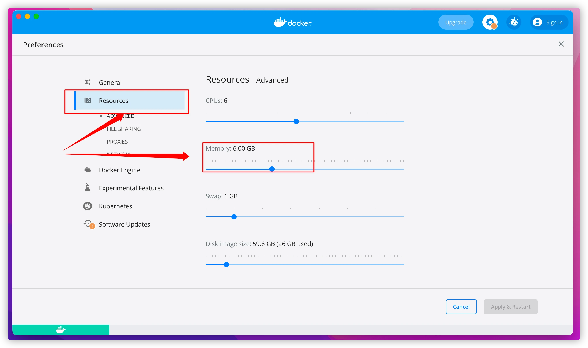
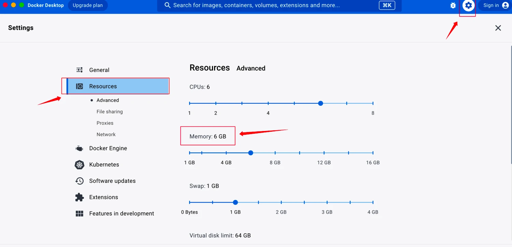

# 安装部署说明

## 部署模式概述
产品部署支持多种模式，用户可以自行选择。
## 点对点（P2P）模式
在P2P模式下，每个节点既是客户端也是服务器，数据处理和计算任务在各个节点之间分布进行。每个节点可以直接与其他节点通信，无需通过中心节点，这使得系统更加去中心化。
适用场景：P2P模式适用于需要高可用性和隐私保护的场景，例如分布式计算、区块链应用等。
## 中心化模式
中心化模式下，所有数据处理和计算任务都集中在一个中心节点上执行，中心节点负责接收来自各个客户端的数据请求，进行数据处理和计算，并将结果返回给客户端。在管理和维护相对简单，资源利用率高，可以更好地控制数据安全和隐私。
适用场景：中心化模式适用于数据量较大、计算任务复杂且对数据安全和隐私要求较高的场景。
## 环境依赖
### 版本要求
操作系统： 
● CentOS7 CentOS8
● Ubuntu 20.04 及以上版本
● MacOS
● Windows (通过WSL2上的 Ubuntu)；
资源准备： 8核/16G 内存/200G 硬盘
Docker：推荐使用 20.10.24 及以上版本
### Docker安装
#### Linux（centos）系统
```shell
# 安装 docker
yum install -y yum-utils
yum-config-manager \
  --add-repo \
  https://download.docker.com/linux/centos/docker-ce.repo
yum install -y docker-ce docker-ce-cli containerd.io

# 启动 docker。
systemctl start docker
```

#### Mac OS 系统
参考官网进行安装： 官方文档安装指导 
Docker软件包：https://download.docker.com/linux/centos/7/x86_64/stable/Packages/

#### Windows系统（不推荐）
参考Docker官方文档在 Windows 上安装 Docker，并确保 Docker 的后段是WSL2
MacOS 需将 Docker container 内存上限提⾼为 6G。
参考WSL官方文档 设置对应的设置即可
#### Docker内存配置（重要‼️）
隐语安装包内存要求，Docker Container 最小内存配置为 6G，不同的内存修改方式如下：
##### 命令行方式
方式一：启动时设置内存
```shell
docker run -m 512m --name my-container my-image  
```
方式二：更新现有内存
```shell
docker update --memory 512m my-container
```
方式三：如果使用 docker-compose 来管理容器，可以在 docker-compose.yml 文件中为服务设置内存限制
```shell
version: '3'
services:
  my-service:
    image: my-image
    mem_limit: 512m
```

方式四：通过编辑 Docker 守护进程的配置文件（通常是 /etc/docker/daemon.json）
```shell
{
  "default-ulimits": {
    "memlock": -1,
    "nofile": {
      "soft": 1024,
      "hard": 2048
    }
  },
  "default-memory": 512m,
  "default-memory-swap": -1
}
更新完成需重启下Docker：sudo systemctl restart docker
```
界面方式
Docker Container版本不同，配置方式不同：
V4.3.1参考：
 

V4.20.1参考：


硬件支持
隐语各模块已适配 X86-64 架构和 ARM-64 架构的硬件，以满足信创环境的多元化需求，
注：ARM 架构暂不支持 TEE。
