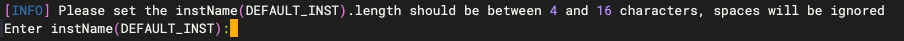
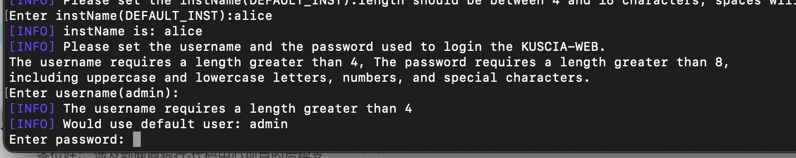
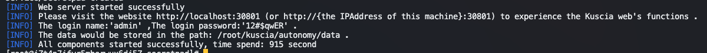

# P2P模式安装部署

## 下载安装包
最新版本下载链接，（如已下载，可以跳过）：
x86架构：secretflow-allinone-linux-x86_64-v1.11.0.tar.gz
arm架构：secretflow-allinone-linux-aarch_64-v1.11.0.tar.gz

## 部署安装包
安装部署需要对linux操作命令有基本的了解。
安装和卸载
执行 tar -zxvf 下载的安装包
示例：tar -zxvf secretflow-allinone-linux-x86_64-v1.11.0.tar.gz  解压x86系统包

解压后到的安装包包含 images文件夹，instal.sh，uninstall.sh，如下图

目录详情介绍
images：镜像文件夹，存放所需的离线镜像包，执行安装部署脚本时会从这里获取镜像进行load，因此allinone包支持离线安装

● kuscia-0.11.0b0.tar：任务调度离线镜像包，主要是做任务调度编排，脚本部署启动kuscia时使用
● secretpad-0.10.1b0.tar：白屏页面离线镜像包，主要启动一个可视化页面，脚本部署启动secretpad使用
● secretflow-1.9.0b2.tar：引擎离线镜像包，主要是提供各种算法能力，脚本部署会将secretflow镜像注册到kuscia容器中。目前提供的是lite镜像包，不包含深度学习能力，如需要深度学习，可以替换secretflow镜像包或重新注册非lite镜像
● serving-0.6.0b0.tar：在线预测镜像包，主要提供在线预测能力，脚本部署会将serving镜像注册到kuscia容器中
● dataproxy-0.1.0b1.tar：DP离线镜像包，配合ODPS数据源使用，脚本部署会将dataproxy镜像注册到kuscia容器中
● capsule-manager-sim-v0.1.0b0.tar，sf-tee-dm-sim-0.1.0b0.tar，teeapps-sim-0.1.2b0.tar可无需关注，主要是trustflow模拟镜像包，不适合生产环境
install.sh
● 一键部署脚本，可启动两个docker容器，分别是secretpad和kuscia容器，且将dataproxy，serving，secretflow镜像注册到kuscia容器中
uninstall.sh
● 一键卸载脚本，会将所有docker容器卸载

## 执行安装命令
 通过cd命令进入到解压后到安装包，执行install.sh 传参数安装节点：
```shell
cd 部署包所在路径
#注：端口范围0-65535范围内都可以，前提是端口没有被占用
bash install.sh autonomy -n alice 
```

## 命令参数介绍
配置参数详解：
<table>
  <tr>
    <th>参数</th>
    <th>注解</th>
  </tr>
  <tr>
    <td>autonomy</td>
    <td>p2p模式下的节点安装参数。</td>
  </tr>
  <tr>
    <td>-n</td>
    <td>节点名称，平台页面的计算节点ID，注意双方节点名称不能相同
Tips
①节点名称由用户自定义，最多 63 个字符，只能包含小写字母、数字，以及 ‘-’，且必须以字  母或数字开头，必须以字母或数字结尾，默认节点名称就是节点ID；
②默认部署成功就是一个节点，如需安装新的节点，重复操作即可，注意一台电脑安装两个节点        需保证两个节点名称/路径/端口均不同。</td>
  </tr>
    <tr>
    <td>-t</td>
    <td>节点token，平台页面中的节点部署令牌</td>
  </tr>
  <tr>
    <td>-d</td>
    <td>项目的安装目录(默认安装目录是：$HOME/kuscia)</td>
  </tr>
  <tr>
    <td>-p</td>
    <td>参数传递的是 lite/autonomy 容器 kuscia-gateway 映射到主机的端口，保证和主机上现有的端口不冲突即可</td>
  </tr>
  <tr>
    <td>-k</td>
    <td>参数传递的是 lite/autonomy 容器 Kuscia-api 映射到主机的 HTTP/HTTPS 端口，保证和主机上现有的端口不冲突即可</td>
  </tr>
  <tr>
    <td>-g</td>
    <td>参数传递的是 lite/autonomy 容器 Kuscia-grpc 映射到主机的 HTTP/HTTPS 端口，保证和主机上现有的端口不冲突即可</td>
  </tr>
  <tr>
    <td>-s</td>
    <td>secretpad平台端口，保证和主机上现有的端口不冲突即可</td>
  </tr>
  <tr>
    <td>-q</td>
    <td>参数传递的是 lite/autonomy 容器 kuccia 映射到主机的 env 端口，保证和主机上现有的端口不冲突即可</td>
  </tr>
  <tr>
    <td>-x</td>
    <td>参数传递的是 lite/autonomy 容器 kuccia 映射到主机的 Metrics 指标采集端口，保证和主机上现有的端口不冲突即可</td>
  </tr>
  <tr>
    <td>-x</td>
    <td>-P	KusciaAPI 以及节点对外网关使用的通信协议，有三种安全模式可供选择：notls/tls/mtls（非必填，只允许小写，默认：tls)，与 Kuscia 部署配置相同 protocol参考链接
notls: 此模式下，通信通过未加密的 HTTP 传输，比较安全的内部网络环境或者 Kuscia 已经存在外部网关的情况可以使用该模式【直接部署在公网有安全风险】。
tls: (默认)在此模式下，通信通过 TLS 协议进行加密，即使用 HTTPS 进行安全传输，不需要手动配置证书。
mtls: 这种模式也使用 HTTPS 进行通信，但它支持双向 TLS 验证，需要手动交换证书以建立安全连接。</td>
  </tr>
</table>

端口示例：
```shell
容器:                端口对应:外部->内部  部署参数:
secretpad  http     port:  8088->8080   -s 参数
kuscia     http     port:  38082->8082  -k 参数
kuscia     grpc     port:  38083->8083  -g 参数
kuscia     gateway  port:  38080->1080  -p 参数
kuscia     Metrics  port:  38084->9091  -x 参数
```

## 安装过程
 设置机构名称
机构名称长度要求大于 4 位字符 ,空格将会被忽略。


设置登录用户名和密码
用户名密码设置要求：
用户名： 长度要求大于4位字符；
 密码： 长度要求大于8位字符，需包含大小写及特殊字符。
参考示例：


安装完成状态
 装输出“All components started successfully, time spend: xxx second”即为部署成功 
 

注：点对点（P2P）模式，如果想做数据求交至少有两个节点，可以按照步骤2-4可以再部署安装另外一个节点。
浏览器访问平台
部署成功后，浏览器打开 http://localhost:secretpad 端口号（或者 http://部署服务器的ip:secretpad端口号），利用部署过程中配置的用户密码登录平台即可体验。


若在部署过程中有相关的问题或者建议，可提交[Issue](https://github.com/secretflow/secretpad/issues)反馈。