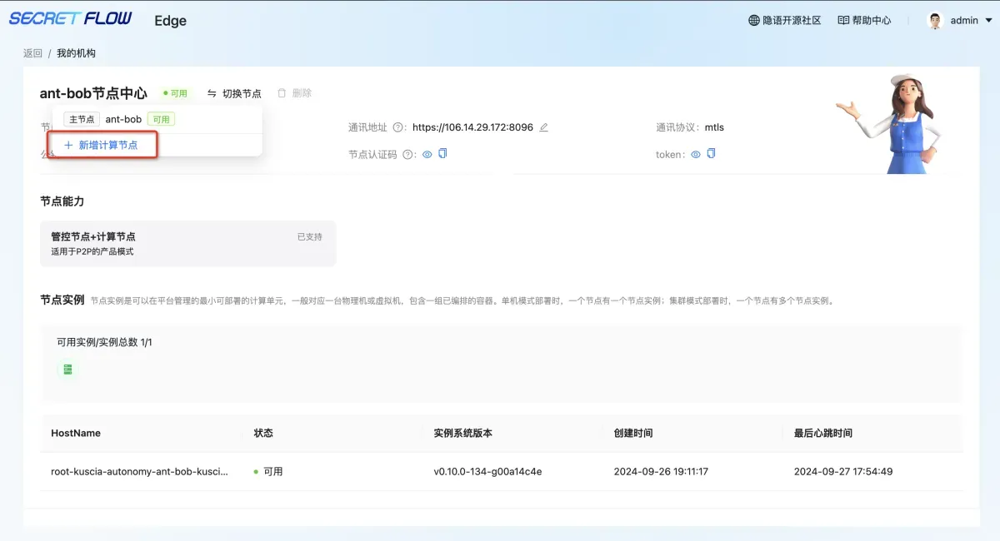
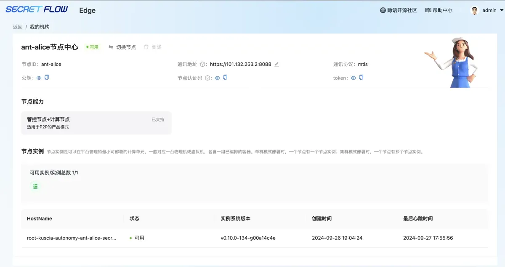
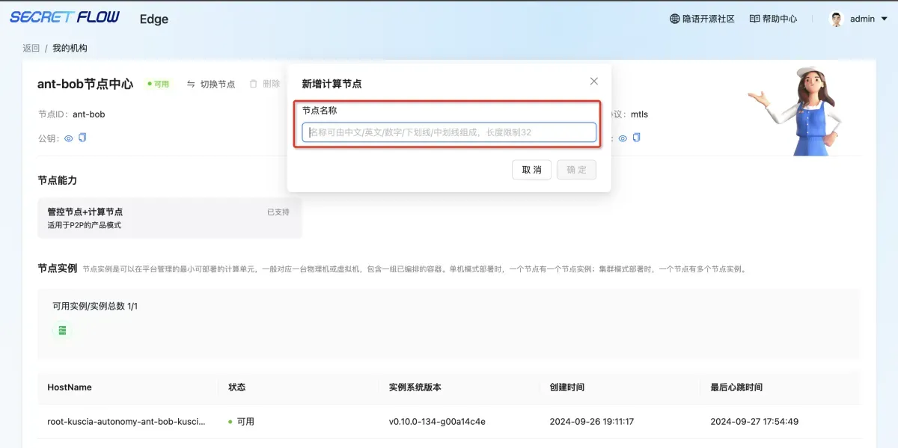

# 我的机构
## 模块说明
本模块可查看我的机构下多节点的基础信息、新增计算节点。
## 查看我的机构
可点击左上角机构机构名称，进入我的机构页面，可查看我的节点通讯地址、节点认证码、token等。

## 新增计算节点
点击“切换节点”-“新增计算节点”，输入节点名称即可关联。
注：此处关联的计算节点仅需包含节点名称，需要用户自行部署计算节点，详见《P2P节点部署》：https://www.secretflow.org.cn/zh-CN/docs/secretpad/v0.10.1b0/deployment/p2p

