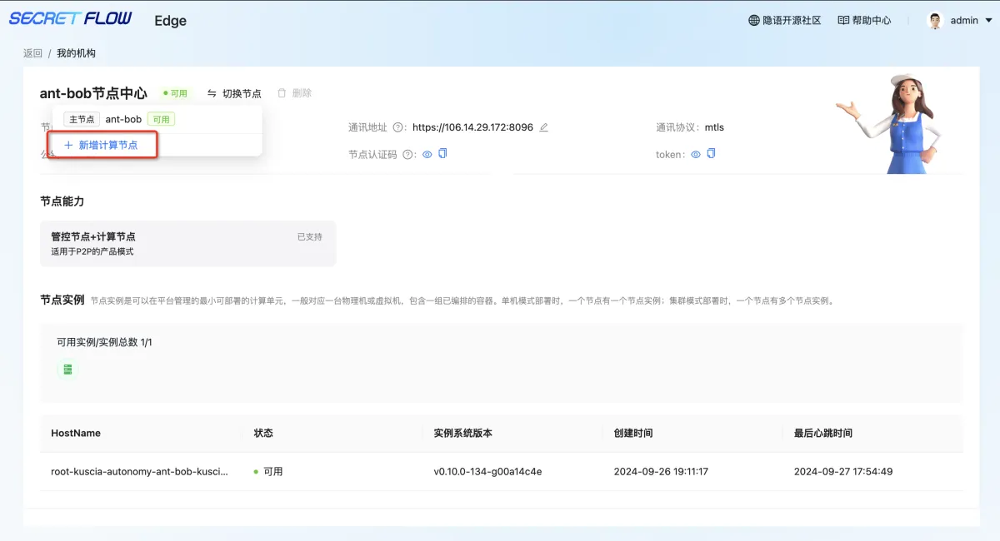
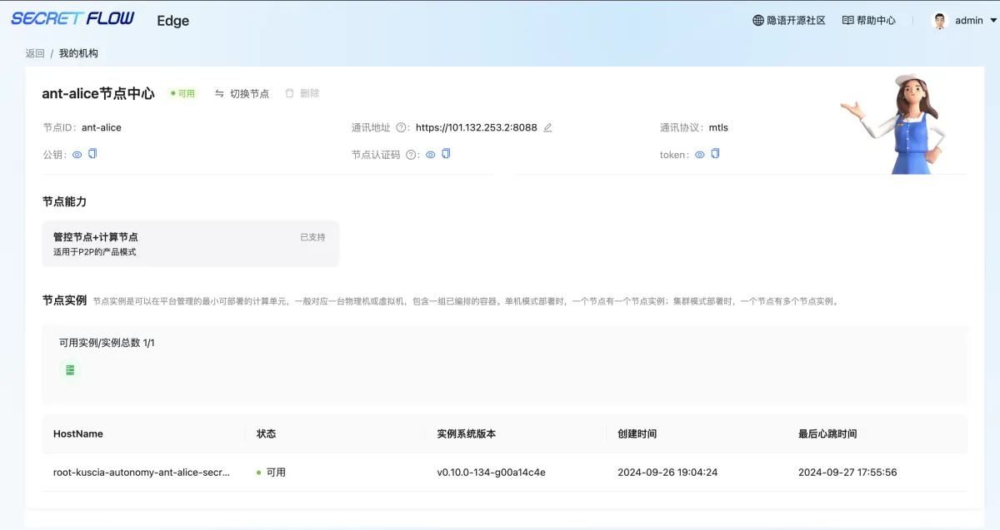
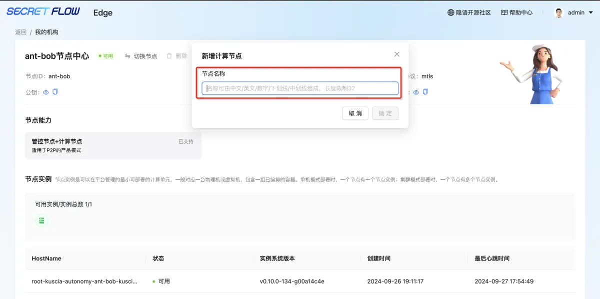

# 我的机构

## 1.模块说明

本模块可新增计算节点，查看我的机构下多节点的基础信息。  

## 2.查看我的机构

可点击左上角机构机构名称，进入我的机构页面，可查看我的节点通讯地址、节点认证码、token等，点击切换节点，可以新增计算节点。  

## 3.新增计算节点

点击新增计算节点，输入节点名称即可关联。此处关联的计算节点仅需包含计算节点，详见计算节点部署信息：https://www.secretflow.org.cn/zh-CN/docs/secretpad/v0.10.1b0/deployment/p2p  

  

