# 项目管理

## 1. 模块说明

本模块主要是对项目进行管理，包括新建项目、新建并执行训练流、添加并配置组件、查看任务结果等操作

## 2. 新建项目

点击“新建项目”—输入项目名称和描述—点击“添加节点”—选择已建立合作关系的节点

 注：“我的项目”或“工作台”都可新建项目，可邀请多个节点，需所有受邀节点同意才可进行后续操作。

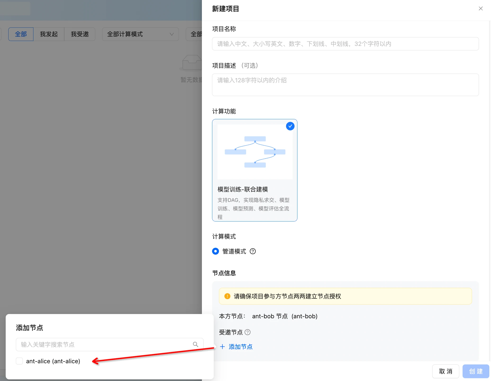

## 3. 受邀参与项目

“工作台”、“消息中心”、“我的项目”均可看到受邀项目，可选择“同意”或“拒绝”

 注：如存在任意一方节点拒绝项目邀约，项目将直接归档 

工作台：

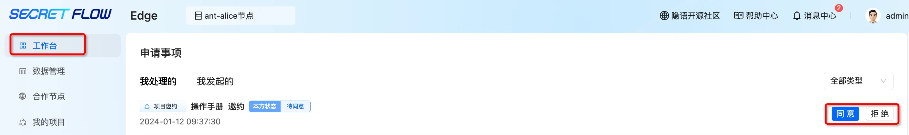

消息中心：

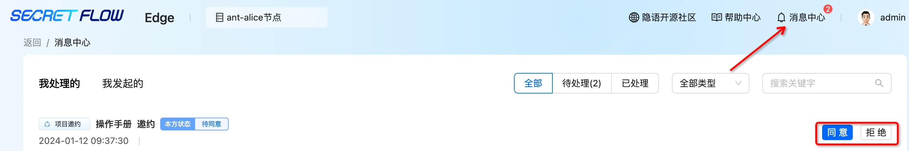

我的项目：

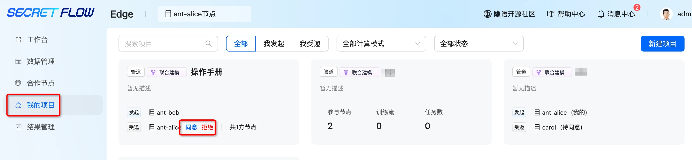

## 4. 进入项目

“工作台”、“我的项目”均可进入项目

工作台：

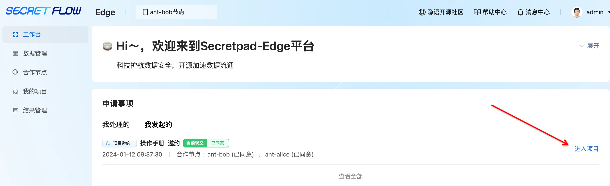

我的项目：

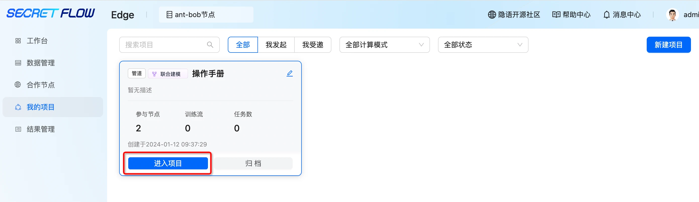

首次进入项目会弹出“新手引导”，可跟随“新手引导”学习页面菜单功能

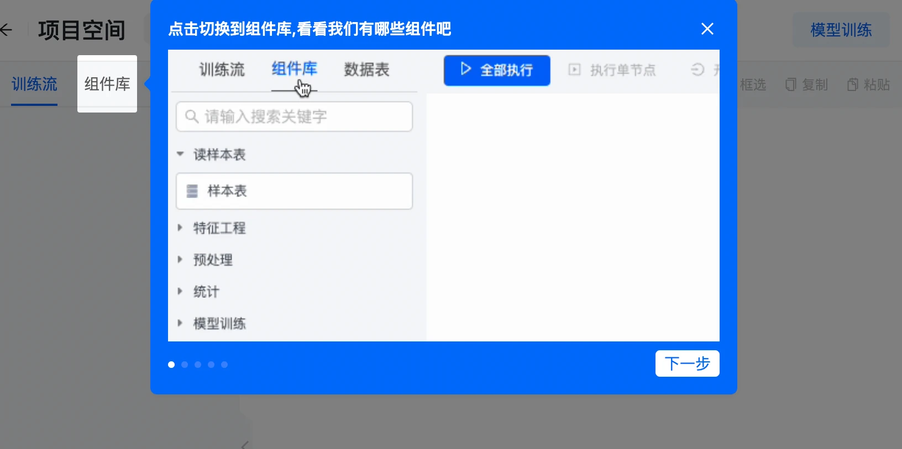

## 5. 训练流

### 5.1. 新建训练流

用户可根据需要自行选择平台内置训练流模板或自定义训练流，目前已内置两种训练流模板“金融风控”“联合圈人”。

点击“创建训练流”—输入训练流名称，选择自定义训练流或内置训练流模板（此处以自定义训练流为例）—点击“创建”。

### 5.2. 修改/复制/删除训练流

系统支持修改训练流名称、复制训练流、删除训练流

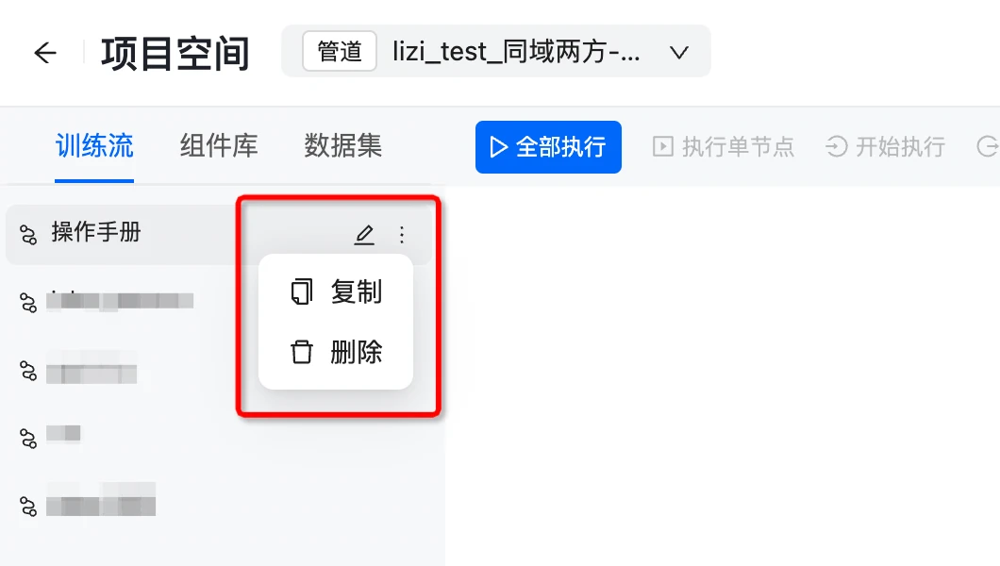

### 5.3. 任务创建

创建训练流后，可在平台拖拽计算需要的组件，并对组件进行配置，详细的组件说明见：
[平台组件说明](https://www.secretflow.org.cn/zh-CN/docs/secretpad-all-in-one/latest/pf7woou4dzgc90ol)
_**注：P2P模式下，训练流创建方才可进行任务的运行和配置操作。**_

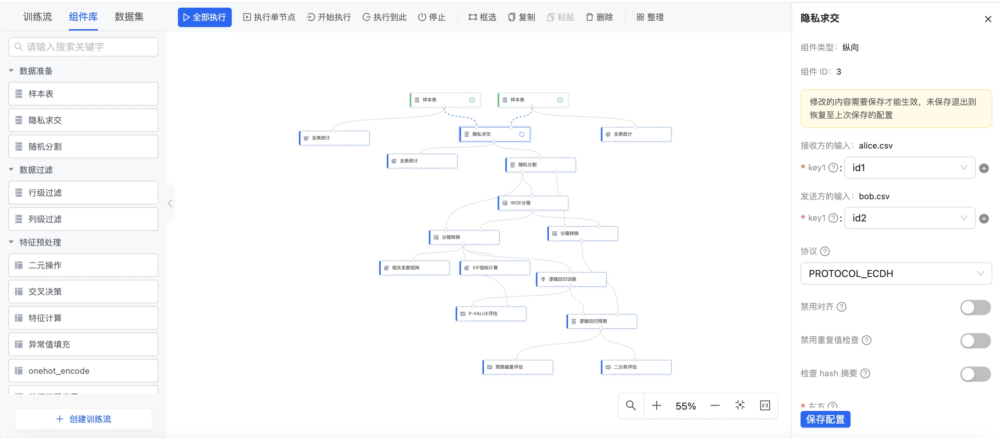

### 5.4. 模型提交

完成一个建模任务后，且画布中有运行成功状态的模型时，可点击模型提交进行模型打包：

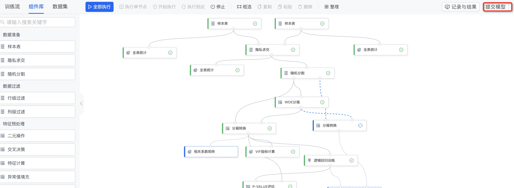

点击提交模型后，选择一个训练好的模型，此时系统会自动关联模型的预处理规则，此时填写模型名称和描述，点击“确认提交”可完成模型的打包提交，并在模型管理模块查看此模型。

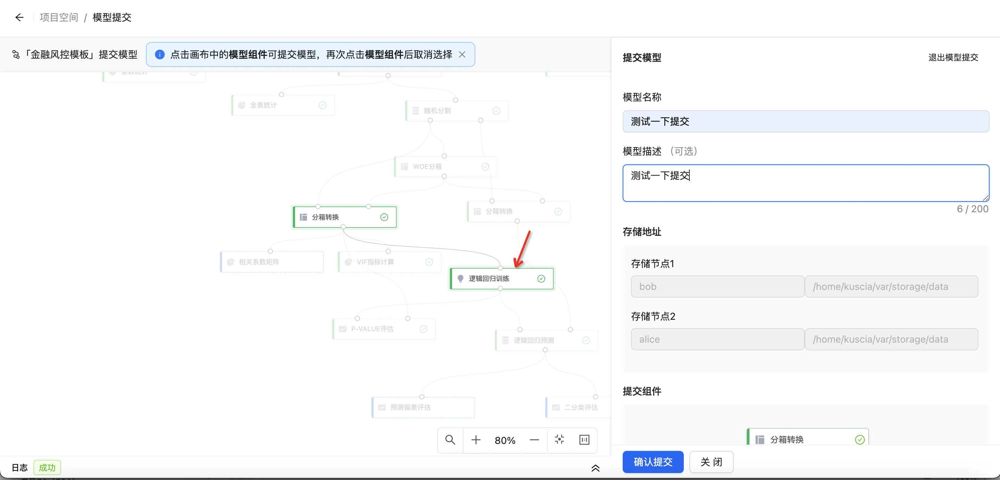

## 6. 模型管理

模型提交后，可在模型管理进行模型查看和模型发布，点击模型发布后，可进行模型的离在线特征映射：

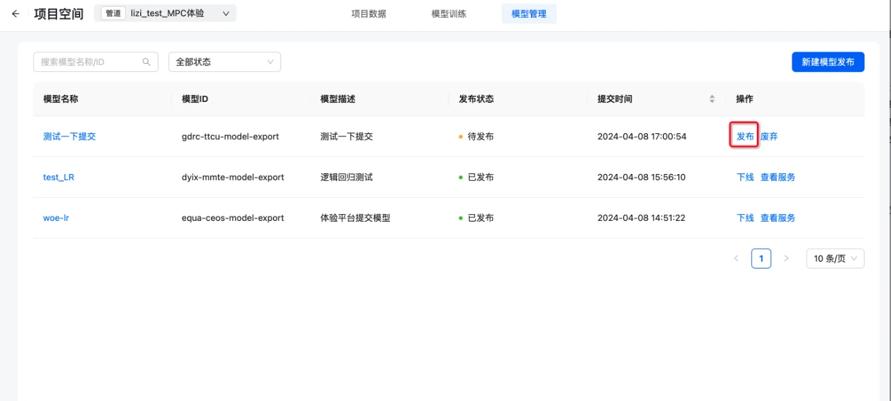

系统内置mock特征，如需使用真实的特征服务，需要前置注册http特征并授权到该项目。

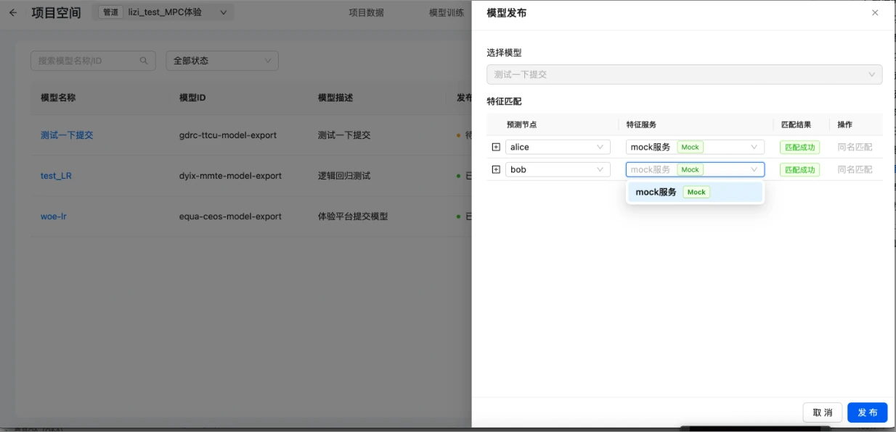

点击确定后，模型即可发布成功，可查看模型，并使用模型ID和endpoints构建特征服务API，详见：https://www.secretflow.org.cn/zh-CN/docs/kuscia/v0.6.0b0/tutorial/run_sf_serving_with_api_cn

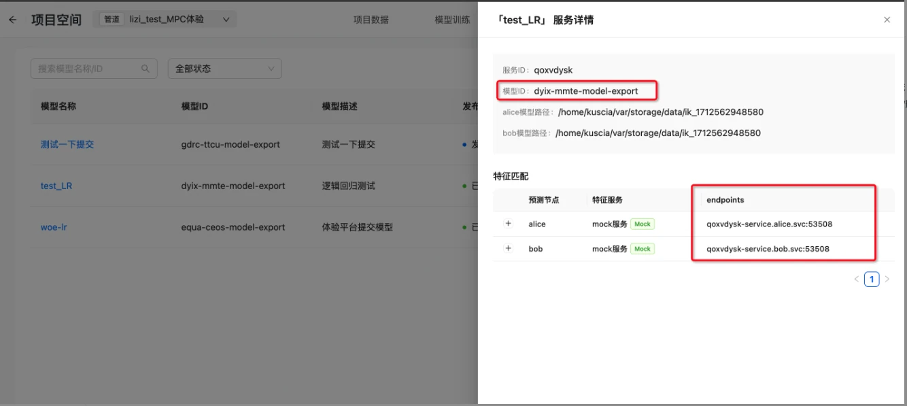

## 7. 组件库

目前系统内置7种类型共31个组件，用户可根据自身需求自行选择，支持模糊查询

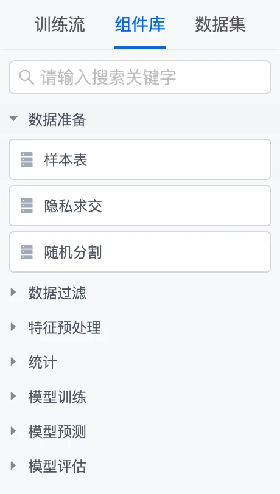

### 7.1. 添加组件

内置“联合圈人”、“金融风控”训练流默认已编排完成，无需用户自行添加组件；

自定义训练流需用户自行添加组件，根据自身需求，从左侧组件列表拖拽相关组件至右侧画布区域，连接相关组件

 注：搭建时请注意连接方式是否正确 

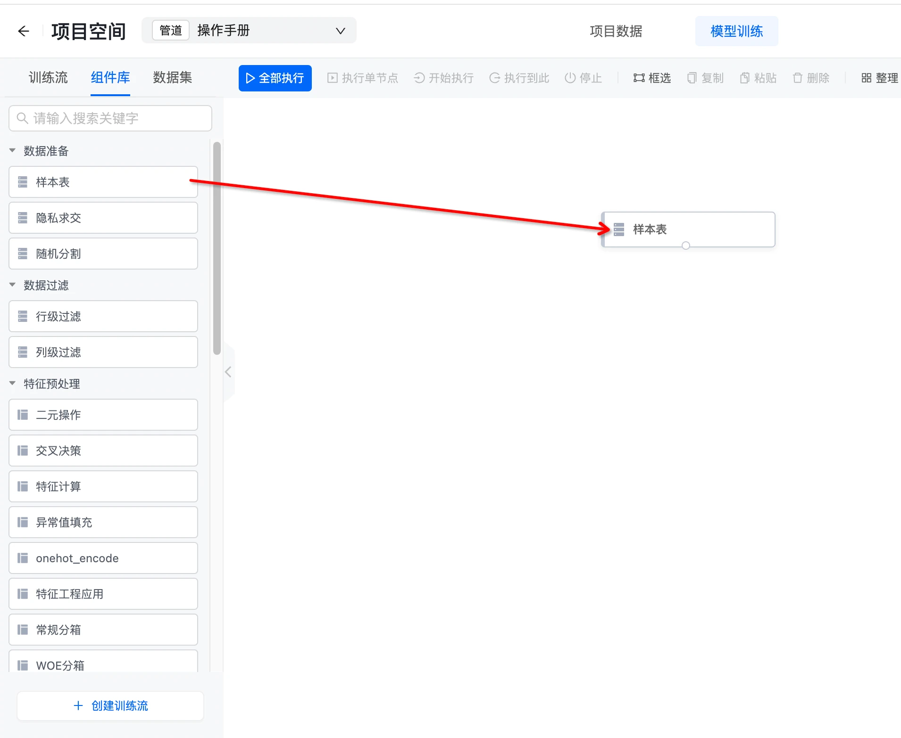
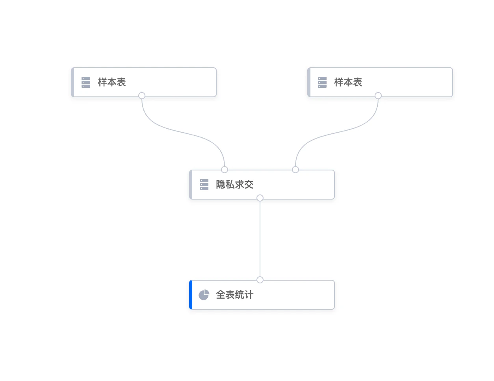

### 7.2. 组件配置

组件连接后需进行配置，点击组件后会弹出配置面板，按照提示配置即可

 注：灰色组件需要配置，蓝色组件无需配置 

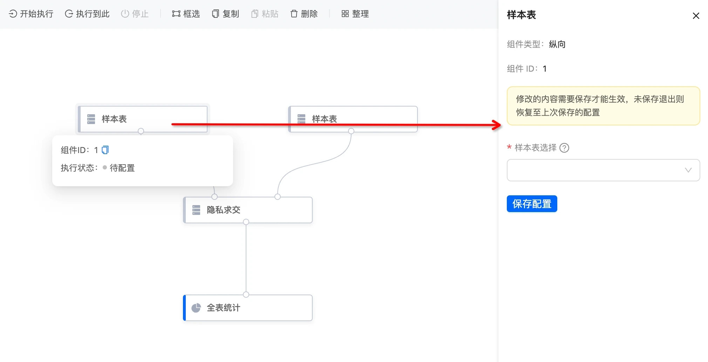

## 8. 数据集

展示该项目已授权的数据表，鼠标悬停数据表上将展示数据表具体字段

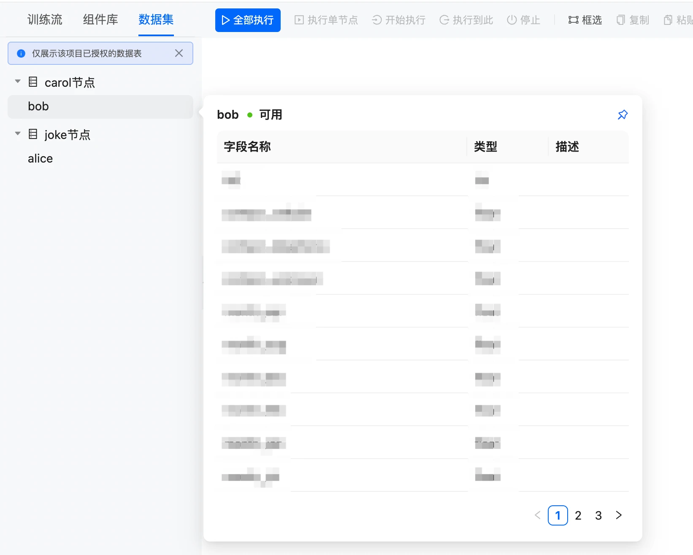