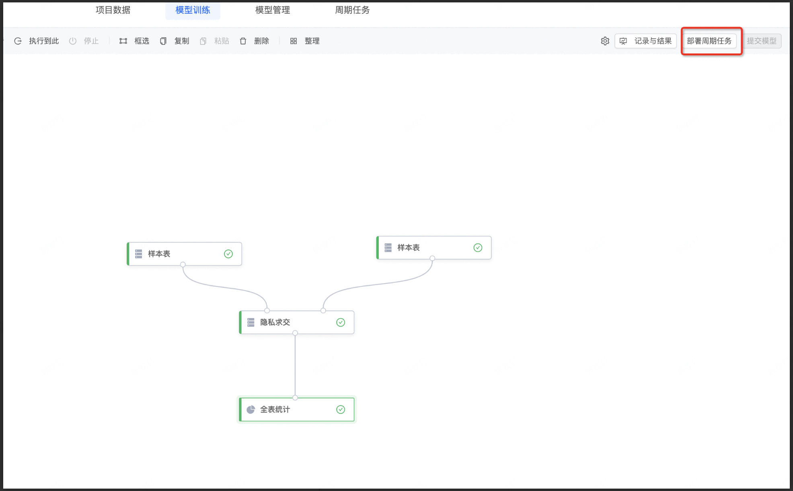
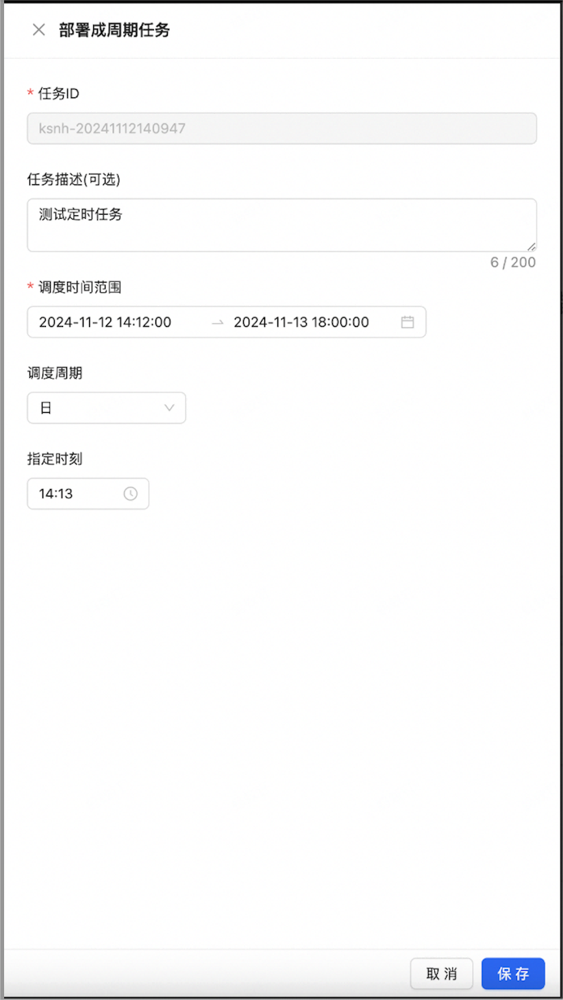
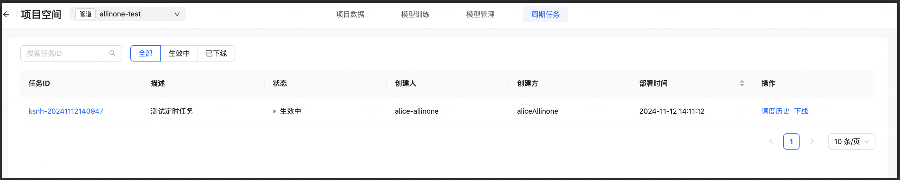
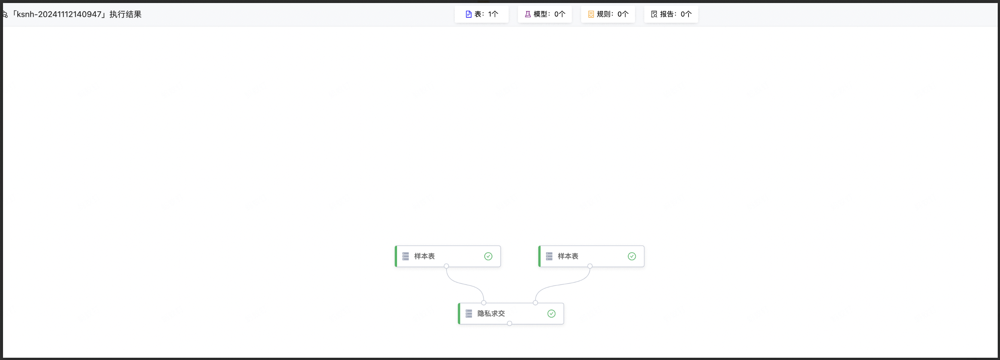
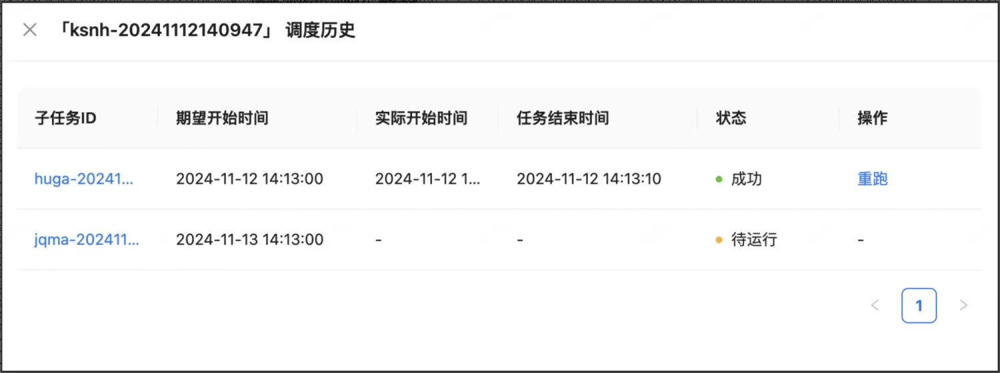

# 定时周期任务

## 1.模块说明

本模块主要是对部署周期任务进行说明，包括使用说明和配置说明。

## 2.部署周期任务

部署周期任务，需要首先执行成功一次任务流，并且周期任务选择的样本表，通常是分区表，如下：

新建周期任务需要填写如下信息：任务描述，调度时间范围，调度周期，指定日期，指定时刻。

**任务ID**：由前端调用SecretPad后端生成，随机字符串和时间戳（并非是在kuscia中查看的jobId）  
**调度时间**：范围需要大于等于24小时  
**调度周期**：分为日，周，月维度，日维度代表每天执行，没有指定日期选项，周维度可以指定周中某一天或某几天，月维度可以指定月中某一天或某几天  
**指定时刻**：任务具体的执行时间  
本文将以日维度介绍周期任务

定时任务设置完成保存之后，可以在画布上的周期任务列表中看到发布的周期任务。

点击任务ID可以看到具体执行的任务。

调度历史中包含任务执行记，本次示例是以日维度，每天14:13执行任务，运行成功后，如下图：

