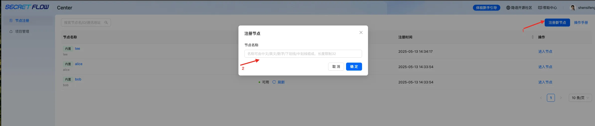
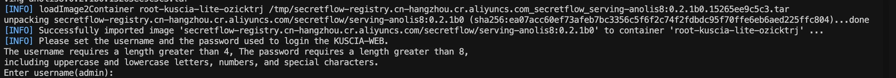

# 中心化模式快速体验

## 注意事项
<li>了解缩写的关键字注释，可参考</li>
<li>了解管道模式和枢纽模式的区别</li>
       
## 前提条件
<li>通过浏览器能正常登录，检查各个节点工作正常</li>

## 操作准备
### 登录平台
浏览器打开 http://localhost:secretpad 端口号（或者 http://部署服务器的ip:secretpad端口号），利用部署过程中配置的用户密码登录平台即可体验 ，如已经登录，可跳过。


### 管道模式创建项目
管道模式是指多方数据安全（MPC）和联邦学习（FL）模式下的隐私计算模式。
#### 新建项目
中心化项目登陆之后可以直接新建项目：
首测体验，可以选择内置训练流模版，联合圈人和二分类建模
填写项目名称->（项目描述）->选择管道模式->选择训练流模版，创建项目。


#### 运行及结果
二分类建模内置训练流的运行及结果：


联合圈人内置训练流的运行及结果


### 枢纽模式创建项目
枢纽模式是指可信硬件空间（TEE）的隐私计算模式，目前开源产品的枢纽模式只支持仿真模式。（用户如需真正的可信数据空间，可以联系我们以商业化项目模式推进）
#### 新建项目
填写项目名称->（项目描述）->选择枢纽模式->添加节点->创建项目。


#### 运行及结果
创建二分类建模训练流运行及结果


自建训练流的运行及结果


### 新增节点（可选）
中心化模式下内置了两个节点alice和bob，用户可以按需新增其他节点。
节点名称可由中文/英文/数字/下划线/中划线组成，长度限制32，新增的节点不能和已有的节点名称重复。


点击新增节点名称，获取获取：①计算节点ID ②部署令牌


安装新节点：
同一网络内，只需获取本机的ip地址即可，以mac为例，通过ifconfig命令获取③ip地址。
若是跨网部署，则需要运维人员生成外网IP。
部署包节点包和allinone的部署包是同一个，所以直接下载解压allinone的部署包即可。参考方式。
新增节点命令：
```shell
cd 部署包所在路径
# -n：平台节点Id，举例：结构信息节点ID：gbqlkfbw
# -m：secretpad页面入口地址，宿主机真实ip（ifconfig查看本机ip）和宿主机端口（docker ps查看secretpad容器8080在宿主机映射的端口）
# -t：从节点信息中复制获取，结构信息token，（建议刷新下token，再使用token）
# -p，-k，-g，-q，-x，-P和autonomy节点部署含义相同，此处不再过多介绍

bash install.sh lite -n newtest -m 'http://root-kuscia-master:1080' -t xdeploy-tokenx -p 10080  -k 41802 -g 41803 -s 8180 -q 13181 -P notls
```
安装节点过程中，需要输入用户名密码，用于登陆节点平台（密码8位，由大小写字母和特殊字符组成）。


看到“Web server started successfull”的提示即完成部署


刷新查看平台新增节点状态可用。


浏览器登陆新节点：
本次新增的节点平台可以直接用浏览器打开 http://localhost：指定端口号 访问，内置的Alice和Bob节点可以直接访问管理数据，新注册的节点需要通过节点平台访问管理数据。


### 新增数据（可选）
进入项目->点击数据集—>选择节点—>点击➕号，会新弹出该节点的内置界面，在新的Edge界面添加数据。


● 本地数据源
顾名思义，本地的csv格式的文件，上传到隐语平台授权，每个节点上传各自的本地数据。
导入本地数据->设置数据表名称—>输入数据表描述及特征描述—点击“提交”。
重要：特征名称需和实际文件的schame名称保持一致。


本地数据->授权管理
数据上传后需要把数据针对项目做授权，项目才可以使用。
授权管理->添加授权项目->选择授权项目->确认完成数据授权。


● http-data-source
点击添加数据->http-data-source->输入HTTP地址，需输入SPI数据地址、数据表名称和描述，并上传或填写数据表schame进行数据。


## 创建训练流
点击“训练流”—>“创建训练流”—>输入训练流名称—>选择已有训练流模板—点击“创建”
目前内置了“联合圈人”、“二分类建模”两种训练流模板，可根据需求自行选择。
二分类建模：


可以选择快速配置，快捷配置一个训练流内容。

 自定义训练流：
根据自身需求，从左侧组件列表拖拽相关组件至右侧画布区域，连接相关组件，然后对组件逐个配置字段，开始下一步执行操作。


## 组件配置
点击组件“样本表”—选择数据表—保存配置
注：灰色组件需要进行配置，蓝色不需要


点击组件“隐私求交”—分别选择接收方和发送方的输入—保存配置


## 模型发布
完成一个建模任务后，且画布中有运行成功状态的模型时，可点击模型提交进行模型打包：


点击提交模型后，选择一个训练好的模型，此时系统会自动关联模型的预处理规则，此时填写模型名称和描述，点击“确认提交”可完成模型的打包提交，并在模型管理模块查看此模型。

模型提交后，可在模型管理进行模型查看和模型发布，点击模型发布后，可进行模型的离在线特征映射：

