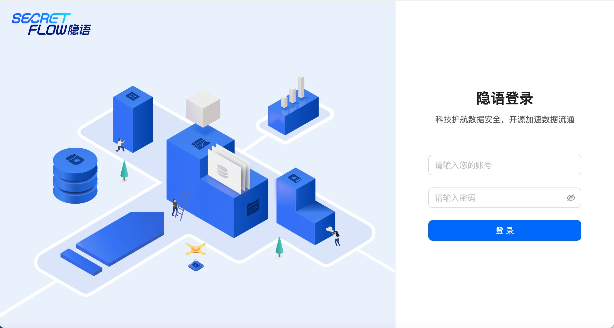
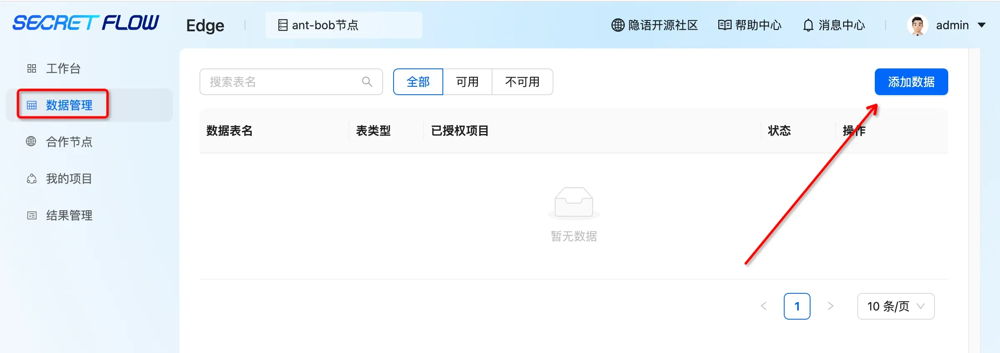

# P2P模式快速体验

## 注意事项
<li>检查两个节点的工作状态是否正常 ，如docker ps 检查容器的运行状态STATUS。</li>
<li>节点分布在多机场景下，需检查节点之间的网络连通性。如telnet 双方节点端口连通性</li>
<li>检查测试数据是否准备，测试数据下载链接：测试数据下载</li>

## 前提条件
<li>每个节点都工作正常，通过浏览器能正常登录</li>
<li>每个节点准备下测试数据 csv格式</li>

## 操作准备
### 登录平台
浏览器打开 http://localhost:secretpad 端口号（或者 http://部署服务器的ip:secretpad端口号），利用部署过程中配置的用户密码登录平台即可体验 ，如已经登录，可跳过。


### 添加合作节点
添加合作节点，故至少有两个节点需要相互感知对方信息。节点之间通过<添加合作节点>建立授权关系，此步骤是后续创建合作项目进行联合计算的前提。需要双方分别添加对方节点才可建立双向授权。
#### 查看机构信息
可以查看当前节点ID，通讯地址，通讯协议，公钥，节点认证码、token等。


#### 修改通讯地址
默认通讯地址为http://127.0.0.1:port 或者 https://127.0.0.1:port，需自行修改为对外通讯地址，修改后系统会更新节点认证码。
地址查询方式：由于本机会有多网卡，以及不同局域网和广域网的地址出口 IP 不同，需要用户自行查看判断 IP 地址；以 Linux 为例，查询ip命令行，输入命令 ifconfig；如无公网，或者公网查询失败，可以咨询机器管理员。


#### 端口查询方式：
部署时-p指定的端口（docker ps 查看kuscia容器1080在宿主机映射的端口），修改通讯地址


查询过ip地址和端口后，修改更新本节点的通讯地址。


#### 添加对方节点
执行本操作前，确保双方节点都修改完成通讯地址。
点击合作节点，点击添加合作节点。


方式1 复制节点认证码方式添加对方节点（推荐）。
1.从对方机构信息中，复制要添加的合作节点的节点认证码

2.粘贴到本地节点认证码输入框，后点击<识别解析>

3.修改为本方节点IP,并选择对应的协议。

方式2 手动填写对方节点信息，该步骤需要在双方机构中分别执行。


该步骤需要在双方机构中分别执行。
#### 检查节点状态
检查节点状态是否可用，目前是可用，如有不可用的状态，检查下双方节点ip信息，端口，协议等是否正确。


### 新增计算节点（按需添加）
新增计算节点，即P2P模式先新增autonomy_node节点，该功能是在同一个机构下，添加多个新节点，实现多个节点工作。


鼠标放到切换节点，会弹出新增节点的按钮


点击新增计算节点
节点名称可由中文/英文/数字/下划线/中华线组成，长度限制32


新增的计算节点状态，新增的节点是不可用，需要在主机实际安装新节点。


宿主机安装新节点：
与安装autonomy节点不同点在于执行脚本命令输入的参数不同，脚本执行后操作步骤相同，这里仅提供相关部署命令。
```shell
# -n：平台节点Id，举例：结构信息节点ID：gbqlkfbw
# -m：secretpad页面入口地址，宿主机真实ip（ifconfig查看本机ip）和宿主机端口（docker ps查看secretpad容器8080在宿主机映射的端口）
# -t：从节点信息中复制获取，结构信息token，（建议刷新下token，再使用token）
# -p，-k，-g，-q，-x，-P和autonomy节点部署含义相同，此处不再过多介绍

./install.sh autonomy-node -n gbqlkfbw -m 'http://xxxxx:8080' -t xdeploy-tokenx -p 38080 -g 38081 -k 38082 -q 38083 -x 38084 -P notls
```
安装完成后，刷新页面，新增节点状态从不可用变更成可用状态，即添加成功。


### 创建项目
创建合作节点授权、且双方准备好合作数据后，可进行合作项目的发起，并在项目内通过训练流的创建和任务执行完成一个建模任务。
新建项目：


点击新建项目->填写项目名称-〉项目描述->选择本方节点-〉选择受邀节点-》创建项目

等待被邀请方同意：

被邀请节点，可以选择同意或者拒绝。


等待被邀请方同意后->进入项目，观看第一次进入项目的操作引导。
组件介绍-〉拖拽组件->组件配置->任务执行->查看执行结果->查看历史记录


### 数据授权
点击“数据管理”—>“添加数据”—>点击上传或拖拽本地数据文件至右侧区域



本地数据源：
顾名思义，本地的csv格式的文件，上传到隐语平台授权，每个节点上传各自的本地数据。
导入本地数据->设置数据表名称—>输入数据表描述及特征描述—点击“提交”。
重要：特征名称需和实际文件的schame名称保持一致。


本地数据->授权管理
数据上传后需要把数据针对项目做授权，项目才可以使用。
授权管理->添加授权项目->选择授权项目，确认完成数据授权。


http-data-source：
点击添加数据->http-data-source->输入HTTP地址，需输入SPI数据地址、数据表名称和描述，并上传或填写数据表schame进行数据。


### 创建训练流
点击“训练流”—>“创建训练流”—>输入训练流名称—>选择已有训练流模板—点击“创建”
目前内置了“联合圈人”，“二分类建模”两种训练流模板，可根据需求自行选择
二分类建模：


可以选择快速配置，快捷配置一个训练流内容。

 自定义训练流：
根据自身需求，从左侧组件列表拖拽相关组件至右侧画布区域，连接相关组件，然后对组件逐个配置字段，开始下一步执行操作。


## 组件配置
点击组件“样本表”—选择数据表—保存配置
注：灰色组件需要进行配置，蓝色不需要


## 运行及结果
光标悬停到对应组件—点击“执行结果”—下载执行结果。也可点击“结果管理”—下载对应项目执行结果


## 模型发布
完成一个建模任务后，且画布中有运行成功状态的模型时，可点击模型提交进行模型打包：


点击提交模型后，选择一个训练好的模型，此时系统会自动关联模型的预处理规则，此时填写模型名称和描述，点击“确认提交”可完成模型的打包提交，并在模型管理模块查看此模型。

模型提交后，可在模型管理进行模型查看和模型发布，点击模型发布后，可进行模型的离在线特征映射：

