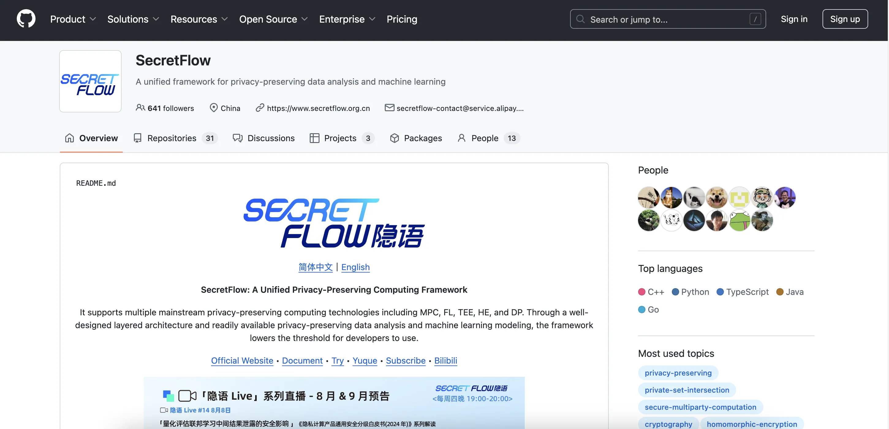
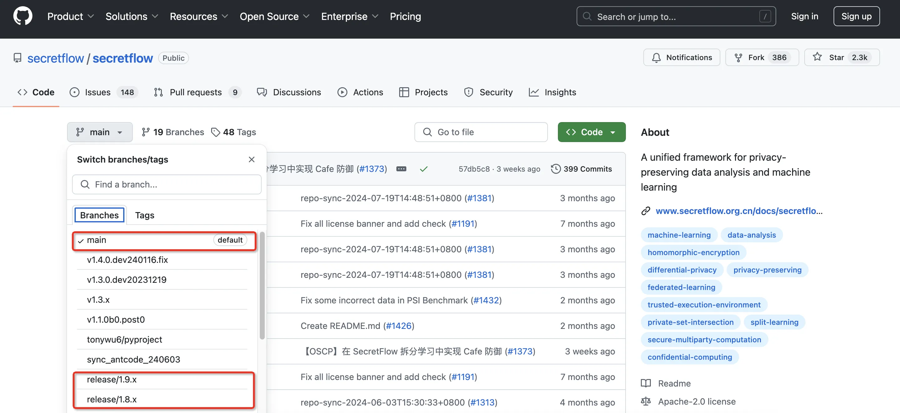
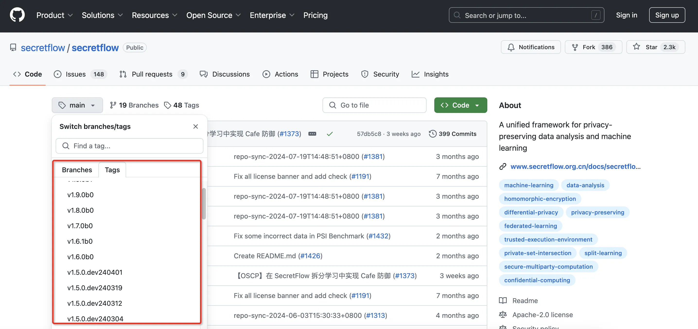

# 版本说明
## 前言
本文旨在通过介绍版本管理流程，为开源项目的开发者提供安全可靠的组件版本，从而建立稳定的迭代节奏。
开源版本
隐语开源版本的发布以月为单位，通常情况下新版本会在每月下旬发布到 GitHub 和 Gitee ，开发者可访问https://github.com/secretflow进入隐语官方社区。

## 分支介绍
隐语在 GitHub 社区使用 main 和 release 两个分支作为版本管理的公共分支，以下是对分支的用途介绍。
  ○ main 分支：作为主线分支，主要用于 Git 仓库新版本的合并以及日常代码维护。但 main 分支不能保证代码同步的及时性和一致性，例如新版本发布后的 bugfix 代码可能不会第一时间同步到 main 分支，所以不建议开发者用于生产测试。
  ○ release 分支：正式版本的发布分支，隐语每一个发布版本都会根据版本号新建对应的 release 分支。release 分支的代码经过测试和安全审查，有更好的功能稳定性及安全性保障，并且新版发布后的 bugfix 代码也会第一时间同步到 release 分支。
  

Tag介绍
隐语通过遵循 Semantic Versioning 2.0.0 规范来进行版本控制。版本号格式为：X.Y.Z{b0}{{.devYYMMDD}|{.postP}}。
变量说明
X：代表主版本，只有在隐语发生大版本的变动时才会更新，变动频次极低。
Y：代表次版本，用于隐语日常版本的迭代，变动频率通过为一个月一次或两个月一次。
Z：代表补丁版本，在次版本的基础上对已发现的问题进行修复或功能改进所发布的更新版本。
b0：代表beta版本，经过测试和内部团队安全审查后的版本，适合开发者和测试人员使用，“0”为数值变量按自然序递增。
devYYMMDD：代表开发版本，可能包含最新更改的临时版本，但未经充分测试或安全审查，存在不稳定因素，YYMMDD为时间变量。
postP：紧急修复版本，修复后需要经过充分测试以及安全审查转为正式版，P为数值变量按自然序递增。

案例说明
<table>
  <tr>
    <th>版本号</th>
    <th>说明</th>
    <th>是否经过测试</th>
    <th>是否经过安全审查</th>
  </tr>
  <tr>
    <td>1.5.0b0</td>
    <td>Pre-releases正式版本</td>
    <td>Y</td>
    <td>Y</td>
  </tr>
  <tr>
    <td>1.5.0b1、1.5.1b0</td>
    <td>基于1.5.0b0进行的修复更新版本</td>
    <td>Y</td>
    <td>Y</td>
  </tr>
  <tr>
    <td>1.5.0.dev240801</td>
    <td>Developmental releases 2024年8月1日开发版本</td>
    <td>N</td>
    <td>N</td>
  </tr>
  <tr>
    <td>1.5.0.post0</td>
    <td>Post-releases
1.5.0紧急修复版本</td>
    <td>N</td>
    <td>N</td>
  </tr>
</table>